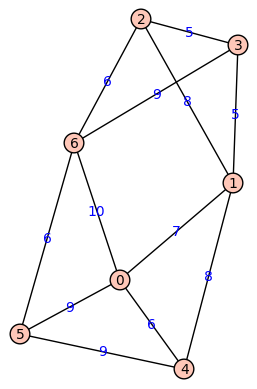

# MTH 325 Guided Practice 10.3: Rooted trees

## Overview

In this lesson we introduce the concept of a _rooted tree_. A rooted tree is a tree in which we designate one vertex to be special, the "root", and then we think of all the edges as directed and "flowing out" from the root. Most applications of trees in computer science assume that trees are rooted, and introducing the root-based heirarchy of vertices in a tree opens up several new applications to us. For example we will look at a new algorithm for finding a minimum spanning tree known as _Kruskal's Algorithm_. 

## Learning objectives

__Basic objectives__: Each student is responsible for gaining proficiency with each of these tasks _prior_ to engaging in class discussions, through the use of the learning resources (below) and through the working of exercises (also below). Note that important new terminology is given in italics. 

+ Given a tree with a root, identify the following: the internal vertices, the leaves, the height of the tree, the level on which a vertex sits, the parent of a vertex, the children of a vertex, and the ancestors and descendants of a vertex. __Note that some of the terminology is defined in the Homework A for this section.__

__Advanced objectives__: The following objectives are the subject of class discussion and further work; they should be mastered by each student _during_ and _following_ class discussions. 

+ Use Kruskal's Algorithm to find a minimal spanning tree in a graph.  

## Learning resources 

__Reading:__ Read Section 10.3 of your textbook, except for the longish section in the middle titled “Mathematica Implementation of Kruskal’s Algorithm”. This section goes on for several pages. (You can read that if you want, but it won’t make much sense if you don’t know the software Mathematica.) Do, however, read the section “Sage Note” near the end because it will show you how to invoke Kruskal’s Algorithm in Sage.

__Video:__ 

+ [Kruskal's Algorithm](https://www.youtube.com/watch?v=wR6JTtAmSWI) (3:40) 
 
## Exercises

The following exercises are to be done _during_ and _following_ your reading and viewing of the resources. Work these out on paper and then enter the responses into the appropriate submission form (see Submission Instructions) by the deadline. You will receive a mark of __Pass__ if each item response shows a good-faith effort to be right and is submitted prior to the deadline. 

The exercises below refer to this tree in which 1 is the root:

And this weighted graph. The weights are superimposed on the edges: 

In case you can't see the edge weights, the complete weighted edge list is: [(0, 1, 7), (0, 4, 6), (0, 5, 9), (0, 6, 10), (1, 2, 8), (1, 3, 5), (1, 4, 8), (2, 3, 5), (2, 6, 6), (3, 6, 9), (4, 5, 9), (5, 6, 6)]. 

1. List all the leaves of the tree. 
2. List all of the vertices in the tree that sit at level 4. 
3. State the height of the tree. 
4. List all the children of vertex 16. 
5. How many parents does each vertex (other than the root) have? Will this always be the case in any tree? Explain. 
5. Shifting to the weighted graph, perform Kruskal's Algorithm to find a minimal spanning tree for this graph. State the tree as an edge list, and then state the total weight. 

## Submission instructions

Submit your responses using the form at this link: [http://bit.ly/1Sp41ar](http://bit.ly/1Sp41ar)