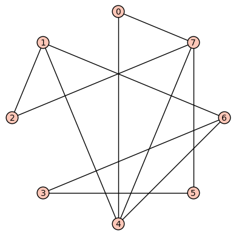

# MTH 325 Guided Practice 9.1: Graphs -- A General Introduction

## Overview

With this section, we introduce the second of three main tools of discrete structures: the **graph**. We have already met and extensively used the concept of a *directed graph* in our study of relations. A graph is just like a directed graph... except without the direction. In other words, a graph is a collection of vertices with edges that connect some of them, and the edges are just line segments with no direction specified. Graphs are at the heart of many important algorithms and are useful in modeling many situations involving networks and connections. In this section, we will introduce the concept of a *graph* (and the related ideas of *directed graphs* and *multigraphs*), *paths* and *circuits* in a graph, *isomorphic* graphs, and the *degree* of a vertex. 

## Learning objectives

__Basic objectives__: Each student is responsible for gaining proficiency with each of these tasks _prior_ to engaging in class discussions, through the use of the learning resources (below) and through the working of exercises (also below). Note that important new terminology is given in italics. 

+ State the formal definition of a *directed graph*, *simple graph*, *multigraph*, *undirected graph*, and *complete* undirected graph. 
+ Given a graph (undirected), identify its vertices and edges as well as any paths that connect two vertices. 
+ Given a path in a graph, state the *initial vertex*, *terminal vertex*, its *edge list*, its *length*, and its *vertex list*. Also state whether the path is a *circuit* or not and whether it is *simple* or not. 
+ Given a vertex in an undirected graph, state its degree. If the graph is directed, state its in-degree and out-degree. 

__Advanced objectives__: The following objectives are the subject of class discussion and further work; they should be mastered by each student _during_ and _following_ class discussions. 

+ Determine whether two graphs are isomorphic. 
+ Given a graph, answer questions 2--5 just before the subsection on "Isomorphic Graphs". 

## Learning resources 

To gain proficiency in the learning objectives, use the following resources. You may include other resources if you wish, in addition to or in replacement of the following. 

__Textbook__: In _ADS_, read Section 9.1. Make sure to read actively, working through examples and activities as you go. 

*Video*: This video is optional if you understood the book, but I thought it was very clear and potentially helpful: 

+ [Graph theory: An Introduction](http://www.youtube.com/watch?v=HmQR8Xy9DeM) (12:31) 

Some notes about this video: When the speaker defines the edge list of a graph, he does it in terms of two-element subsets of the vertex set, for example ${v_1, v_2}$; for us, we'll consider an edge to be an *ordered pair* of elements from the vertex set instead, for example $(v_1, v_2)$. Finally, this video introduces some ideas we are not formally taking up until later, specifically the concept of the adjacency matrix for an undirected graph, but it doesn't hurt to see it early. 

## Exercises

The following exercises are to be done _during_ and _following_ your reading and viewing of the resources. Work these out on paper and then enter the responses into the appropriate submission form (see Submission Instructions) by the deadline. You will receive a mark of __Pass__ if each item response shows a good-faith effort to be right and is submitted prior to the deadline. 

All of the exercises refer to this (undirected) graph: 



1. How many edges does this graph have? 
2. Is there a path of length 4 between vertex 1 and vertex 0? If so, state this path as a list of edges, each edge represented as an ordered pair. For example a path from 7 to 6 would be `[(7,4), (4,6)]` and this path has length = 2. 
3. Find a circuit of length starting and ending at that has length 4, and phrase it again as a list of edges (represented as pairs). Yes, such a circuit exists. 
4. Find the degree of each vertex in this graph and write the results as a list of numbers, with the first element of the list being the degree of vertex 0, the second the degree of vertex 1, and so on. In other words, make a list `[d0, d1, d2, d3, d4, d5, d6, d7]` in which d0 is the degree of vertex 0, d1 is the degree of vertex 1, etc. This is called the _degree sequence_ of the graph. 
5. Add up the integers in the degree sequence and then compare it to the number of edges. Then run the code block below, which generates a random graph in Sage (using 10 vertices and a 50% chance of any two vertices being connected) and then prints off the sum of the degree sequence followed by the number of edges. You can change the number of vertices and the connection probability if you want. Do you notice a pattern? What is it?  

<div class="sage">
<script type="text/x-sage">random_graph = graphs.RandomGNP(10, 0.5)
random_graph.show()
print('Number of edges = %s') % random_graph.num_edges()
print('Sum of degrees = %s') % sum(random_graph.degree_sequence())</script>
</div>

In case the embedded Sage cell above doesn't appear or doesn't work, here is the block of code inside it that you can cut/paste into a Sage worksheet at SageMath Cloud: 

```random_graph = graphs.RandomGNP(10, 0.5)
random_graph.show()
print('Number of edges = %s') % random_graph.num_edges()
print('Sum of degrees = %s') % sum(random_graph.degree_sequence())```

## Submission instructions

Submit your responses using the form at this link: [http://bit.ly/1MrLRkh](http://bit.ly/1MrLRkh)