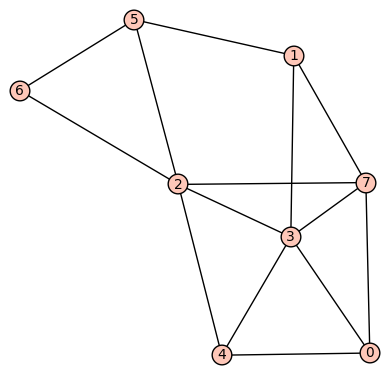

# MTH 325 Guided Practice 9.4: Eulerian and Hamiltonian Graphs

## Overview

In this section we return to a pair of questions that pertain to _paths_ and _circuits_ in a graph. First, if we’re given a graph, is there a path through the graph that touches every vertex exactly once? And second, given a graph, is there a path through the graph that traverses every edge exactly once? (We can formulate similar questions about circuits and not just paths.) These two questions give us the concepts of an __Eulerian path__ and a __Hamiltonian path__, both of which capture important properties of a graph and have numerous applications.

## Learning objectives

__Basic objectives__: Each student is responsible for gaining proficiency with each of these tasks _prior_ to engaging in class discussions, through the use of the learning resources (below) and through the working of exercises (also below). Note that important new terminology is given in italics. 

+ Determine whether a path (circuit) in a graph is an Eulerian path (circuit). 
+ Determine whether a path (circuit) in a graph is a Hamiltonian path (circuit). 
+ Use Theorem 9.4.2 to determine if a graph is Eulerian or has an Eulerian circuit. 

__Advanced objectives__: The following objectives are the subject of class discussion and further work; they should be mastered by each student _during_ and _following_ class discussions. 

+ Summarize the strategy behind the proof of Theorem 9.4.2. 
+ Given that a graph is Eulerian (or has an Eulerian circuit), find an example of an Eulerian path (or circuit) in the graph. 
+ Determine whether a graph has a Hamiltonian path or circuit. 

## Learning resources 

To gain proficiency in the learning objectives, use the following resources. You may include other resources if you wish, in addition to or in replacement of the following. 

__Textbook__: In _ADS_, read Section 9.4. You can just skim the section on Gray Codes. 

__Video:__:

+ [Eulerian Path](https://www.youtube.com/watch?v=ycRuO-u6rt8) (2:50) This video not only explains Eulerian paths but also the idea behind Theorem 9.4.2.
+ [Eulerian Path Solution](https://www.youtube.com/watch?v=Dx1lpbpSHwI) (2:23) This is the follow-up to the previous video, so you should watch both. What the speaker calls a “tour” is what we call a “circuit”.
+ [Hamilton Paths and Circuits](https://www.youtube.com/watch?v=5WWcm-wW0nk) (12:51)

## Exercises

The following exercises are to be done _during_ and _following_ your reading and viewing of the resources. Work these out on paper and then enter the responses into the appropriate submission form (see Submission Instructions) by the deadline. You will receive a mark of __Pass__ if each item response shows a good-faith effort to be right and is submitted prior to the deadline. 

Consider the following graph:

Each of the following questions 1--4 has two response items at the submission form. One is a multiple choice where you check "yes" or "no" depending on how you answer the question. In cases where the answer is "yes", you are asked in the second response item to give an example of either a path or a circuit. __Phrase these paths and circuits as edge lists.__ For example, a path that goes from 0 to 3 to 5 to 7 would be the edge list `[(0,3), (3,5), (5,7)]`. 

1. Is this graph Eulerian? If so, give an example of an Eulerian path contained in the graph. 
2. Does this graph have an Eulerian circuit? If so, give an example of onecontained in the graph. 
3. Is this graph Hamiltonian? If so, give an example of a Hamiltonian path contained in the graph. 
4. Does this graph have a Hamiltonian circuit? If so, give an example of one contained in the graph. 
5. Unrelated to the sample graph above: If a graph is Eulerian, then does it have to be Hamiltonian? If you think so, explain why (doesn't have to be formal, or even correct). If not, give a counterexample. 
6. If a graph is Hamiltonian, then does it have to be Eulerian? If you think so, explain why (doesn't have to be formal, or even correct). If not, give a counterexample. 

## Submission instructions

Submit your responses using the form at this link: [http://bit.ly/1M3ipVB](http://bit.ly/1M3ipVB)