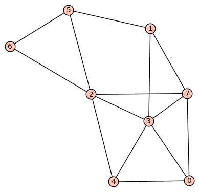

# MTH 325 Guided Practice: Weighted Graphs and Dijkstra's Algorithm 

## Overview

Our next topic in graph theory has many applications, some of which are being investigated in various application projects. That topic is _weighted graphs_, which are graphs whose edges have numerical values attached that might represent distances, costs, and so on. Weighted graphs are used to model networks in which traveling from one node to another might incur different “costs” depending on the nodes. An associated problem of great importance is: Given a weighted graph and a starting node, what is the path to each of the other vertices that has the least total cost? We’ll solve this problem using the very powerful _Dijkstra’s Algorithm_.

__NOTE: This material is NOT located in your book.__ See the Resources section below for places to go to learn about this topic.

## Learning objectives

__Basic objectives__: Each student is responsible for gaining proficiency with each of these tasks _prior_ to engaging in class discussions, through the use of the learning resources (below) and through the working of exercises (also below). Note that important new terminology is given in italics. 

+ Generate a weighted graph using Sage. 
+ Find the weight of a path between two vertices in a weighted graph. 
+ Outline the overall strategy of Dijkstra's Algorithm and explain how we know that it eventually stops and why it returns the correct result. 

__Advanced objectives__: The following objectives are the subject of class discussion and further work; they should be mastered by each student _during_ and _following_ class discussions. 

+ Use Dijkstra's Algorithm to find a path of lowest cost in a weighted graph. 
+ Find the shortest path between two vertices in a weighted graph using Sage commands. 

## Learning resources 

NOTE: Since the information in this unit does not come from your book, it’s especially important to complete all the reading and all the video viewing and to ask questions (in person, by email, etc.) if you have any.

__Reading:__

+ [Wikipedia blurb](http://en.wikipedia.org/wiki/Graph_(mathematics)#Weighted_graph) about what a weighted graph is.
+ The Wikipedia entries for the [algorithm](http://optlab-server.sce.carleton.ca/POAnimations2007/DijkstrasAlgo.html) and [description](http://en.wikipedia.org/wiki/Dijkstra's_algorithm#Description) of Dijkstra’s Algorithm. If you’re having trouble following the algorithm, you can go view one of the videos first.
+ [Animated web slide show of how Dijkstra’s Algorithm works](http://optlab-server.sce.carleton.ca/POAnimations2007/DijkstrasAlgo.html). When it says a node is “solved”, that means “visited”.

__Video:__

+ [Dijkstra’s Algorithm](https://www.youtube.com/watch?v=gdmfOwyQlcI) (5:01) You might want to watch this one twice to start to get a grasp on the process.
+ [Graphs: Dijkstra’s Algorithm](https://www.youtube.com/watch?v=8Ls1RqHCOPw) (9:17) Another example using Dijkstra’s Algorithm, this time using a directed graph.
+ [Dijkstra’s Algorithm example](https://www.youtube.com/watch?v=UG7VmPWkJmA) (4:00) Yet another example. No sound other than Mozart. “Removing” a vertex means marking it as visited.
+ [Creating a weighted graph in Sage from an adjacency matrix](http://www.youtube.com/watch?v=hv1IrJjbH-I) (3:45)
+ [Creating a weighted graph in Sage from an edge list](http://www.youtube.com/watch?v=1C9fNr7GpqM) (2:20)

## Exercises

The following exercises are to be done _during_ and _following_ your reading and viewing of the resources. Work these out on paper and then enter the responses into the appropriate submission form (see Submission Instructions) by the deadline. You will receive a mark of __Pass__ if each item response shows a good-faith effort to be right and is submitted prior to the deadline. 

Consider the following graph:

Each of the following questions 1--4 has two response items at the submission form. One is a multiple choice where you check "yes" or "no" depending on how you answer the question. In cases where the answer is "yes", you are asked in the second response item to give an example of either a path or a circuit. __Phrase these paths and circuits as edge lists.__ For example, a path that goes from 0 to 3 to 5 to 7 would be the edge list `[(0,3), (3,5), (5,7)]`. 

1. Is this graph Eulerian? If so, give an example of an Eulerian path contained in the graph. 
2. Does this graph have an Eulerian circuit? If so, give an example of onecontained in the graph. 
3. Is this graph Hamiltonian? If so, give an example of a Hamiltonian path contained in the graph. 
4. Does this graph have a Hamiltonian circuit? If so, give an example of one contained in the graph. 
5. Unrelated to the sample graph above: If a graph is Eulerian, then does it have to be Hamiltonian? If you think so, explain why (doesn't have to be formal, or even correct). If not, give a counterexample. 
6. If a graph is Hamiltonian, then does it have to be Eulerian? If you think so, explain why (doesn't have to be formal, or even correct). If not, give a counterexample. 

## Submission instructions

Submit your responses using the form at this link: [http://bit.ly/1M3ipVB](http://bit.ly/1M3ipVB)