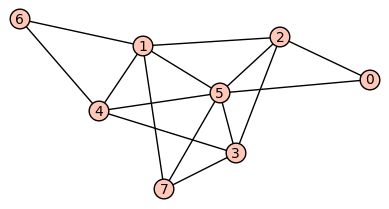
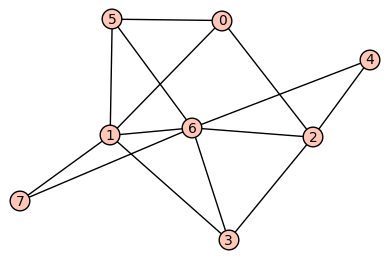

# MTH 325 Guided Practice 9.6: Planarity and Colorings

## Overview

Our next and final topic in graph theory involves two distinct but related ideas: 

+ __Planarity__ of a graph involves determining whether a graph can be redrawn in a two-dimensional plane so that none of its edges cross. We will look at examples of graphs that are planar and nonplanar, and at three important theorems that derive from being planar. 
+ __Colorings__ of graphs involve attempts to assign colors to the vertices of a graph so that no two adjacent vertices share the same color. This simple but important idea has far-reaching implications in both theoretical and practical areas. 

## Learning objectives

__Basic objectives__: Each student is responsible for gaining proficiency with each of these tasks _prior_ to engaging in class discussions, through the use of the learning resources (below) and through the working of exercises (also below). Note that important new terminology is given in italics. 

+ Given a graph in visual form, determine whether it is planar or not. 
+ Given a graph, create an example of a valid coloring of the vertices of the graph. 
+ Determine the chromatic number of a graph. 

__Advanced objectives__: The following objectives are the subject of class discussion and further work; they should be mastered by each student _during_ and _following_ class discussions. 

+ Use Theorems 9.6.2 and 9.6.3 to help determine if a graph is planar. 
+ Give examples of graphs for which the converses of Theorems 9.6.2 and 9.6.3 are false. 
+ Outline the structure of the proofs of Euler's Formula, Theorem 9.6.2 and Theorem 9.6.3. 
+ Given a connected planar graph and any two of the following: number of vertices, number of planar regions, and number of edges -- determine the third missing quantity. 
+ State the Four-Color Theorem and use it to help determine if a connected graph is planar. 

## Learning resources 

__Reading:__ Read Section 9.6 of your textbook. [Then read this PDF](https://drive.google.com/file/d/0B_-QCkjK6ddRTGZlU1ZGQzJjU3c/view?usp=sharing) (click on the link to open) which consists of the first couple of pages from a very good textbook, which explains graph coloring and a nice little application of coloring. 

__Video:__

+ [Planar graphs](https://www.youtube.com/watch?v=NJ_5X-JB3A8) (1:37)
+ [Nodes, edges, regions](https://www.youtube.com/watch?v=6vyrVwP2GTc) (0:58) 
+ [Regions in a planar graph](https://www.youtube.com/watch?v=aDLHDSHFyts) (0:08) followed by [Regions in a planar graph -- solution](https://www.youtube.com/watch?v=_F3kS_2Z2pc) (0:21)
 
## Exercises

The following exercises are to be done _during_ and _following_ your reading and viewing of the resources. Work these out on paper and then enter the responses into the appropriate submission form (see Submission Instructions) by the deadline. You will receive a mark of __Pass__ if each item response shows a good-faith effort to be right and is submitted prior to the deadline. 

Consider the following graphs, which we'll refer to as Graph 1 (on the left) and Graph 2 (on the right). 

Each of these questions pertains to one or both of these graphs. 

1. Is Graph 1 planar? Explain how you know. 
2. Is Graph 2 planar? Explain how you know. 
3. What's the smallest number of colors you need to make a valid vertex coloring of Graph 1? (Remember the rules for a valid graph coloring as described in the PDF supplied above.) On the response form, state the colors for each vertex. 
4. What's the smallest number of colors you need to make a valid vertex coloring of Graph 1? On the response form, state the colors for each vertex. 
5. __Planarity__ is a game that you can play online at [http://planarity.net](http://planarity.net) or through a smartphone app. The game presents you with a graph whose edges are tangled up, and the goal is to disentangle the edges so that none of them cross. For this problem, play three rounds of Planarity and untangle the graph. After each round, record three pieces of data: (1) the number of vertices in the graph, (2) the number of edges in the graph, and (3) the number of planar regions in the graph. The concept of a "planar region" is defined and described in the videos. Remember to count the infinite region "outside" the graph when you total up the number of regions. We'll use your data to discuss an interesting property of planar graphs in class. 

## Submission instructions

Submit your responses using the form at this link: [http://bit.ly/1l6tnzD](http://bit.ly/1l6tnzD)