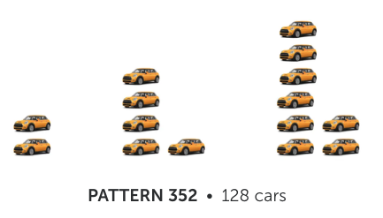

# AEP 2: Recursion in visual patterns 

## Overview 

In this AEP, you'll apply the concepts of **recursion** to take a visual pattern, find a **recursive model** for the pattern, and prove that your model works -- using three different visual patterns. 

**Initial deadline: Sunday, October 15, 11:59pm ET**. Reminder of how AEP deadlines work: This *initial* deadline is the last date by which you are allowed to submit a *first* draft. No *first* drafts are accepted past this date. However, once you submit a first draft on or before this deadline, there are no deadlines for revisions until Sunday, December 3. If your work needs revision, you can continue to revise and resubmit without penalty and without deadlines until that date. The only restrictions are from the course syllabus: 

- Only two submissions of AEP work are allowed per week; and 
- Your initial draft must be a good-faith effort at a complete and correct solution prior to the initial deadline; otherwise no revision will be allowed. 

You are allowed to spend one token to extend this deadline 24 hours. 

## Background

In class, we motivate the concept of [recursion](https://publish.obsidian.md/mth225/Recursion+and+Induction/Recursion) -- the process of computing or constructing an object using simpler versions of itself -- using visual patterns. The initial stage of a pattern is given expicitly; then the pattern evolves by taking the previous stage of the pattern and doing something to it, usually adding additional structure. The additional structure and the way in which it is added on, can allow you to define a [recurrence relation](https://publish.obsidian.md/mth225/Recursion+and+Induction/Recurrence+relation) that describes these changes precisely. 

In computer science, many structures and operations are defined recursively, in a very similar way to visual patterns. For example the concept of a *graph*, central to MTH 325, is recursive; sorting algorithms like [MergeSort](https://www.geeksforgeeks.org/merge-sort/) are recursive. Entire languages, like [Haskell](https://www.haskell.org/), are built on recursion. A strong understanding of recursion is essential to be a computer scientist, and we can practice that skill on a small scale with basic visual patterns. 

The website https://www.visualpatterns.org/ contains 500 fun visual patterns to explore; we will do some of these in class. The patterns are numbered 1 through 500 and can be accessed at the bottom of the website. For example, here is visual pattern 352: 

The number that's shown ("128 cars") is the number of objects in **step 43** of the sequence, **if we start the index at 1** (and not zero-indexed as we often do). In this case, for instance, step 1 of the sequence has 2 cars; step 2 has 5 cars; step 3 has 8 cars. If $c_n$ is the number of cars in step $n$, this means that $c_1 = 2, c_2 = 5$, and $c_3 = 8$ and apparently $c_{43} = 128$. 

## Tasks for this AEP

Each student in MTH 225-03 and MTH 225-04 has been assigned **three visual patterns** from the visualpatterns.org website. You can find your assignment at this spreadsheet: 

https://docs.google.com/spreadsheets/d/1vEKFtrLlQvnDZ1fu_aORpvFLP8nVBXTNMLv150OQMG0/edit?usp=sharing

Note that *no other student* has your three visual patterns, so this assignment is uniqe. (Please note: You do not have to do this particular AEP if you prefer to work on others. But every student in the course has been assigned three visual patterns just in case you decide to work on this.)

For **each** of the three visual patterns you are assigned, do the following: 

1. Study the visual pattern and then write a clear English explanation, consisting of at least 2-3 sentences, describing exactly how the pattern is changing from one step to the next. You should explain in precise terms (in English, not math) how we are getting from one step to the next. 
2. Use your explanation from the previous step to find the number of objects in the *first step that is not shown on the website*. For most patterns, this will be step 4, since most of the patterns on the website give the first three steps. However, for example Pattern 392 gives the first five steps, and in this case you would find the number of objects in step 6. Be sure to do more than just state your answer --- explain how you got it. 
3. Write a recursive definition for the number of objects in the visual pattern at any stage. Remember this requires two things: An initial condition or conditions, and a recurrence relation. For the initial condition or conditions, remember we are starting the index at 1, not 0. You do not have to give an explanation for your definition, but it should be a mathematical way of phrasing of your explanation in part 1. 
4. Use your recurrence relation to find the number of objects in step 43. The answer is given on the website, so that's not the main point here; the point is to show the work so that a reader can see that your recurrence relation "works". You can do this part in one of two ways: Either do the math one step at a time, starting with $a_{43}$ and working backwards; or write a recursive Python function that will do the computation for you directly. The second method is HIGHLY preferred for your sake! 

Since you have three visual patterns to work with, you will be doing each of these four steps three different times --- therefore you will have 12 parts to turn in. 

# Expectations and Grading Criteria 

AEPs are marked *Success*, *Revise*, or *Incomplete* on the basis of completeness, overall correctness, presentation, and the quality of your explanations. **The primary criterion is the quality of your explanations.** Submissions that are just computations with no explanations attached will be marked *Revise* or *Incomplete* with instructions to provide explanations. 

In particular: 

- **Your audience for AEP submissions is a classmate -- someone who knows all the math you do, but has no familiarity with your solution to these problems**. Your work should be sufficiently complete and clear so that this person can fully understand your reasoning, and agree with it, without having to do any significant extra work. Your submission is graded from this standpoint as well, so if it's reasonable to think that a normal MTH 225 student would fail to grasp a part of your work without having to fill in gaps themselves, you'll be asked to revise your solution until this is no longer the case. 
- **Most good technical communication is a combination of computations and plain English.** Work that is *all* computation and *no* verbal explanation will likely not meet the standards for "Success"; likewise if the work is *nothing but* verbal explanation. 

Please carefully review the [guidelines for AEP submissions in the Standards for Student Work document](https://github.com/RobertTalbert/discretecs/blob/master/MTH225-Fall2023/course-docs/standards-mth225-f23.md#standards-for-aeps) before submitting your first draft, to save yourself time and effort. 

In addition to these general requirements, on this assignment "Success" requires the following: 

- If you are writing Python code to do Task 4, the entire assignment **must** be done in a Jupyter notebook, so that your code can be checked for correctness. Do not turn in two documents --- turn in one Jupyter notebook, that has both text and code in it. 
- Task 1 must consist of a clear, correct English explanation of the visual pattern and should not use any mathematical notation or computations, and it should be 2-3 sentences long. 
- The recursive definitions must include both an initial condition or conditions, *and* a recurrence relation. One without the other is not a correctly-formed recursive definition. 

## Submitting your work 

**AEP submissions must be typewritten and saved as either a PDF or MS Word file. No part of your submission may involve handwriting; work that is submitted that contains handwriting will be marked *Incomplete* and returned without feedback.** This includes electronic handwritten docments, for example using a stylus and a note-taking app. To type up your work, you can use MS Word or Google Docs (both of which have equation editors for mathematical notation) or any other computer-based math typesetting tool. Just make sure you save your work as a Word document or PDF (no `.odt`, `.rtf`, or other file extensions are allowed).

If you are writing this assignment up in a Jupyter notebook, you'll need to share a **link** to your notebook rather than the notebook itself, because Blackboard will not render `*.ipynb` files. Just make sure your permissions are set to "Everyone with the link can comment" and then paste the link into the submission area. 

And remember if you are writing code for Task 4, the entire AEP must be in a Jupyter notebook and not two separate documents, or a Word document with code pasted into it, etc. 

When you have your work typed up, double-check it for neatness, correctness, and clarity. Then simply submit your document on Blackboard, in the **AEP** area, in the **AEP 2** assignment. 

## Getting Help

You **may** ask me (Talbert) for help on this assignment in the form of **specific mathematical or technical questions, or clarifying questions about the instructions**. If I cannot answer a question because it would give too much away, I'll tell you so. However please note: **I will not "look over your work" before you submit it to give you feedback on the overall submission**. I have made the expectations clear, so just follow those directions and submit your best work, and you'll be allowed to revise it if needed. 

For AEPs, the syllabus policy on collaboration is: 

>On *AEPs*, you are **allowed to engage in general discussions of strategy only with others, but no collaboration on the details of a problem are allowed.**.

The safest approach is simply not to discuss any part of your work on an AEP with anyone except the professor. 

However:  **You can ask technology related questions to anyone at any time**. For example if you need help figuring out how to type up your work, there are no restrictions on that. 