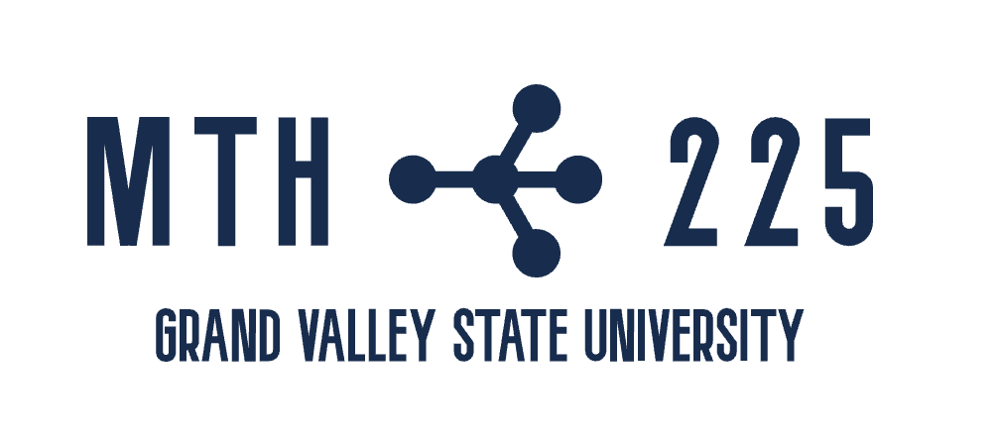

# MTH 225: Discrete Structures for Computer Science 1

>Let us change our traditional attitude to the construction of programs: Instead of imagining that our main task is to instruct a computer what to do, let us concentrate rather on explaining to human beings what we want a computer to do.
>
>-- Donald Knuth, *Literate Programming*

## About MTH 225 and this syllabus

**Welcome to MTH 225!** I'm Dr. Robert Talbert, the professor for this course. I'm grateful you're here. 

In this course, you will learn **the math that all of computer science is based on**. You'll learn things like how to do arithmetic in binary, how to count the number of ways to deal a five-card poker hand, and how to generate complex data structures using simple rules involving recursion. And more! By studying discrete structures, **you'll gain a superpower to make you an expert learner of any hardware and any software, including those that haven't been invented yet**. As a computer scientist, your ability to learn new things quickly, and use fundamental concepts to model complex ideas, are more valuable than your coding skills. 

**This syllabus contains all the information you need to navigate the course.** The main document will be kept continuously up to date at this link. When you see blue- or purple-underlined text in the syllabus or any other document, it's a clickable link. For example, [click here for a cat video](https://www.youtube.com/watch?v=aFuUidBR1aQ). A PDF version of the syllabus will also be available on Blackboard in the *Course Documents and Tools* folder, but it will not be updated unless there is a major change. 

**This document is meant to be read once, then searched as needed.** If you need to find something, the easiest way is to pull up this  document, hit `Control-F` or `Command-F`, and then do a search for the text you're looking for. 

All course materials for MTH 225 are available on GitHub at https://github.com/RobertTalbert/discretecs. The current version is in the folder `MTH225-Fall2023`. Critically important documents (syllabus, etc.) will also be on Blackboard. 

## Key Information

**Professor:** Robert Talbert, Ph.D., Professor of Mathematics. My office is Mackinac Hall C-2-513 and my email is talbertr@gvsu.edu. 

**Meetings:** Section 03 and Section 04 meet Monday/Wednesday/Friday in Mackinac Hall B-1-110. Section 03 meets 12:00-12:50pm and Section 04 meets 2:00-2:50pm. 

**Student drop-in hours:** 11:00-11:50am MWF. Others will be determined during week 1; watch this space for an update. No appointment is needed for drop-in hours. If you want to make an appointment outside office hours for an in-person or online meeting, schedule yourself at http://calendly.com/robert-talbert. 

**Blackboard, Class Page, and Class Vault:** Our main course portal is on Blackboard, which you can access at http://lms.gvsu.edu. Please note that we are using *Blackboard Ultra*, a major update to Blackboard which has significant differences from previous versions. If you need a tutorial on how to navigate Blackboard Ultra,  We use two other electronic resources for the class: the **[Class Page](https://docs.google.com/document/d/1JxG_s77q1Z3Ho_GsHXsQafZhpFJ_lW1Bbl7Hn0epWns/edit?usp=sharing)** which is a Google Doc showing notes and resources for class meetings; and the **[Course vault](https://publish.obsidian.md/mth225)** which serves as our primary textbook. All of these are linked to Blackboard in the *Course Documents and Tools* folder, so you don't need to remember them all. But it's a good idea to bookmark the ones you use frequently in your browser. 

**Contacting the prof:** Email (talbertr@gvsu.edu) is preferred. You can schedule a video or phone call outside of office hours through [my Calendly page](https://calendly.com/robert-talbert/). Be sure to read [my availability/response policy](https://github.com/RobertTalbert/discretecs/blob/master/MTH225-Fall2023/course-docs/mth225-syllabus-f23.md#instructor-availability-and-message-responses). 

**Course calendar:** The official course calendar is in **Google Calendar** [at this link](https://calendar.google.com/calendar/embed?src=9faa4be7819d7e9f621c4deb8f2e0fc91ab47d8140a117459e9ca26d5611ae06%40group.calendar.google.com&ctz=America%2FDetroit). It is also linked on the [Class Page](https://hackmd.io/@rtalbert235/HyTuIxi4q) and embedded at the end of this syllabus, although some web formats do not display it correctly. Assignments that are turned in on Blackboard will also have their due dates shown on the Blackboard calendar. *In case of an apparent date conflict on assignments or course documents, the Google Calendar is assumed to be correct.* 

**Definition of "week":** In our course, a "week" is defined to begin at 12:01am ET on Monday and end at 11:59pm ET the following Sunday. 

**Course content and videos:** The content for the course is housed in the **Course Vault** (https://publish.obsidian.md/mth225), a wikipedia-style website containing interconnected articles for every major course concept. A *optional* additional textbook is [Discrete Mathematics: An Open Introduction](http://discrete.openmathbooks.org/dmoi3/dmoi.html) by Oscar Levin. It's free; just click the link. A PDF copy is available for download [here](http://discrete.openmathbooks.org/pdfs/dmoi3-tablet.pdf). Not all course material is included in the Levin textbook, and we may not follow the exact sequence that this book uses. But you are free to use it as a supplement. A playlist of instructional videos is available on Vimeo at https://vimeo.com/showcase/8667148, and individual videos are embedded in course vault articles. 

**Course tools:** We will use [Juypyter notebooks](https://jupyter.org/) on the [Google Colab platform](https://colab.research.google.com/) throughout the course for Python programming and writing up some assignments. You'll receive training on these tools in the first week of classes. 

**Technology:** For our class, you should have access to a laptop (a tablet is acceptable but not recommended) and a high-speed internet connection. You are *strongly encouraged* to have a device with a touchscreen and stylus input, or an external drawing pad. If technology access is an issue for you, please let me know so we can discuss your options. 

## How to have an good experience in MTH 225

**I want you to be successful in this class.** This is my #1 priority as a professor at GVSU. Everything in MTH 225 is built to lead you toward having a deep learning experience that is also deeply enjoyable. My goal is to challenge you and support you in equal measures, so you'll learn a lot and have a great experience in the process. 

In MTH 225, you can expect:

- A learning environment that challenges you, but also where support is readily available and freely given. 
- Work that is meaningful and not "busy work", and grading practices that prioritize growth and improvement. 
- Transparency and openness in how the course is run, including clear instructions on what you need to do and when, prompt and helpful feedback on your work, and timely replies to messages and questions. 
- Openness to your ideas about the course, with regular solicitations for feedback that are taken seriously through a continuous improvement process. 
- Above all, **respect** -- for you as a learner, as an adult, and as a human. 

Success in MTH 225 is within everyone's reach, but it's not effortless. On your end, your success in the course depends on three things: 

1. **Active engagement during class time**. The best way to learn anything is to be an active participant in the process. Students who approach the class with a passive mindset typically struggle, and often fail. Those who approach it with an active mindset, on the other hand, often surprise themselves with how much and how well they learn. Make it a priority not to just attend and take notes, but *get involved*. 
2. **Asking questions**. The material in MTH 225 is challenging, and you will almost certainly be confused or stuck at times. **This is a feature, not a bug, of the learning process.** It's normal and it means you're doing the course right. But when struggle happens, don't wait for things to make sense on their own: *Ask questions* of me and your classmates and take action to make sense of the material. 
3. **Good management of time, tasks, and information.** Understanding the material won't help you if you procrastinate, skip announcements, or don't use a calendar. All course information will be clearly laid out for you, but it's up to you to import that information into your own lives and act on it. 

If you can commit to these, then I have every expectation that you'll succeed in the course, no matter what your math background or perceived math skill is.

## Goals and Structure 

The overall goal of MTH 225 is to **build a solid foundation in the basic theory and tools for the mathematics that computer science is built on**, especially the theory and tools you will need for later coursework such as MTH 325 and CIS 263. 

### Course-level learning objectives:

Upon completion of MTH 225, you will be able to: 

* Represent integers using different number bases, and perform integer arithmetic using different bases and modular arithmetic.
* Formulate, manipulate, and determine the truth of logical expressions using symbolic logic.
* Formulate and solve computational problems using sets and functions.
* Formulate and solve complex counting problems using computational thinking and the tools of combinatorics.
* Evaluate numerical and other sequences using recursion, and solve simple recurrence relations.
* Write clear, correct, and convincing arguments to explain the correctness of a solution using combinatorial proof and mathematical induction.
* Explain the reasoning behind solutions to computational problems clearly to an appropriate audience.
* Apply effective problem-solving skills in solving computational problems.
* Apply computer programming and computational thinking to frame and solve mathematical and computational problems.
* Self-assess your work and apply feedback from others to make improvements in that work.

### Course module structure

The course content is split up into five modules:

- **Module 1: Computer arithmetic**. Representing integers in binary, octal, and hexadecimal; binary arithmetic; two's complement notation for negative integers; the Division Algorithm and modular arithmetic. 
- **Module 2: Logic**. Logical propositions, conditional statements, truth tables, predicates, and quantification. 
- **Module 3: Sets and functions**. Set notation and representation, set operations, functions. 
- **Module 4: Combinatorics**. The Additive and Multiplicative counting principles, the binomial coefficient, permutations, dots-and-dividers counting methods; using computational thinking to solve combinatorics problems. 
- **Module 5: Recursion and induction**. Numerical sequences in closed-formula and recursive forms, solutions to recurrence relations, the Principle of Mathematical Induction and proof by induction. (This module will be split up into two parts with the first happening after Module 2.)

The basic skills that you'll learn in the course are encapsulated in a list of **15 Learning Targets**, eight (8) of which are labelled as **CORE** targets and represent the essential skills that every MTH 225 student should possess by the end of the course. You can find that list in [Appendix A](https://github.com/RobertTalbert/discretecs/blob/master/MTH225-Fall2023/course-docs/mth225-syllabus-f23.md#appendix-a-learning-targets), and it's linked elsewhere on our various course sites. 

## MTH 225 Workflow 

Each class meeting has activities for you to do *before*, *during* and *after* the class. For details on specific assignment types, see the next section. 

* **Before class:** You'll be asked to complete a **Class Prep** assignment that will involve you in reading content from [the course vault](https://publish.obsidian.md/mth225/) and watching some of the videos at [our playlist](https://vimeo.com/showcase/8667148). You'll then complete a small set of basic questions and exercises. This way, you'll come to class ready to work, and we can skip  lectures on the basics in class unless it's really needed. 
* **During class:** Class meetings will be focused on *answering questions* and *doing active work*, both intended to make it easy for you to make sense of the material and ask questions. Selected portions of your class work will be written up individually and turned in as **Application/Analysis** sets. We'll also use time in class for assessment and for completing other assignments, so that a lot of the "homework" for the class is done during class time. 
* **After class:** In addition to getting started on the next Class Prep and writing up Application/Analysis problems, you should expect to spend time in between classes doing practice on concepts you don't fully understand yet, and asking questions. There will be occasional **Application and Extension Problems** (AEPs) to work on. 

A typical week in MTH 225 looks like this: 

1. **Sunday** - Complete Class Prep for Monday 
2. **Monday** - Q&A from Class Prep and active work on more advanced concepts from Class Prep 
3. **Tuesday** - Complete Class Prep for Wednesday 
4. **Wednesday** -- Q&A from Class Prep and active work on more advanced concepts from Class Prep 
5. **Thursday** - Complete Class Prep for Friday 
6. **Friday** -- Q&A from Class Prep and active work on more advanced concepts from Class Prep 
7. **Saturday** -- Nothing! If you stay current on work during the week you should always have Saturday open. 

## Assessments and Grades

### Overall approach to grades in MTH 225 

The way grading work in MTH 225 is different from what you might have experienced. In MTH 225: 

- **Almost none of your assignments have point values**. In fact only the final exam is graded with points. Therefore there is **no partial credit and no averaging**. 
- Instead, assignments have **standards** which are descriptions of what constitutes "acceptable" work. These are given in detail in the document *[Standards for Student Work](https://github.com/RobertTalbert/discretecs/blob/f454fa80b1ec09b5380c09813903f9fcb406e315/MTH225-Fall2023/course-docs/standards-mth225-f23.md)* which you can find at the link and on Blackboard in the *Course Documents and Tools* folder. When you submit an assignment, I will read it carefully and compare it with the standards, and simply determine whether it meets the standards or not. Typically your work is marked either **Success** or **Retry** depending on whether it meets the standards or not. 
- After I evaluate your work, in most cases you will receive **detailed feedback** that will tell you whether your work meets the standards, and if not, the feedback will tell you what was missing and how you might go about fixing it. 
- Then, on most items, you will have the chance to **retry** the assignment if needed, get more feedback, and repeat this **feedback loop** until the work meets our standards. 
- Your course grade is not based on point totals or averages (because there are no point values). Instead, the course grade is based on **how many important learning tasks you've successfully accomplished** by the end of the semester, using a simple table that's given below. 

Therefore grades in MTH 225 are based not on your ability to do good work at a single point in time, but rather on your ability to **eventually learn the material** by acting on feedback from previous attempts. 

This process, using standards and feedback loops rather than points and averages, is how evaluation of work happens in most situations outside of college. In your future jobs, for example, you'll be reviewed regularly by your manager; it's not a "one and done" situation where you get a point score and then the process is over. Instead, in a real job, you get feedback and coaching on how to improve, and then you act on the feedback and show the boss that you have improved. 

I've been using this grading method since 2017, originally in MTH 325 and now in all my classes. We do things this way because **learning takes time**, and I believe grading your work based on a single point of data such as a quiz or test and then averaging all of those data is not only inaccurate, but statistically invalid and even unethical. Feedback loops are how all human learning takes place. So this seems like the best way to do grading. 

Those are the main concepts; the details are in the rest of the syllabus. Most students need a week or two to adapt to this system, but then everything is fine. I encourage you to ask questions at any time so I can help you. 

### How you will be assessed 

There are five major kinds of assignments in MTH 225: 

- **Class Prep:** These are done prior to class and will give you the basic knowledge of terms, ideas, and basic concepts that will allow us to jump right into applications when we get to class. They involve reading articles from the [course vault](https://publish.obsidian.md/mth225) (and occasionally [watching video](https://vimeo.com/manage/showcases/8667148/info)), asking questions about what you read, and answering some simple questions about the content. 
- **Application and Analysis:** In class, we will work in groups on higher-level tasks involving application and analysis of the basics. You'll be responsible for individually completing selections from this work that you start in groups during class, and turning these in to be checked for basic overall correctness. 
- **Checkpoints:** Each week (typically) we'll take time in class for a timed quiz over a subset of the 15 Learning Targets [found in Appendix A](https://github.com/RobertTalbert/discretecs/blob/f454fa80b1ec09b5380c09813903f9fcb406e315/MTH225-Fall2023/course-docs/mth225-syllabus-f23.md#appendix-a-learning-targets). 
- **Application/Extension Problems (AEPs):** These are longer-form problems that involve deeper applications of the concepts from class, on applications in a variety of domains and in problems whose solutions require computer tools and good technical writing. 

Each of these assignments is graded as follows: 

| Assignment | Basis for grading | What's recorded on Blackboard |
| :---------: |  :---------: |  :---------: |
| Class Prep | Completeness and effort only | *Success* or *Incomplete* |
| Application/Analysis | Completeness and overall correctness | *Success*, *Retry*, or *Incomplete* |
| Problems on Checkpoints | Overall correctness | *Success* or *Retry* |
| AEPs |  Completeness, overall correctness, writing, and presentation | *Success*, *Retry*, or *Incomplete* |

[The Standards for Student Work document](https://github.com/RobertTalbert/discretecs/blob/f454fa80b1ec09b5380c09813903f9fcb406e315/MTH225-Fall2023/course-docs/standards-mth225-f23.md) contains details on the quality standards for each kind of assessment in the course. Please read this carefully and review before each submission you make. 

The fifth major assessment is a brief but comprehensive **final exam**, graded using points (out of 100) whose schedule is on the course calendar. More information on this is coming around mid-semester.

### Checkpoints and Learning Targets

The [15 Learning Targets given in Appendix A](https://github.com/RobertTalbert/discretecs/blob/f454fa80b1ec09b5380c09813903f9fcb406e315/MTH225-Fall2023/course-docs/mth225-syllabus-f23.md#appendix-a-learning-targets) are the basic skills of MTH 225. They are not the only things that matter in the course; but part of your job in the course is to **demonstrate skill on as many of these Learning Targets as you can, at some point in the semester.** 

The main way you'll demonstrate skill on Learning Targets is by **working Checkpoint problems**. Almost every week, we will have a short in-class quiz, called a Checkpoint, over a portion of the Learning Targets. Each Checkpoint contains one problem for each Learning Target that is covered, and each problem focuses on just one Learning Target. Each problem on a Learning Target is a **demonstration of skill** on that target. 

The [The Standards for Student Work document](https://github.com/RobertTalbert/discretecs/blob/f454fa80b1ec09b5380c09813903f9fcb406e315/MTH225-Fall2023/course-docs/standards-mth225-f23.md) contains details on what constitutes a *successful demonstration of skill* on each Learning Target. Generally, a successful demonstration of skill involves completing the action or task described by the Learning Target with no significant errors and only a small number of minor mistakes allowed, along with a clear explanation of the work.  Your work on Checkpoints will be graded per problem, and each problem that you work will receive a mark of **Success** if the work meets the success criteria and **Retry** if it does not. 

The Blackboard gradebook will record the number of successful demonstrations of skill you have attained on each Learning Target. **Once you have provided two successful demonstrations of skill on a Learning Target, you are considered to have mastered that concept, and no further quiz work is necessary.** We will use the term **Level 1** to describe a Learning Target with *one* successful demonstration of skill and **Level 2** to describe a Learning Target with *two* successful demonstrations of skill. 

Problems covering Learning Targets that are not CORE, will appear on **three consecutive Checkpoints**, beginning when the Learning Target is covered in class, offering you three opportunities to demonstrate skill on those Learning Targets. Problems covering CORE Learning Targets will appear on *every* Checkpoint beginning when they are covered in class. Some Checkpoints near the end of the semester will be all-inclusive, covering all 15 Learning Targets; and the final exam will contain an optional section with one last attempt on any Learning Target that needs one. An initial schedule of which Learning Targets will appear on which Checkpoint is given at the end of this syllabus in [Appendix B](https://github.com/RobertTalbert/discretecs/blob/master/MTH225-Fall2023/course-docs/mth225-syllabus-f23.md#appendix-b-schedule-of-checkpoint-coverage).

Because of the cumulative nature of the Checkpoints, you have the freedom to skip problems that you are not prepared to work; just practice for another week and try again at the next quiz (if the Learning Target is available). If you attempt a quiz problem and it receives a **Retry** mark, or if you are absent for a quiz, or if you choose not to attempt a problem because you're not prepared for it, you can just take it later. 

Alternative methods of demonstrating skill on Learning Targets may be made available during the semester as needed. 

## Course Grades

Your course grade is assigned using the table below. It shows the requirements for the "base grade" of A, B, C, or D; criteria for plus/minus grades are shown below the table. The numbers in the table refer to the number of **Success** marks on each item. **To earn a grade, complete ALL the requirements listed in the row for that grade.**

| Grade | Class Preps (out of 25) | Application/Analysis out of 10)  | Learning Targets at Level 1 | Learning Targets at Level 2 | AEPs (out of 8) |
| :---: | :-------------------:   | :-------------: | :--------------------: | :-------: | :----: |
| A | 20 |  8 | All 8 Core + 6 others | All 8 Core + 4 others | 6 |
| B | 18 |  7 | All 8 Core + 4 others | All 8 Core + 2 others | 4 |
| C | 16 |  6 | All 8 Core + 2 others | Any 8 Core  | 2 |
| D | 10 |  4 | Any 8 | 0 | 0 |

A grade of "F" is earned if not all of the requirements for a "D" are met.

The final exam isn't in this table because the only effect it has on your course grade is to potentially add a "plus" or "minus" to the base A/B/C/D grade. See below for full details. 

If the total number of assignments of a given type is changed due to scheduling or other issues, this table will be updated. 

**Plus/Minus grades:** A *plus* modifier to a base grade is given if you meet all the requirements for the base grade and either: 

- You also complete either the Level 2 Learning Target requirement or the AEP requirement for the next grade up, *or*
- You earn an 85% or higher on the final exam. 

(Completing both of these does not raise your grade further.) A *minus* modifier is given if:

- You complete all the requirements for a base grade *except* Class Preps, *or*
- You earn 50% or lower on the final exam. 

Note: Significant deficiencies in Class Prep submissions may warrant a further reduction in your grade. 

*Exceptions:* GVSU does not award grades of A+ or D-. 

To track your grade as the semester unfolds, you can use the *Course Grade Tracker* handout that is posted on Blackboard in the *Course Documents and Tools* folder. 

## Revisions and reattempts 

**You can revise or reattempt most assignments you turn in, without penalty, until they meet the criteria for acceptable work given in the [Standards for Student Work](https://github.com/RobertTalbert/discretecs/blob/f454fa80b1ec09b5380c09813903f9fcb406e315/MTH225-Fall2023/course-docs/standards-mth225-f23.md) document.** This allows you to keep working on a concept and eventually demonstrate your understanding for full credit, even if your initial attempts aren't successful. 

Not all work can be revised, and most work has limitations on revision. Here are the details: 

| Assignment | Revisions allowed | How to revise and resubmit |
| :-------: | :----------------: | :-------------------------: |
| Class Prep | *May not be revised.* | n/a |
| Application/Analysis | Application/Analysis sets may be revised **once per set**. | Submit a revision on Blackboard. |
| Learning Targets | Each target appears on multiple quizzes. | Retry the skill on a later Checkpoint. |
| AEPs | Up to **two submissions per week** of AEPs are allowed. | Submit a revision on Blackboard. |

**Limitations on revisions:** Although there is no penalty for revising or reattempting work, we place the following limitations on this process to keep the feedback process manageable: 

- **Learning Targets can only be retried on later Checkpoints**. Makeup quizzes outside scheduled Checkpoint times are not available. (However alternative methods for giving demonstrations of skill may be made available later.)
- **Application/Analysis sets can only be revised *once*** since you get the benefit of group work on the first attempt.  
- **Only two submissions *per week* are allowed for AEPs**. In a given week, you can submit first attempts on two different AEPs; or a first attempt on one and a revision of another; or revisions on two different AEPs; or even two revisions of the same AEP. But only two are allowed per week. (A third and final item can be purchased with a token.) Make sure to build a habit of submitting AEP work early and often, since you cannot wait until the end and submit several all at once. 
- **No revisions any work are allowed after 11:59pm ET on Sunday, December 3** in order to provide time and space to grade all pending revisions for final course grade determinations.

### Retry vs. Incomplete

Application/Analysis and AEP submissions are marked *Success*, *Retry*, or *Incomplete*. Both *Retry* and *Incomplete* provide the opportunity to revise and resubmit in most cases. The differences between these two marks are: 

- A *Retry* mark is given to work that represents a good-faith effort at a complete and correct solution and which shows partial understanding of the concepts, but which has significant errors or gaps. 
- An *Incomplete* mark, on the other hand, is given when there's not enough information in the attempt to determine if there was partial understanding. This can happen because parts of the assignment were skipped or ommitted; there is code that won't run due to syntax errors; there are fundamental misunderstandings of the problem; or there are too many errors to justify spending time to correct each one and so a complete restart is best. 

In each case I will give feedback about the issues that are present. Work marked *Retry* can be revised and resubmitted without penalty, subject to the restrictions above. Work marked *Incomplete* is subject to further restrictions: 

- You must spend a token (explained below) to revise any AEP marked *Incomplete*. 
- If a revision of an Application/Analysis set is marked *Incomplete*, no further revisions are allowed. 

### Tokens 

Tokens are a fake currency (like Bitcoin) used in MTH 225 to buy exceptions to the rules. Each student starts with five tokens; your current "balance" is found in the Blackboard gradebook. You can spend one token to purchase any of the following: 

- A single 48-hour extension to any AEP deadline (except the December 3 deadline) 
- A revision of an AEP or Application/Analysis set marked *Incomplete* (except for revisions of Application/Analysis that are themselves marked *Incomplete*)
- A submission of a third AEP in a given week (Normally you can only submit two items per week)
- Change the mark on a Class Prep from *Incomplete* to *Success* 

To spend a token, fill out the [Token Spending Form](https://docs.google.com/forms/d/e/1FAIpQLSdec4ILo7guFJteABZ-e8AxK1GxDOJ-f2yEOWKxjAjH84SP2A/viewform) at the link shown here, or on our Blackboard site in the *Forms* folder. The "purchase" is complete as soon as you fill the form out; you do not need to wait for approval.

Please see the *Late Work and Deadlines* section below for additional information and some important restrictions about deadline extensions via tokens. 

**Tokens may not be "stacked"**, for example you may not spend two tokens to extend the deadline on an AEP by 96 hours; or three tokens to submit five AEPs in a given week. 

Other uses of tokens, and ways for earning more, may become available during the semester. 

## Academic integrity and honesty 

**This course is subject to [GVSU course policies](http://www.gvsu.edu/coursepolicies/) and the [GVSU student code](https://www.gvsu.edu/cms4/asset/7B58A5E7-F4C2-114C-CCDA36F96BD2AF73/the_statement_final_fa2020(2).pdf). This document establishes guidelines and expands and clarifies these policies with respect to all work done in MTH 225 this semester.** 

The student code defines **academic misconduct** as *any action or behavior that misrepresents one’s contributions to or the results of any scholarly product submitted for credit, evaluation, or dissemination*. This includes cheating, collusion, dual submission, falsification, and plagiarism as well as any behavior that enables or helps others do these things.

Academic misconduct is a serious matter and carries significant consequences, up to and including failure of the course and possible suspension from the university. In all cases, the guidelines established in the GVSU catalog and GVSU student code will be followed. I reserve the right to discuss the nature and origins of any assignment with any student before assessing it.

>[!important] IMPORTANT
>**PLEASE NOTE**: **None of these policies should be necessary because there's no need to be academically dishonest thanks to the revision/resubmission policy.** Rather than engage in academic dishonesty and putting your entire career at risk, just turn in your best complete good-faith effort on assignments. And then, if revisions are needed, you'll typically get the chance. **The important thing in MTH 225 is not the grade, it's the understanding and growth you get from engaging in a feedback loop on your work.** 

Different assignments in MTH 225 have different levels of acceptable collaboration. These are detailed below. **It's your job to read these carefully, know what is acceptable and what is not acceptable on each kind of assignment, and stay within bounds.** 

- On *Class Prep*, you are **allowed and encouraged to collaborate with others** as long as your  responses reflect your own understanding and are not merely copied from another. Remember, these are only graded on completeness and effort, and mistakes are not penalized. 
- On *Application/Analysis sets*, you **are allowed** (in fact, expected) **to work on these in groups during class time first**. You can, and should, use your group work as the basis for your individual writeup. However, **they must be finished individually with no collaboration beyond what took place in class**. For example if you need to talk with one of your group members to clarify something they said during class, that is OK; but it is not OK to question that person further about work that didn't take place during class, or to continue working as a group outside of class beyond your class work. 
- On *Checkpoints*, you will take these individually in class and **no collaboration is allowed at all**. Additionally **your use of technology is restricted to a basic scientific or graphing calculator**. 
- On *AEPs*, you are **allowed to engage in general discussions of strategy only with others, but no collaboration on the details of a problem are allowed.**. 

**Definition of "others" in these policies:** Collaboration with "others" includes current students in your section of MTH 225; students in other sections of MTH 225; former students from MTH 225; discussion-oriented websites like StackExchange or Reddit; and artificial intelligence applications such as ChatGPT. The intention here is that **the work you submit is your thinking, not someone or something else's.** 

I have no interest in creating a police state in your course. But I am obliged to investigate any evidence I percieve in which a student is submitting work that does not faithfully represent their own understanding. This investigation may involve discussions about the work or a request to reproduce the work or something like it, in a face-to-face meeting. 

There are two important exceptions to these rules: 

- *Technical* details about an assignment --- for example how to format an equation in Markdown, or getting general help on using Jupyter notebooks --- is fine to discuss in whatever level of detail you want with anyone else. 
- **You can ask me (Talbert) any question you want, about anything, at any time.** Getting help from the professor is not academic dishonesty! In case I cannot answer a question because it would reveal spoilers for the solution, I'll tell you so and it will be no big deal. 

## Getting help 

As mentioned, you will almost certainly find yourself lost, stuck, or confused on *something* in this course, possibly quite often. This is not a defect in your character or intelligence; it's a sign you are being challenged, and you can turn that challenge into real growth by **seeking out help as soon as you need it**. 

Make every effort to get yourself unstuck and resolve your questions on your own first. But then: 

* **Attend drop-in hours and ask questions there.** You can use the in-person drop-in hours, the online ones, or both. No appointment needed. 
* [Schedule an appointment through Calendly](https://calendly.com/robert-talbert/) if drop-in hours don't work for you. 
* **Work with a classmate** as long as you're staying within bounds on academic honesty above. In particular, working in groups on Class Prep is a very good idea and will help keep you from getting stuck at the beginning of a new concept. 

## Course Policies 

### Attendance, absence, and participation

- **Attendance** is expected at all class meetings and is required for working on Application/Analysis sets and Checkpoints. While attendance is not directly part of your grade, it will be recorded at each class meeting, so that I can reach out to students who are absent often. 
- **Remote attendance** (via live-streaming or recorded class meetings) is generally not offered in MTH 225. If you are in a situation where you believe you need a remote attendance option, please let me know as soon as possible.
- **Absences** from class do not require permission from me or prior notification, although a heads-up is helpful. However: 
    - If you are absent, you will not have the benefit of working with your group on Application/Analysis; you will be expected to complete the set on your own. 
    - If you are absent from a Checkpoint, no makeups are available. Each Learning Target appears on multiple quizzes, so if you miss one, you'll be expected to make an attempt on the next quiz.

Exceptions to these rules are always up for discussion. If you believe you need special accommodation, please contact me as soon as possible to discuss it. 

### Inclement weather 

In case of a major weather event that makes in-person meeting inadvisable, **class will be moved online**. You'll be provided with links to the tools for doing this in case it becomes necessary. **Class will not be cancelled completely unless the university itself closes.** Make sure to check your email daily for announcements about changes to the class. 

### Deadlines 

All deadlines for assignments will be clearly indicated either on the assignment, the course calendar, or both and will be repeated in the weekly announcements. Deadlines follow a consistent pattern to make them easier to remember: 

- Class Preps are always due at **11:59pm Eastern Time the night before their class**. (For example, Wednesday Class Preps are due 11:59pm ET Tuesday.) 
- Application/Analysis sets are always due at **11:59pm ET on Fridays**. Revisions of Application/Analysis sets will also have deadlines, which will be announced in class (typically one week after the original set is graded). 
- Checkpoints are given in class, and the work is collected at the end of the period, so the end of the hour is the "deadline". A schedule for these will be available early in the semester. 

**For AEPs:** Each AEP has an **initial deadline**. Your **first attempt** on an AEP must be submitted by that deadline, and no first attempts on an AEP are accepted after that initial deadline. However, once your first attempt is submitted, there is **no deadline** for turning in revisions (if revisions are needed); you can continue to work with an AEP at your own pace once the initial draft is turned in. However, **a single deadline of 11:59pm ET on Sunday, December 3** is in place for all work on AEPs. 

## Late work and deadline extensions

Most deadlines in MTH 225 are there for you as "commitment devices", something you can put on your calendar to establish a time frame for completion and to motivate you to complete the work in a timely way. But there is also a great deal of flexibility: 

- **Class Preps**: While these are due at 11:59pm ET the night before a class, I will not grade these until the following morning. If you need an hour or two more to complete a Class Prep, go ahead and submit it a little late. If it's turned in by the time it's graded, it will be considered an on-time submission. *However, please note well:* The actual time of grading varies from day to day, and is usually early (like, 5:30am some times). I cannot guarantee the schedule, so make every effort to submit these on time. 
- **Application/Analysis:** A similar rule holds for these -- although they are due on Fridays at 11:59pm ET, I will not grade these until the following Monday. So make every effort to complete these on time; but if you desperately need the weekend to complete it, go ahead and take the weekend. 

Deadline extensions are also available for "purchase" by [spending a token](https://docs.google.com/forms/d/e/1FAIpQLSdec4ILo7guFJteABZ-e8AxK1GxDOJ-f2yEOWKxjAjH84SP2A/viewform). However the following restrictions apply: 

- **Deadlines on Class Prep and Application/Analysis assignments** (including revisions of Application/Analysis) **may not be extended**, because of the built-in flexibility in the deadline stated above. If you need more time to complete the assignment, just take it, within the time frames stated above. 
- **Checkpoints must be submitted during class time**. These don't have "deadlines" as such since they are done strictly in person. Therefore a token can't "extend the deadline". 
- Therefore **deadline extensions via tokens only applies to AEPs**. Tokens can be spent to extend any deadline once by 48 hours. The exception is the Sunday, December 3 deadline by which all AEP work for the course must be submitted. The new deadline is 48 hours past the original deadline -- not 48 hours from the time you spend the token. You may not extend the deadline on an assignment twice, or spend more than one token to extend the deadline more than 48 hours. 

Further, **to extend a deadline with a token, you must spend the token *before the original deadline*.** Requests to extend a deadline after the original one has passed will be declined. 

If you are in a life situation where submitting work on time consistently is an issue, please let me know and we will try to work something out. 

### Technology skills and support 

You should be proficient in the basic technology skills listed at [this GVSU policy page](https://www.gvsu.edu/online/technology-requirements-for-onlinehybrid-courses-8.htm). This list is specifically for online and hybrid courses, but the skill set applies to our class as well. If you need help at any time with those skills, please ask me or a classmate. 

**I (Talbert) am not able to provide tech support** since I lack the skill and permissions to fix all possible problems. 

**Tech support:** Technology issues will happen with almost 100% certainty, usually at the worst possible moment. **When this happens, do NOT contact me first!** Instead, contact the appropriate person or office listed below: 

* For help with **Blackboard:** Email the Blackboard Help Desk at bbadmin@gvsu.edu or call (616)331-8526. For hours of operation and more information see http://www.gvsu.edu/elearn/help. 
* For help with **the GVSU network, email, or printing**: Email the GVSU IT Help Desk at helpdesk@gvsu.edu; or call (616)331-2101 or toll free (855)435-7488. For hours of operation and more information see https://www.gvsu.edu/it. 
* For help with **your computer:** Try the GVSU IT Help Desk (above) or contact your device's manufacturer or a computer store. 
* For help with **any other technology:** Ask a question of a classmate (or me), seek out the help documentation in the tool you are using, or do a targeted Google search. 

**If technology issues prevent submitting work:** If you have contacted an appropriate source of help and an issue still persists that prevents you from turning in work in the usual way (for example on Blackboard), **you are expected to take alternative measures to get your work turned in on time.** For example, if Blackboard is offline and a deadline is near, send an email with an attachment. Then, submit the work using the normal means later. 

### Instructor availability and message responses

**You can ask a question about anything at any time.** You have both the right and the responsibility to ask questions about anything in the course you don't fully understand, whether math or some aspect of the syllabus or anything else. You can use email (talbert@gvsu.edu), drop-in hours, or grab me before or after class. Email is the best venue for me, but use what works best for you. 

However, please note that I do not always respond immediately to messages. In particular **I do not typically check email between 6:00pm and 6:00am on weeknights**, and **I do not typically check email at all on weekends**. That said, 

- Messages sent on a weekday (Monday-Friday) before 4:00pm ET will get a response *the same day*. 
- Messages sent after 4:00pm ET Monday-Thursday will get a response *the next day*. 
- Messages sent after 4:00pm on Fridays or on the weekend will get a response *the following Monday*. 

**Please plan ahead for instructor availability.** For example if you have something to turn in on a Friday, and you send a question by email after 4:00pm, my reply may not come in time to help you; plan ahead for contingencies like this. 

### Special accommodations and basic needs 

If you have special needs because of learning, physical or other disabilities, it is your responsibility to contact Disability Support Resources (DSR) at (616)331-2490 or http://www.gvsu.edu/dsr/. DSR will help you arrange accommodations. Then, speak with me in person about making those accommodations and ensure that they are consistent with your arrangements with DSR.

If you have difficulty affording groceries or accessing sufficient food to eat every day, or if you lack a safe and stable place to live, I encourage you to visit [Replenish](https://www.gvsu.edu/replenish/), a food resource for GVSU students. If you are comfortable doing so, please speak with me about your circumstances so that I can advocate for you and to connect you with other campus resources.

If, for purposes of gender identity and expression, your official name (in Banner) does not match your preferred name, your name can be updated in Blackboard. Please contact the registrar's office to submit this request. The registrar's office will contact the Blackboard administrator to make the change and will also contact your professors to inform them that your name in Banner will not match the name in Blackboard.

## About the instructor 

I'm Robert Talbert, the professor for this course. I'm a Professor of Mathematics and also work in the president's office. This is my 31st year of teaching overall (not counting tutoring gigs). I have a Ph.D. in Mathematics from [Vanderbilt University](http://vanderbilt.edu) and a B.S. degree from [Tennessee Tech University](http://www.tntech.edu). 

I was, at best, a thoroughly mediocre math student in school until my senior year of high school, when I had a teacher for Calculus (hi, Mrs. Allen) who stopped trying to cram things into my head and instead showed me the basics -- and then backed off, and let me work things out on my own (with support if I got stuck). Basically, this is how I teach today. 

After a two-year gig as a Psychology major in college, I changed my major to math after a late-night dare from my roommate (long story) and, to my great surprise, I fell in love with the subject. I ended up getting a Ph.D. working in an obscure area at the intersection of abstract algebra and geometry, and I also discovered I loved teaching math to college students. So I went on to spend 14 years teaching in [small liberal arts colleges](http://franklincollege.edu) before coming to GVSU in 2011.

Now, I teach computer scientists and engineers how to think like mathematicians, I do research on how to make college teaching better, and I have an appointment as Senior Faculty Fellow for Learning Futures, in which I coordinate research and development projects to make your learning experience better here. When nobody is looking, I'm working on my data science skills including learning the languages R and Julia. 

I live in Allendale with my family, consisting of a wife and three kids, although two of those kids are currently elsewhere (one is a high school exchange student in Australia this year, the other has a job and an apartment). I'm an avid bass guitar player, currently playing in the Grand Rapids and Muskegon areas with two cover bands. I also love the outdoors and get out to run, bicycle, or hike when I can. You can read more about what I'm thinking and doing at my website, [rtalbert.org](https://rtalbert.org), or at my "other blog" [Grading for Growth](https://gradingforgrowth.com) about alternative grading practices which I co-author with my GVSU colleague Prof. David Clark. I'm also on Twitter at [@RobertTalbert](http://twitter.com/RobertTalbert) and on [LinkedIn](https://www.linkedin.com/in/roberttalbert/). I will accept any connection request on LinkedIn from a student! 

## Appendix A: Learning Targets

The Learning Targets labeled with a star ⭐ are the CORE Learning Targets. 

1. I can convert a positive integer from base 10 to base 2, 8, and 16 and vice versa and represent a negative integer in base 2 using two's complement notation. 
2. ⭐ I can add, subtract, multiply, and divide positive integers in base 2. 
3. ⭐ I can identify the hypothesis and conclusion of a conditional statement and state its converse, contrapositive, inverse, and negation. 
4. I can construct truth tables for propositions involving two or three atomic propositions and use truth tables to determine if two propositions are logically equivalent. 
5. I can determine the truth value of a predicate at a specific input, the truth value of a quantified predicate, and the negation of a quantified predicate. 
6. ⭐ I can determine elements of a recursively-defined sequence using a recurrence relation and derive a recurrence relation for a recursively-defined sequence. 
7. ⭐ Given a statement to prove using mathematical induction, I can state the framework of a proof. (Identify the predicate, identify and prove the base case, state the inductive hypothesis, and state what needs to be proven in the inductive step)
8. ⭐ I can convert a set given in roster notation to set-builder notation and vice versa; and determine if an object is an element of the set. 
9. ⭐ I can find the intersection, union, difference, symmetric difference, power set, cardinality, cartesian product, and complement of sets. 
10. I can determine if a mapping is a function; identify the domain, range, and codomain of a function; and determine the image of a specific input in one function or a composition of functions.
11. I can determine if a function is injective, surjective, or bijective. 
12. ⭐ I can apply the Additive and Multiplicative Principles and the Principle of Inclusion/Exclusion to formulate and solve basic combinatorics problems.
13. ⭐ I can compute factorials and binomial coefficients, and apply the these concepts to solve basic combinatorics problems. (permutations, selections, distributions)
14. I can determine if a sequence of numbers is arithmetic or geometric and derive both closed-form and recursive formulas for them. 
15. I can use the characteristic root method to find a closed-form solution for a first- or second-order linear homogeneous recurrence relation. 

## Appendix B: Schedule of Checkpoint coverage

Here is an initial schedule of which Learning Targets are covered on which Checkpoints, and when those will occur. This schedule may change during the semester, in which case you will be notified; the Course Calendar (below) is always assumed to be right in case of apparent date conflicts. 

| Checkpoint | Date           | Learning Targets included                             |
| ---------- | -------------- | -------------------------------- |
| 1          | 9/13           | 1, 2                             |
| 2          | 9/20           | 1, 2, 3, 4                       |
| 3          | 9/27           | 1, 2, 3, 4, 5                    |
| 4          | 10/4           | 2, 3, 4, 5, 6, 7                 |
| 5          | 10/11          | 2, 3, 5, 6, 7, 8, 9              |
| 6          | 10/18          | 2, 3, 6, 7, 8, 9, 10, 11         |
| 7          | 10/25          | 2, 3, 6, 7, 8, 9, 10, 11, 12, 13 |
| 8          | 11/1           | 2, 3, 6, 7, 8, 9, 10, 11, 12, 13 |
| 9          | 11/8           | 2, 3, 6, 7, 8, 9, 12, 13         |
| 10         | 11/15          | 2, 3, 6, 7, 8, 9, 12, 13, 14     |
| 11         | 11/20 (Monday) | 1-15                             |
| 12         | 11/29          | 2, 3, 6, 7, 8, 9, 12, 13, 14, 15 |
| 13         | 12/4 (Monday)  | 1-15                             |
| Final exam | 12/13          | 1-15                                 |

## Appendix C: Course Calendar 

You can access the calendar directly at this link: https://calendar.google.com/calendar/embed?src=9faa4be7819d7e9f621c4deb8f2e0fc91ab47d8140a117459e9ca26d5611ae06%40group.calendar.google.com&ctz=America%2FDetroit  It's also embedded on Blackboard in the *Course Documents and Tools* folder, as well as below (although some web versions may not display it). 

<iframe src="https://calendar.google.com/calendar/embed?src=9faa4be7819d7e9f621c4deb8f2e0fc91ab47d8140a117459e9ca26d5611ae06%40group.calendar.google.com&ctz=America%2FDetroit" style="border: 0" width="800" height="600" frameborder="0" scrolling="no"></iframe>

**Important dates:**

- September 1: 100% tuition refund deadline
- September 3-4: Labor Day recess, no classes
- September 22: 75% tuition refund deadline
- October 22-24: Fall break, no classes
- November 10: Last day to drop with a "W" grade
- November 22-26: Thanksgiving break, no classes
- December 9: Last day of classes

## Appendix D: Course Tools and Links

- **Blackboard**: http://lms.gvsu.edu, then look for your section of MTH 302. 
- **Google Colab:** This is our platform for using Python to do linear algebra and differential equations. Go to https://colab.research.google.com/ and sign in with your GVSU Google account. 
- **Calendly**: This is for scheduling appointments with me outside of the usual drop-in hours. Go to https://calendly.com/robert-talbert then choose the kind of appointment you want, then pick any open 20-minute time slot. Note, appointment slots are limited. 