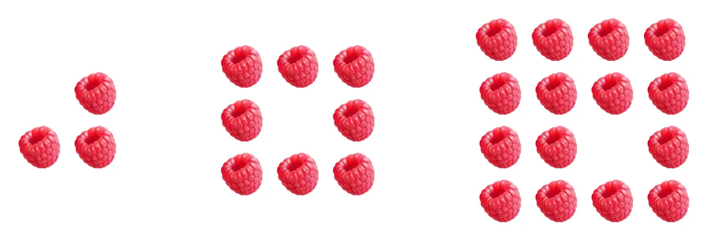

# Challenge Problems -- MTH 225 Winter 2024 

## General notes about these problems 

- You do not need to work every single one of these problems. A grade of "A" in the course requires ten (10)  Successful solutions; a "B" requires six (6); a "C" requires two (2). Choose problems that appeal to your curiosity and interest. 
- You are to submit **typewritten** solutions that are **clear, correct, and complete**. Please see the Standards for Student Work document for details on the criteria on what these mean. 
- Your solution **must represent your ideas, that you yourself generated, and must be given in your own voice**. They cannot significantly consist of ideas from another person or from an artificial intelligence tool, and they must be given in your own words. Violations of this policy will be investigated as academic misconduct. See the syllabus for the full policy. 
- Challenge Problem submissions are graded "Success" or "Retry". Perfection is not required for "Success", but your solutions need to be free of major errors, and consist of complete good-faith efforts that are clearly communicated. Again, see the Standards for Student Work document for details on the criteria used to determine "Success". 
- Generally speaking, **your grade on a Challenge Problem is based on the quality of the explanation you give, not the correctness of answers.** Strive to make sure your solutions are correct, clear, and complete relative to the standard audience for these solutions. 
- If you receive a "Success" mark on a submission, you are done with that problem. Otherwise ("Retry") you may submit a revision at any time, through April 14. 
- **You are allowed up to three (3) Challenge Problem submissions per week**: Three new solutions, three revisions, or any combination of new solutions and revisions. 

Also, generally speaking **I (Talbert) will not "look over" your work before it's submitted to look for mathematical, logical, or other errors**. Just do your best, give a complete good-faith effort, and if a revision is needed, you'll have the opportunity to do so with detailed feedback from me and without any penalty. 

---

## Problem List 

### Problem 1

1. If $n$ is any positive integer, what is the binary representation for $2^n$? Give an answer to this question that is specific and clear as possible, then *explain why your answer is correct*. 
2. If $a$ is any positive integer, suppose you convert it to binary and then add it to itself. How does the binary form of the result compare to the binary form of $a$, the original integer? Give an answer to this question that is specific and clear as possible, then *explain why your answer is correct*.
3. In [the video about the base 10 conversion algorithm](https://vimeo.com/578187581), it was stated that we can use that algorithm to convert a decimal integer into *any* base, not just base 2, 8, or 16. [Go to this website](https://numbergenerator.org/random-6-digit-number-generator) and generate a random 6-digit integer in base 10. Then use the algorithm to convert this integer into **base 20**. See below for a mini-explanation of base 20. Show all your work and explain what you're doing. 

**Mini-tutorial on base 20**: A number in base 20 is written as a sum of powers of 20. For example, if $(371)_{20}$ is in base 20, then in base 10 this is...
$$(3 \times 20^2) + (7 \times 20^1) + (1 \times 20^0) = 1200 + 140 + 1 =  1341$$
In base 16 we had to expand our set of digits we could use, adding the letters A-F to the usual digits 0-9. In base 20, we could have place values from 0 to 19, so we need to add more digits. For this, we use the usual 0-9 and the letters A, B, C, D, E, F **and the letters G, H, I, and J** to represent 16, 17, 18, and 19. So for example, the integer J6GA in base 20 when converted to base 10 is
$$J6GA = (19 \times 20^3) + (6 \times 20^2)+ (16 \times 20^1) + (10 \times 20^0) = 154730.$$
Likewise, the decimal number $2052$ is $52C$ in base 20 (which you can check using the algorithm!).

**Notes and requirements:** In addition to the usual criteria for successful work found in the [Standards for Student Work document](https://github.com/RobertTalbert/discretecs/blob/master/MTH225-Winter2024/course-docs/Standards%20for%20Student%20Work%20W24.md), please note: 

- Your explanations in the first two parts cannot consist only of examples. Remember, examples do not explain why a general statement is always true. Give an explanation that does not rely on any specific choice of the integer. 
- You may also not just give a few more examples and say something like "The pattern continues" or "Every other integer works the same way". This is too reliant upon specific examples. 


### Problem 2 

The [base conversion algorithm](https://publish.obsidian.md/mth225/Computer+Arithmetic/Base+conversion+algorithm) is a fundamental topic in the course, and being able to use it is the main idea in Supplemental Skill S1. But the video content and the vault never explain *why* this algorithm always works --- they only illustrate how to perform the steps. In computer science, this is not good enough: We want to know not only how to implement an algorithm but also explain why it works, without just using examples. 

In this Challenge Problem, you'll focus on explaining just one part of the algorithm: Its **stopping criterion**. This is a condition that, when met, causes the algorithm to stop and return a result. Every algorithm must have a stopping criterion, and this stopping criterion must be guaranteed to always happen, otherwise the algorithm can enter an infinite loop and never stop. For the base 10 conversion algorithm, the stopping criterion is **the quotient equalling zero** during the process of dividing. When the quotient hits zero, we stop and list the remainders back in reverse order. But, question: **Does the quotient always end up being zero, regardless of the input? And if so, why?** 

To get an answer to this question, you'll be doing two things: Critiquing the explanations produced by generative AI tools, and then coming up with your own explanation. 

1. [This document shows](https://docs.google.com/document/d/1xoGyxRGJVPP33RjuV5jJNXhS4b0LBI8JEfz5jdjN4ow/edit?usp=sharing) the output from three different AI tools --- ChatGPT, ~~Bard~~ Gemini (Google's AI tool), and CoPilot (Microsoft) --- when given the prompt: *In the base conversion algorithm, why does the quotient always end up being zero?* This is the prompt that someone might give, if they were looking for a computer to explain the answer to this question rather than coming up with their own ideas. Read through all three responses and do the following for each AI repsonse: 

   (a) Summarize the answer to the question ("Why does the quotient always end up being zero?") in 1-2 sentences. 
   
   (b) Our standard for verbal explanations is that they must be clear, correct, and complete. In the Standards for Student Work document, it states that 

>Your standard audience for Challenge Problems is a classmate in MTH 225 who is new to the problem: Someone who has the mathematical and technical background that you have from their study in the course, but who has no knowledge of the problem you are solving. All solutions need to be aimed at this audience unless it says otherwise. Before you turn in a submission of a Challenge Problem, ask yourself honestly: If I were receiving this solution from a classmate, would I be able to understand the solution and agree with the results, using only what is in the solution along with the basic skills from the class? If the answer is "no", then keep working to make the solution clearer, more correct, or more complete.

Based on this standard -- and putting yourself in the shoes of the MTH 225 student reading the work --- would you rate the AI's response as "Successful", or does it need to be revised? Why? Be as specific as possible, and don't be afraid to be critical! This is an AI, not a person. 

2. A "Successful" explanation of why a condition is *always* met, must not rely on specific examples. If you removed any specific examples from the explanation, what's left over should complete the statement *This condition is always met regardless of the specific inputs, because...* in a way that is clear, complete, and mathematically correct. It should convince you without your "BS detector" going off and without you needing to do extra work beyond what's given in the explanation. In your view, do any of these AI responses meet that standard? If so, which ones, and why? If not, which ones, and why not? 

3. Prepare your own explanation, that meets all the standards we've discussed above and does not merely paraphrase the AI's or a combination of the AI's.


### Problem 3

An early topic in the course is **logical connectives**. We studied four of these: "and" ($\wedge$), "or" ($\vee$), "not" ($\neg$), and "if-then" ($\rightarrow$). But there are others -- and there might be relationships between them. 

1. One important connective is "if and only if", denoted by a double headed arrow $\leftrightarrow$. Look up a truth table for $P \leftrightarrow Q$ to see how it works. Then, show that $P \leftrightarrow Q$ is logically equivalent to the proposition $(P \rightarrow Q) \wedge (Q \rightarrow P)$. (Note: What's the clearest and simplest way to show two statements are logically equivalent?)
2. The first part of this problem shows why we didn't discuss "if and only if" in class: It's **dependent on** (or "built using") other logical connectives. That is, if somebody doesn't understand $P \leftrightarrow Q$, you can explain that it's the same thing as $(P \rightarrow Q) \wedge (Q \rightarrow P)$. Using only the connectives $\wedge$ and $\neg$, can you explain any of the other three ($\vee$, $\rightarrow$, $\leftrightarrow$) in a similar way? Which ones, and how? And, if there are any that *cannot* be explained using these two connectives, explain why not.  
3. Redo part 2 but start with the connectives $\rightarrow$ and $\neg$. 
4. If you started with only $\leftrightarrow$, could you explain any of the other four? If so, then which ones? If not, then why not? 

Side note: This general problem, which has to do with the expressibility of compound logical statements using a small set of basic logical operators, is a key topic in advanced computer science and language design. 


### Problem 4

Below is a visual pattern involving raspberries. Steps 1, 2, and 3 of the pattern are shown. 


1. Draw, by hand or with a computer program, the figures that would appear in steps 4 and 5. Then explain, briefly but in detail, how you know these figures accurately represent the pattern. **Your explanation must address exactly how the figure in a given step is visually incorporated into the figure in the next step**. 
2. Using only the visual description from the first part, write a recurrence relation for $R(n)$, the number of raspberries in step $n$. Explain, briefly but in detail, why your recurrence relation accurately represents the visual progression of figures that you addressed in part 1. Assume that we start indexing at $n=1$, so $R(1)$ is the number of raspberries in the initial figure. And note that we can directly observe that $R(1) = 3$. 
3. Since $R(1)$ is the number of raspberries in the initial figure, we know that Use the recurrence relation in part 2 to compute $R(2), R(3), R(4), \dots, R(10)$. (Remember you don't "compute" $R(1)$ because that's given to you as an initial condition, $R(1) = 3$.) To show your work, you can do one of two things: *Write out all the steps mathematically* using the recurrence relation, or *write a Python function* that implements your recurrence relation and then use Python to do your computations. If you opt for Python, you can either copy and paste your code into your writeup, or put it on [gist.github.com](https://gist.github.com) and share the link in your writeup; your code must be a **recursive function**, that is, a Python function (not just a block of code, but a function) that uses recursion. If you opt for showing your steps without Python, you must use the recurrence relation from part 2. 
4. Whichever method you choose in part 3, go back to your visualizations and check that the first five results ($R(1)$ through $R(5)$) agree with the visual pattern itself. That is, actually count the raspberries in the pictures and then compare to your computations. They should be the same. If not, something needs to be fixed! There's nothing to turn in on this step, it's just a "BS detection" step you need to engage with. 


### Problem 5

Suppose you're given an alphabetized list of words, specifically a Python list containing strings. For example: 

```python
words = ["Are", "Body", "Career", "Computer", "Dam", "Mathematics", "Science", "Ugh", "Why"]
```

Remember that in Python, lists are zero-indexed, so for example `words[0] = "Are"` and `words[2] = "Career"`. Suppose that you are given a new word, and your job is to first determine if the word is currently on the list, and if it is, to find where (by giving its index in the list). 

Here is a basic Python function that does this. Its inputs are the list of words (again, assume the list is alphabetized already) and the new word. 

```python
def s(word_list, word):
  i = 0
  while i < len(word_list):
    if word == word_list[i]: 
      print(i)
      break
    elif word < word_list[i]: 
      print("Fail") 
      break
    else: i += 1
  if i >= len(word_list): 
    print("Fail")
```

(Note: This code works but it might not be totally efficient.) 

The problem is: **Rewrite this code as a recursive Python function**. 

Your submission on this should consist of: 
1. **The code itself**, saved as a public GitHub Gist, and you will **share the link to the Gist**. [Click here for instructions on how to do this](https://docs.github.com/en/get-started/writing-on-github/editing-and-sharing-content-with-gists/creating-gists), and ask for help if you need it. You'll need to create a GitHub account, but if you are involved in computer science then your GitHub presence will be an essential part of your professional portfolio in the future, so it's worth it. 
2. **An explanation for how you wrote your code**. Explain it to someone with the same amount of Python background as you but who has no experience with this particular problem. Write this up separately, in a Word or other text document and submit a PDF in the appropriate assignment folder on Blackboard. *Do not simply add comments to your code* or include an explanation in the code; doing so will result in a "Retry" and no feedback will be given. 

**The resulting Python function *must* be recursive and it must run correctly**, producing correct results with no syntax errors. Functions that are not recursive or which produce syntax errors when entered will be marked "Retry" with no feedback given. 


### Problem 6

Define an integer sequence $c_n$ recursively as follows: Define $c_0 = 0$, $c_1 = 2$, $c_2 = 2$, and for all $n > 2$ define $c_n = c_{n-1} + 3c_{n-3}$. Prove using mathematical induction that for all $n \in \mathbb{N}$, $c_n$ is even. 

Notes on this problem: 
- $\mathbb{N}$ is the set of all natural numbers: $\mathbb{N} = \lbrace 0,1,2,3,4,\dots \rbrace$
- An integer is defined to be "even" if it is a multiple of 2; that is, $k$ is even if there exists another integer $m$ such that $k = 2m$. (Question you will need to answer: Under this definition, is the number $0$ even?)

### Problem 7

The **logarithm base 2** of a number $x$, written $\log_2(x)$, is a math function that plays an outsized role in computer science, especially in the analysis of algorithm performance. It is defined as **the power to which you would raise $2$ in order to get $x$**. That is, if $\log_2(x) = a$ then $2^a = x$. For example, $\log_2(8) = 3$, $\log_2(1024) = 10$, and (using a calculator) $\log_2(100)$ is around $6.644$. You can compute more values of the logarithm base 2 using Wolfram|Alpha; [click here for an example](https://www.wolframalpha.com/input?i=log+base+2+of+1000). Or in Python, enter `import math` to load a library of special math functions and then use the `math.log2` function. For example, `print(math.log2(1000))` will print the logarithm base 2 of $1000$ (assuming the `math` library was imported first). 

Consider the following recursive function, given here as Python code: 

```python
def r(n):
	if n == 1: 
		return 0
	else:
		L = r(n//2)
	return L+1
```

Here, the `//` sign means **integer division**, that is, regular division but drop the remainder. For example `19//2` equals `9`.

With this information, prove using mathematical induction that for all integers $n \geq 1$, the value that is output by this algorithm for `r(n)` is $\lfloor \log_2(n) \rfloor$, that is, the logarithm base 2 of $n$ rounded down to the next lowest integer. (The "floor function" $\lfloor x \rfloor$ simply means round down to the next lowest integer; for example $\lfloor 3.999 \rfloor = 3$.) 

### Problem 8

Problem 8 doesn't necessarily have anything to do with MTH 225, it's just a fun problem. 

If you write out the numbers 1 through 4 in words -- "one", "two", "three", "four" -- then you use 15 letters: Three letters each for "one" and "two", five letters for "three", and four letters for "four", so $3+3+5+4 = 15$.

**Problem**: **If all the numbers from 1 to 900 were written out in words, how many letters would you use?** 

Rules for this problem: 
- **ADDED 2024-02-19:** If you use code to solve this problem:
  - You must use Python and not some other language, unless you get my permission first.
  - You may not use external libraries. That is, `import` statements are not allowed. You are to use "base" Python only (and it's all you need).
  - You may not use object-oriented programming techniques such as classes. (They're not necessary.)
- Do not count spaces or hyphens. 
- Use the word "and" when working with numbers over 100, for example 245 is "two hundred and forty five" (a total of 23 letters). 
- You can solve this problem any way you like, other than "brute force", that is, by actually writing out all the numbers from 1 to 900 and counting words. You can write code for it; or devise a mathematical shortcut; or anything else you can think of. 
- But whatever you end up doing, your submission must clearly state your answer *and* especially, you must give a correct, complete, and clear explanation that thoroughly explains how you arrived at the answer. 