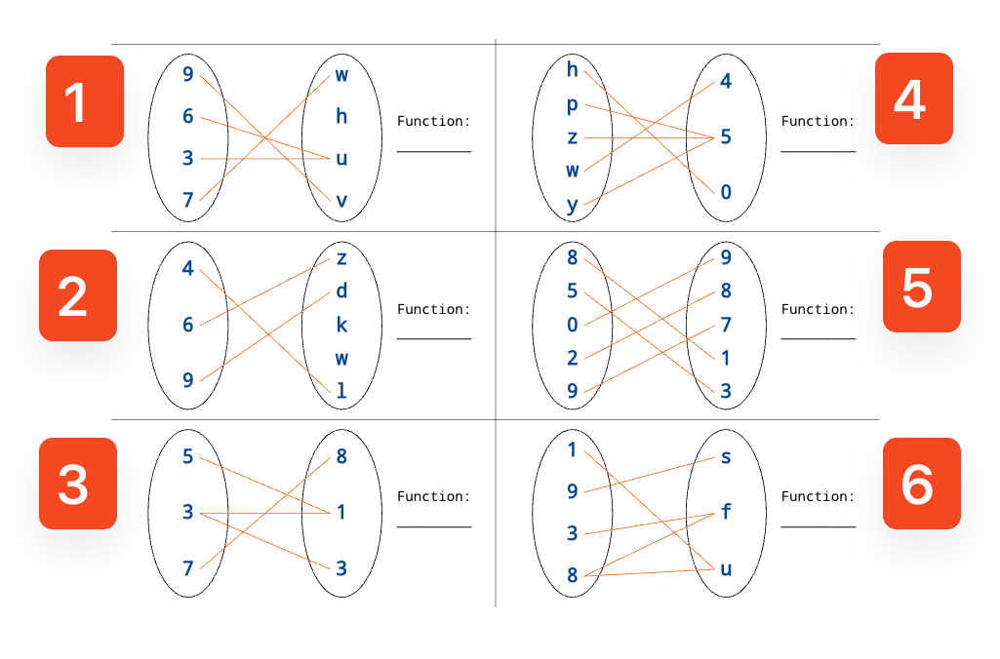

# MTH 225: Learning Target Exam 3 -- Solutions Guide 

## NOTES ON THIS GUIDE

Answers for Learning Targets 3 and 5 are not given in this guide because they can be checked using a technological tool. Please consult [the "How To Practice" guide](https://github.com/RobertTalbert/discretecs/blob/master/MTH225-Winter2025/How%20to%20practice.md) for links to those tools. 

---

## Learning Target 1

>(**CORE**) Given two integers $a$ and $b$, I can find the quotient and remainder when dividing $a$ by $b$, the greatest common divisor of $a$ and $b$ using the Euclidean Algorithm, and the value of `a % b`.

1. Use long division to find the quotient and remainder when dividing 44667 by 123.
2. Use the Euclidean Algorithm to find the greatest common divisor of 44667 and 123.
3. Find the value of the following: 
   - a. `44667 % 123`.
   - b. `123 % 44667`.
   - c. `44667 % 44667`.

**Answers:**

1. Quotient is 363 and remainder is 18. For steps, use the checking tool from the "How To Practice" document.
2. The algorithm proceeds like this: 

$$\begin{eqnarray*}
44667 &=& 363 \cdot 123 + 18 \\
123 &=& 6 \cdot 18 + 15 \\
18 &=& 1 \cdot 15 + 3 \\
15 &=& 5 \cdot 3 + 0
\end{eqnarray*}$$

The algorithm stops here since the remainder is zero. The GCD is the last nonzero remainder we get, which is 3. 

3. 
   - a. `44667 % 123` is 18 as we found in the long division.
   - b. `123 % 44667` is 123 because 123 is less than 44667.
   - c. `44667 % 44667` is 0 because 44667 is divisible by 44667.

## Learning Target 2

>I can convert a positive integer between bases 2, 8, 10, and 16; and I can represent a negative integer in binary using twos complement.

1. Convert the decimal (base 10) number 44667 to hexadecimal using the base conversion algorithm. 
2. Convert the binary number 10110111 to decimal (base 10). 
3. Convert the octal number 127 to decimal (base 10).

**Answers:**

1. The algorithm proceeds like this:
   - $44667 \div 16 = 2791$ remainder 11, which is B in hexadecimal.
   - $2791 \div 16 = 174$ remainder 7.
   - $174 \div 16 = 10$ remainder 14, which is E in hexadecimal.
   - $10 \div 16 = 0$ remainder 10, which is A in hexadecimal.
   - So, $44667 = \text{AE7B}_{16}$. 
2. $10110111 = 1 \cdot 2^7 + 0 \cdot 2^6 + 1 \cdot 2^5 + 1 \cdot 2^4 + 0 \cdot 2^3 + 1 \cdot 2^2 + 1 \cdot 2^1 + 1 \cdot 2^0 = 183$.
3. $127 = 1 \cdot 8^2 + 2 \cdot 8^1 + 7 \cdot 8^0 = 87$.

## Learning Target 4

>(**CORE**) I can identify the hypothesis and conclusion of a conditional statement and state its converse, contrapositive, and negation.

Consider the implication: If $n$ is an odd integer, then $n^2$ is an odd integer.

1. State the hypothesis and conclusion of the implication.
2. State the converse of the implication.
3. State the contrapositive of the implication.
4. State the negation of the implication.

**Answers:**

1. Hypothesis: $n$ is an odd integer. Conclusion: $n^2$ is an odd integer.
2. Converse: If $n^2$ is an odd integer, then $n$ is an odd integer.
3. Contrapositive: If $n^2$ is an even integer, then $n$ is an even integer.
4. Negation: The integer $n$ is odd and $n^2$ is even.

## Learning Target 6

>Given a predicate, I can state the free variable(s); determine whether quantified forms are true or false; and state its negation.

1. For each quantified predicate below, state whether it is True or whether it is false. The domain of each predicate is $\mathbb{N} = \lbrace 0, 1, 2, 3, \dots \rbrace$. 
   - a. $\forall n, n^2 \geq n$
   - b. $\exists n, n^2 = 2n$
2. State the free variable(s) in each predicate. If there are no free variables, say so. 
   - a. $\forall n, n^2 \geq n$
   - b. $\exists x \exists y, x + y = 0$
   - c. $\forall x, x + y = 0$
3. State the negation of the statement: *Every natural number is either even or odd.* Phrase the result in clear English and do not just put the word "not" or "it is not the case that" in front of the original statement. 

**Answers:**

1. 
   - a. True. 
   - b. True. For example, $n = 0$ is a solution.
2. 
   - a. No free variables. 
   - b. No free variables. 
   - c. Free variable: $y$. 
3. There exists a natural number that is neither even nor odd.  

## Learning Target 7

>I can determine whether a sequence of statements is a valid rule of deduction and determine if two statements are logically equivalent. 

1. Use a truth table to determine if the argument with premises $p \rightarrow q$ and $q \rightarrow r$, and conclusion $p \rightarrow r$ forms a valid rule of deduction.
2. Use a truth table to determine if the propositions $p \lor q$ and $(\neg p) \land (\neg q)$ are logically equivalent.

**Answers:**

1. The truth table for the argument is as follows:

| p | q | r | p→q | q→r | p→r |
|---|---|---|-----|-----|-----|
| T | T | T | T   | T   | T   |
| T | T | F | T   | F   | F   |
| T | F | T | F   | T   | T   |
| T | F | F | F   | T   | F   |
| F | T | T | T   | T   | T   |
| F | T | F | T   | F   | T   |
| F | F | T | T   | T   | T   |
| F | F | F | T   | T   | T   |

The argument is valid because the conclusion is true whenever the premises are true (see rows 1, 5, 7, 8). 

2. The truth table for the propositions is as follows:

| p | q | p ∨ q | ¬p | ¬q | (¬p) ∧ (¬q) |
|---|---|-------|-----|-----|-------------|
| T | T | T     | F   | F   | F           |
| T | F | T     | F   | T   | F           |
| F | T | T     | T   | F   | F           |
| F | F | F     | T   | T   | T           |

The two statements are not logically equivalent because the last column is not the same as the third column.

## Learning Target 8

>Given a recurrence relation for a sequence or other structure, I can find several instances of the sequence or structure.

**Note**: The recurrence relations here use subscripts instead of function notation. So, $a_n$ means $a(n)$, $a_{n-1}$ means $a(n-1)$, and so on. 

1. Consider the recurrence relation $a_n = 2a_{n-1} - 3a_{n-2}$ with initial conditions $a_0 = 1$ and $a_1 = 2$. Find the first five terms of the sequence.
2. Consider the recurrence relation $a_n = 3a_{n-1} + n$ with initial condition $a_0 = 1$. Find the first five terms of the sequence.
3. Consider the following set defined recursively: The number $2$ is an element of the set, and if $a$ is an element of the set then $a/2$ is also an element of the set. List at least five elements of the set.

**Answers:**

1. The first five terms of the sequence are $1, 2, 1, 4, -5$: 

$$\begin{eqnarray*}
a_0 &=& 1 \\
a_1 &=& 2 \\
a_2 &=& 2 \cdot 2 - 3 \cdot 1 = 1 \\
a_3 &=& 2 \cdot 1 - 3 \cdot 2 = 4 \\
a_4 &=& 2 \cdot 4 - 3 \cdot 1 = -5
\end{eqnarray*}$$

2. The first five terms of the sequence are $1, 4, 13, 40, 121$.

$$\begin{eqnarray*}
a_0 &=& 1 \\
a_1 &=& 3 \cdot 1 + 0 = 4 \\
a_2 &=& 3 \cdot 4 + 1 = 13 \\
a_3 &=& 3 \cdot 13 + 2 = 40 \\
a_4 &=& 3 \cdot 40 + 3 = 121
\end{eqnarray*}$$

3. The first five elements of the set are $2, 1, \frac{1}{2}, \frac{1}{4}, \frac{1}{8}$. Since $2$ is in the set, so is $2/2$ which is $1$. Since $1$ is in the set, so is $1/2$. Since $\frac{1}{2}$ is in the set, so is $\frac{1}{4}$. And so on.

## Learning Target 9

>(**CORE**) Given a statement to prove by mathematical induction, I can set up the framework for its proof.

Consider the statement: For all positive integers $n$, $1 + 2 + 3 + \dots + n = \dfrac{n(n+1)}{2}$. 

Suppose we want to prove this statement by induction.

1. State the predicate involved in the proposition.
2. State the value of the variable that corresponds to the base case. 
3. Prove that the base case holds. 
4. State the inductive hypothesis. 
5. State the inductive step (what you would need to prove to complete the argument). Note, you do not need to provide a completed proof here. 

**Answers:**

1. Predicate: $P(n)$ is the statement $1 + 2 + 3 + \dots + n = \dfrac{n(n+1)}{2}$.
2. Base case: $n = 1$.
3. Base case: When $n=1$, the left side of the equation in the proposition is just the single term, $1$. And, the right side is $\dfrac{1(1+1)}{2} = 1$. So, $P(1)$ is true.
4. Inductive hypothesis: Assume $1 + 2 + 3 + \dots + k = \dfrac{k(k+1)}{2}$ is true for some $k \geq 1$.
5. Inductive step: Prove $1 + 2 + 3 + \dots + k+1 = \dfrac{(k+1)(k+2)}{2}$. 

## Learning Target 10

>Given a set in roster notation, I can rewrite it in set-builder notation and vice versa, and I can determine its elements and subsets.

1. Given the set $A = \lbrace 1, 2, 3 \rbrace$, list all the subsets of $A$.
2. Given the set $B = \lbrace x \in \mathbb{N} \, | \, 1 \leq x \leq 5 \rbrace$, list all the elements of $B$. If you believe this is incorrect set syntax, state why.
3. Given the set $C = \lbrace x \, | \, x \in \mathbb{Z} \, \text{and} \, x \, \text{is even} \rbrace$, write $C$ in roster notation. If you believe this is incorrect set syntax, state why.
4. Given the set $D = \lbrace x \, \% 10 \, | \, x \in \mathbb{N} \rbrace$, write $D$ in set-builder notation. If you believe this is incorrect set syntax, state why.

**Answers:**

1. The subsets of $A$ are $\emptyset$, $\lbrace 1 \rbrace$, $\lbrace 2 \rbrace$, $\lbrace 3 \rbrace$, $\lbrace 1, 2 \rbrace$, $\lbrace 1, 3 \rbrace$, $\lbrace 2, 3 \rbrace$, and $\lbrace 1, 2, 3 \rbrace$.
2. This is correct set syntax. The elements of $B$ are $1, 2, 3, 4, 5$. 
3. This is correct set syntax. $C = \lbrace x \, | \, x \in \mathbb{Z} \, \text{and} \, x \, \text{is even} \rbrace = \lbrace \dots, -4, -2, 0, 2, 4, \dots \rbrace$.
4. This is correct set syntax. (But there was a typo, should say "roster notation" not "set builder".) $D = \lbrace x \, \\% 10 \, | \, x \in \mathbb{N} \rbrace = \lbrace 0, 1, 2, 3, 4, 5, 6, 7, 8, 9 \rbrace$. 

## Learning Target 11

>(**CORE**) I can find the union, intersection, Cartesian product, and difference of two sets; the complement of a set; and the cardinality of a finite set.

**Note**: We usually indicate the complement of a set $A$ by putting a bar over the $A$. However this notation doesn't render well online or in some of the publishing tools I am using. Therefore we will use $A^c$ to indicate the complement of $A$ from here on out. 

Consider the sets $A = \lbrace 1, 2, 3 \rbrace$ and $B = \lbrace 2, 3, 4 \rbrace$, $C = \lbrace  6,7,8 \rbrace$ and the universal set $U = \lbrace 1, 2, 3, 4, 5 \rbrace$.

1. State $A \cup B$.
2. State $A \cap B$.
3. State $A \times C$.
4. State $A \setminus B$.
5. State $A^c$.
6. State $|A|$.

**Answers:**

1. $A \cup B = \lbrace 1, 2, 3, 4 \rbrace$.
2. $A \cap B = \lbrace 2, 3 \rbrace$.
3. $A \times C = \lbrace (1, 6), (1
, 7), (1, 8), (2, 6), (2, 7), (2, 8), (3, 6), (3, 7), (3, 8) \rbrace$.
4. $A \setminus B = \lbrace 1 \rbrace$.
5. $A^c = \lbrace 4, 5 \rbrace$.
6. $|A| = 3$.

## Learning Target 12

>I can determine if a mapping between two sets is a function; if it is, I can determine if it is injective, surjective, and/or bijective.

Below are six mappings between sets, numbered 1 through 6. For each mapping, state if it is a function, and if it is a function, also state if it is injective, surjective, and/or bijective or none of these. 

</img>

**Answers:**

1. This is a function. It is neither injective nor surjective. 
2. This is a function. It is injective but not surjective.
3. This is not a function (3 maps to two outputs). 
4. This is a function. It is surjective but not injective.
5. This is a function. It is bijective.
6. This is not a function (8 maps to two outputs). 

## Learning Target 13

>(**CORE**) I can solve simple counting problems that involve a combination of the Additive Rule, Multiplicative Rule, and Principle of Inclusion/Exclusion.

Solve the following counting problems. Be sure to show all work, and explain your reasoning. Responses that consist only of answers, even if correct, will not be rated as *Master*. Responses that are illegible or very difficult to follow will also not be rated as *Master*. 

1. A student owns 8 pairs of pants, 8 shirts, 2 ties, and 8 jackets. How many different outfits can the student wear to school if each outfit must consist of one of each item?
2. A standard Missouri state license plate consists of a sequence of two letters, one digit, one letter, and one digit. An example is `CX8 W2`. There are no other restrictions on the contents of the plate. How many such license plates can be made?
3. In a class of 30 students, 18 students like basketball, 15 students like soccer, and 12 students like both basketball and soccer. How many students like basketball or soccer (or both)?

**Answers:**

1. There are $8 \times 8 \times 2 \times 8 = 1024$ different outfits. (Uses the Multiplicative Principle)
2. There are $26 \times 26 \times 10 \times 26 \times 10 = 1,690,000$ different license plates. (Uses the Multiplicative Principle, it is literally a license plate problem)
3. There are $18 + 15 - 12 = 21$ students who like basketball or soccer. (Uses the Principle of Inclusion/Exclusion)