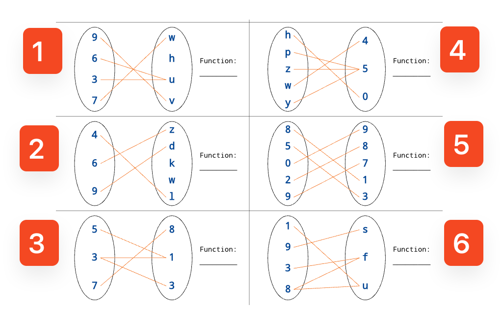

# MTH 225: Learning Target Exam 4

## Instructions

**NEW RULES regarding Learning Targets you have already mastered:**

1. You may not attempt any Learning Target on which you already have a rating of *Master*.
2. If you do reattempt a Learning Target on which you have a rating of *Master*, you will receive a 10 point deduction from your engagement credit total for each Learning Target you attempt on which you already have a rating of *Master*.
3. Also, if you reattempt a Learning Target on which you have a rating of *Master*, you will receive whatever rating you earn on that Learning Target, even if it is lower than *Master*.

These rules are in place for all Learning Target reattempts from now on, including the final exam and mini-exams. 

Additionally on this exam: 

- Put no more than one Learning Target on a single page, including the back of that page. One Learning Target per piece of paper you are handing in. 
- Put your name at the top of each page you submit. 
- As always: **You must show your work and explain your reasoning clearly and in complete sentences in order to earn a rating of *Master* unless the problem clearly says otherwise** -- for example if it asks you merely to "State" something. 

---

## Learning Target 1

>(**CORE**) Given two integers $a$ and $b$, I can find the quotient and remainder when dividing $a$ by $b$, the greatest common divisor of $a$ and $b$ using the Euclidean Algorithm, and the value of `a % b`.

1. Use long division to find the quotient and remainder when dividing 3438 by 12.
2. Use the Euclidean Algorithm to find the greatest common divisor of 3438 and 12.
3. Find the value of the following: 
   - a. `5555555555555 % 5`.
   - b. `3438 % 12`.
   - c. `12 % 12`.

## Learning Target 2

>I can convert a positive integer between bases 2, 8, 10, and 16; and I can represent a negative integer in binary using twos complement.

1. Convert the decimal (base 10) number 3438 to octal using the base conversion algorithm. 
2. Convert the binary number `11001101` to decimal (base 10). 
3. Convert the hexadecimal number `33F` to decimal (base 10).

## Learning Target 3

>I can perform arithmetic operations on binary numbers. 

1. Compute the sum of the binary numbers 10111011 and 11001100.
2. Compute the difference of the binary numbers 11100111 and 10001100.
3. Compute the product of the binary numbers 1011 and 10.
4. Compute the quotient and remainder when dividing 10011 by 11.

## Learning Target 4

>(**CORE**) I can identify the hypothesis and conclusion of a conditional statement and state its converse, contrapositive, and negation.

Consider the implication: *If $p$ is a prime number, then $p$ is odd.*

1. State the hypothesis and conclusion of the implication.
2. State the converse of the implication.
3. State the contrapositive of the implication.
4. State the negation of the implication.

## Learning Target 5

>I can write the truth table for a statement containing two or three variables.

Write the truth tables for the following statements. Be sure to include all intermediate columns. 

1. $(p \lor q) \land r$
2. $(p \land q) \rightarrow r$

## Learning Target 6

>Given a predicate, I can state the free variable(s); determine whether quantified forms are true or false; and state its negation.

1. For each quantified predicate below, state whether it is True or whether it is false. The domain of each predicate is $\mathbb{N} = \lbrace 0, 1, 2, 3, \dots \rbrace$. 
   - a. $\forall n, n^2 < n$
   - b. $\exists n, n^2 \leq n$
2. State the free variable(s) in each predicate. If there are no free variables, say so. 
   - a. $\exists n, n^2 \leq n$
   - b. $\exists x \exists y, x + y + z= 0$
   - c. $\forall y, x + y = 0$
3. State the negation of the statement: *Some prime numbers are even.*  Phrase the result in clear English and do not just put the word "not" or "it is not the case that" in front of the original statement. 

## Learning Target 7

>I can determine whether a sequence of statements is a valid rule of deduction and determine if two statements are logically equivalent. 

1. Use a truth table to determine if the argument with premises $p \rightarrow r$ and $q \rightarrow r$, and conclusion $p \rightarrow q$ forms a valid rule of deduction.
2. Use a truth table to determine if the propositions $p \land q$ and $(\neg p) \land (\neg q)$ are logically equivalent.

## Learning Target 8

>Given a recurrence relation for a sequence or other structure, I can find several instances of the sequence or structure.

**Note**: The recurrence relations here use subscripts instead of function notation. So, $a_n$ means $a(n)$, $a_{n-1}$ means $a(n-1)$, and so on. 

1. Consider the recurrence relation $a_n = a_{n-1} + 2a_{n-2}$ with initial conditions $a_0 = 5$ and $a_1 = 3$. Find the first six terms of the sequence.
2. Consider the recurrence relation $a_n = a_{n-1} + n^2$ with initial condition $a_0 = 1$. Find the first five terms of the sequence.
3. Consider the following set defined recursively: The numbers $2$ and $3$ are elements of the set, and if $a$ is an element of the set then $2a$ is also an element of the set. List at least five elements of the set.

## Learning Target 9

>(**CORE**) Given a statement to prove by mathematical induction, I can set up the framework for its proof.

Consider the statement: *For all positive integers $n$, $3^n - 1$ is even*. Suppose we want to prove this statement by induction.

1. State the predicate involved in the proposition.
2. State the value of the variable that corresponds to the base case. 
3. Prove that the base case holds. 
4. State the inductive hypothesis. 
5. State the inductive step (what you would need to prove to complete the argument). Note, you do not need to provide a completed proof here. 

## Learning Target 10

>Given a set in roster notation, I can rewrite it in set-builder notation and vice versa, and I can determine its elements and subsets.

1. Below are several statements about sets and elements. Label each one as **TRUE** or **FALSE**. 

   a) $5 \in \emptyset$

   b) $\{6,7,8\} \subseteq \{5,7,9\}$

   c) $\frac{1}{2} \in \mathbb{Z}$ 

   d) $\mathbb{Z} \subseteq \mathbb{N}$ 

   e) $\emptyset \subseteq \{1,2,3,4,5\}$

   

2. Here are three sets written in set-builder notation. For each, if the set is written using correct set syntax, rewrite it using roster notation. If the set is written using incorrect syntax, write **INCORRECT SYNTAX**. 

   a) $\lbrace n \in \mathbb{N} \, : \, n \, \% \, 3 = 1 \rbrace$

   b) $\lbrace n \in \mathbb{N} \, : \, 2^n \rbrace$ 

   c) $\lbrace  x \, \% \, 3 \, : \, x\in \lbrace 1,2,3,\dots 10 \rbrace \rbrace$

## Learning Target 11

>(**CORE**) I can find the union, intersection, Cartesian product, and difference of two sets; the complement of a set; and the cardinality of a finite set.

**Note**: We usually indicate the complement of a set $A$ by putting a bar over the $A$. However this notation doesn't render well online or in some of the publishing tools I am using. Therefore we will use $A^c$ to indicate the complement of $A$ from here on out. 

Consider the sets $A = \lbrace 0, 1, 2, 3, 4 \rbrace$,  $B = \lbrace 4, 5, 6 \rbrace$, $C = \lbrace  6,7,8 \rbrace$ and the universal set $U = \lbrace 0, 1, 2, \dots, 10  \rbrace$.

1. State $B \cup C$.
2. State $A \cap B$.
2. State $B \times C$.
3. State $C \setminus A$.
4. State $B^c$.
5. State $|A|$.

## Learning Target 12

>I can determine if a mapping between two sets is a function; if it is, I can determine if it is injective, surjective, and/or bijective.

Below are six mappings between sets, numbered 1 through 6. For each mapping, state if it is a function, and if it is a function, also state if it is injective, surjective, and/or bijective or none of these. 

</img>

## Learning Target 13

>(**CORE**) I can solve simple counting problems that involve a combination of the Additive Rule, Multiplicative Rule, and Principle of Inclusion/Exclusion.

Solve the following counting problems. Be sure to show all work, and explain your reasoning. Responses that consist only of answers, even if correct, will not be rated as *Master*. Responses that are illegible or very difficult to follow will also not be rated as *Master*. 

1. Standard automobile license plates in a country display 2 numbers, followed by 2 letters, followed by 3 numbers. How many different standard plates are possible in this system? (Assume repetition of letters and numbers is allowed.)
2. A ternary string is a string made up of 0's, 1's. and 2's. How many ternary strings of length 8 are there?
3. Every one of the 4000 students at Southern Michigan University owns either a tablet or a smartwatch (or both). Surveys show that 3500 students own a tablet, and 1000 students own a smartwatch. How many students own both a tablet and a smartwatch?

## Learning Target 14 

>(CORE) I can compute a binomial coefficient and solve simple counting problems that involve combinations, permutations, or k-permutations.

On the following, be sure to show all work, and explain your reasoning. Responses that consist only of answers, even if correct, will not be rated as *Master*. Responses that are illegible or very difficult to follow will also not be rated as *Master*. 

1. Compute the following. 
   - a. $\binom{10}{3}$
   - b. $\binom{20}{7}$
   - c. $\binom{100}{0}$
2. A club has 25 members. How many ways are there to choose 5 members from the club to represent the club at an activity fair? 
3. A club has 25 members. How many ways are there to choose the president, vice president, and secretary of the club if no one can hold more than one office?

## Learning Target 15 

>I can determine if a sequence is arithmetic or geometric; and I can state closed-form and recursive formulas for arithmetic and geometric sequences.

 four integer sequences. Label each one as **arithmetic**, **geometric**, or **neither**. Then, if a sequence is either arithmetic or geometric, give *both* a closed formula *and* a complete recursive definition for the sequence. **You are to assume that all starting indexes are 0, not 1**. You do not need to show your work, but your answers must conform to the Standards for Student Work Document. 

1. $4, 2, 1, 1/2, 1/4, \dots$
2. $1, 5, 6, 11, \dots$
3. $4, 8, 12, 16, 20, 24, \dots$ 
4. $0, 1, 0, 1,0, 1, \dots$
