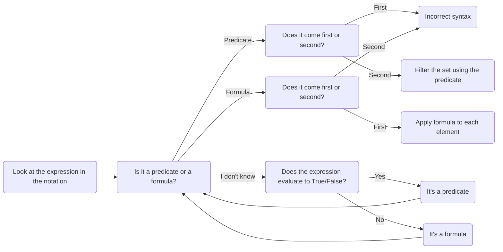

# How to work with set builder notation

This quick tutorial explains in more detail how to decide whether set builder notation is correctly done, and if so, how to convert it to roster notation. 

## Background

[Set builder notation](https://publish.obsidian.md/discretecs/Sets+and+Functions/Set-builder+notation) is a way of notating a set that does not list the elements of the set explicitly but instead describes how to build the set. There are two ways to do this: 

1. State a domain set, followed by a predicate used to filter out elements; or 
2. State a formula, followed by a domain set and then apply the formula to the domain. 

Anything else is considered incorrect syntax. Specifically: **stating the predicate first followed by the domain set is incorrect syntax** and so is **stating the domain set first followed by the formula**. The reason these are considered "incorrect" is because they do not match the way Python works with set builder notation when forming structures like [list comprehesnsions](https://www.w3schools.com/python/python_lists_comprehension.asp).

### Examples of correct/incorrect syntax

Remember that $\mathbb{Z}$ is the entire set of integers: $\mathbb{Z} = \lbrace \ldots, -3, -2, -1, 0, 1, 2, 3, \ldots \rbrace$.

| Syntax | Example | Correct/Incorrect? |
|--------|---------|--------------------|
| Domain set followed by predicate | $\lbrace x \in \mathbb{Z} : x > 0 \rbrace$ | **Correct** |
| Domain set followed by formula | $\lbrace x \in \mathbb{Z} : x^2 \rbrace$ | **Incorrect** |
| Predicate followed by domain set | $\lbrace x \\% 2 = 0 : x \in \mathbb{Z} \rbrace$ | **Incorrect** |
| Formula followed by domain set | $\lbrace x^2 : x \in \mathbb{Z} \rbrace$ | **Correct** |

## Flowchart for deciding correctness and converting to roster notation

The following flowchart can be used to determine whether the set builder notation is correct and how to convert it to roster notation. (Use the navigation tools to zoom in/out and pan around the flowchart.)

To use this flowchart, start with a set given in set builder notation. This will have two parts: A domain set, and an expression. For example if the set is $\lbrace x \in \mathbb{Z} : x > 0 \rbrace$, the domain set is $\mathbb{Z}$ and the expression is $x > 0$.

## Examples 

1. $\lbrace x \in \mathbb{Z} | x > 0 \rbrace$ 
   - This is correct syntax: It is a domain set followed by a predicate. The domain set is $\mathbb{Z}$ and the predicate is $x > 0$. 
   - To convert to roster notation, we filter the set using the predicate: $\lbrace 1, 2, 3, \ldots \rbrace$. The predicate takes the elements of the domain set and returns the ones that make the predicate "True", which in this case are all the positive integers.
2. $\lbrace x \in \mathbb{Z} | x^2 \rbrace$
   - This is incorrect syntax: It is a domain set followed by a formula. The domain set is $\mathbb{Z}$ and the formula is $x^2$. 
3. $\lbrace x \\% 2 = 0 | x \in \mathbb{Z} \rbrace$
   - This is incorrect syntax: It is a predicate followed by a domain set. The predicate is $x \\% 2 = 0$ and the domain set is $\mathbb{Z}$. Notice, $x \\% 2 = 0$ is not a formula -- it is an expression that evaluates to True/False.
4. $\lbrace x^2 | x \in \mathbb{Z} \rbrace$
   - This is correct syntax: It is a formula followed by a domain set. The formula is $x^2$ and the domain set is $\mathbb{Z}$. 
   - To convert to roster notation, we apply the formula to each element of the domain set: $\lbrace 0, 1, 4, 9, \ldots \rbrace$. The formula takes the elements of the domain set and applies the formula to them, which in this case are all the squares of the integers.
