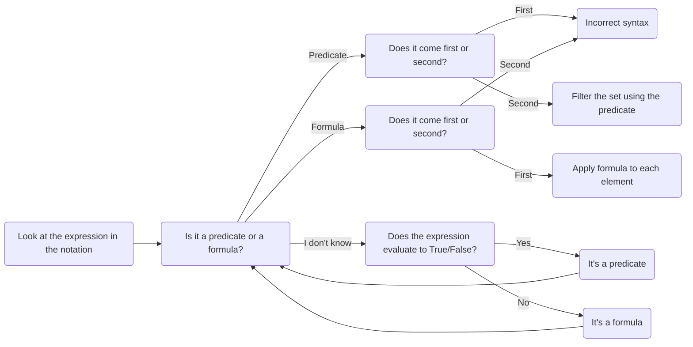

# How to work with set builder notation

```mermaid
flowchart LR

%% nodes
    A("Look at the expression in the notation") 
    B("Is it a predicate or a formula?")
    C1("Does it come first or second?")
    C2("Does it come first or second?")
    D("Incorrect syntax")
    E("Filter the set using the predicate")
    F("Apply formula to each element")
    G("Does the expression evaluate to True/False?")
    H("It's a predicate")
    I("It's a formula")

%% edge connections
    A --> B
    B -->|Predicate| C1
    B -->|Formula| C2
    C1 -->|First| D
    C1 -->|Second| E
    C2 -->|First| F
    C2 -->|Second| D
    B -->|I don't know| G
    G -->|Yes| H
    G -->|No| I
    H --> B
    I --> B
```

