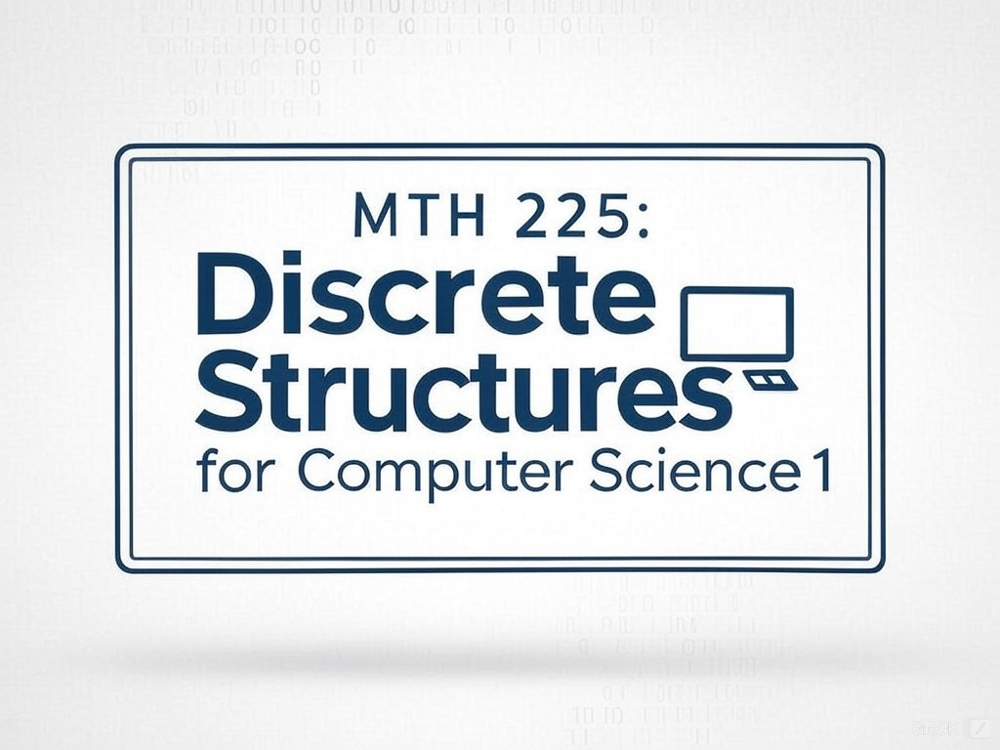

<!--  -->

# MTH 225: Discrete Structures for Computer Science 1, Winter 2025 Syllabus

>Computer Science is no more about computers than astronomy is about telescopes. 
>  
> --― Edsger Wybe Dijkstra

## About this syllabus 

**This syllabus contains all the information you need to navigate the course.** The main document will be kept continuously up to date at this link. When you see blue- or purple-underlined text in the syllabus or any other document, it's a clickable link. For example, [click here for a cat video](https://www.youtube.com/watch?v=aFuUidBR1aQ). A PDF version of the syllabus will also be available on Blackboard, but it will not be updated unless there is a major change. 

**This document is meant to be read once, then searched as needed.** If you need to find something, the easiest way is to pull up this  document, hit `Control-F` (Windows) or `Command-F` (Mac), and then do a search for the text you're looking for. 

All course materials for MTH 225, as well as past versions of MTH 225 and MTH 325, are available on GitHub at https://github.com/RobertTalbert/discretecs. Your course is in the folder [`MTH225-Winter2025`](https://github.com/RobertTalbert/discretecs/tree/master/MTH225-Winter2025). Critically important documents (syllabus, etc.) will also be on Blackboard and [the Class Page](https://docs.google.com/document/d/1pCxYpwLsHa9ciZv4zrtCH2P3aEM6g6Za2onQsOJCung/edit?usp=sharing).

This course is subject to the GVSU policies listed at http://www.gvsu.edu/coursepolicies/. 

## Essential information

- **Instructor**: Robert Talbert, Ph.D., Professor of Mathematics. Email: [talbertr@gvsu.edu](mailto:talbertr@gvsu.edu). Voice: (616)331-8968. Be sure to read my [availability and communication policy](https://github.com/RobertTalbert/discretecs/blob/master/MTH225-Winter2025/course-docs/MTH%20225%20Winter%202025%20Syllabus.md#instructor-availability-and-communication). 
- **Office and drop-in hours**: Mackinac Hall C-2-513, drop-in hours 11:00-11:50am on Monday, Wednesday, and Friday unless otherwise noted. 
- **Appointments:** To schedule an appointment, go to https://calendly.com/robert-talbert and select either "20-minute phone call" or "20-minute online meeting" then choose any open time slot. Note, you must schedule these at least 24 hours in advance and no more than two weeks in advance. 
- **Meetings**: Section 02 -- Mackinac Hall B-1-128, MWF 9:00-9:50. Section 03 -- Mackinac Hall D-1-123, MWF 10:00-10:50. 
- **Required text**: None. 
- **Optional text**: _Discrete Mathematics: An Open Introduction_, 4th edition by Oscar Levin. Available in HTML and PDF format here: https://discrete.openmathbooks.org/dmoi4.html We also use the Course Vault found here: https://publish.obsidian.md/discretecs/ 
- **Other resources**: The course Blackboard site is at http://lms.gvsu.edu. We also use the Class Page, a Google Doc of notes and links, [found at this link](https://docs.google.com/document/d/1pCxYpwLsHa9ciZv4zrtCH2P3aEM6g6Za2onQsOJCung/edit?usp=sharing). This link is also on the Blackboard site. **We will use the Class Page for most things, and reserve Blackboard for announcements and gradebook only.** 
- **Technology requirements:** It's highly recommended to have a laptop and access to a high-speed internet connection for work outside of class. You will need a basic handheld scientific or graphing calculator for exams in class. There is no preferred model of device. For in-class technology use, [please see the "Using technology during class meetings" section](https://github.com/RobertTalbert/discretecs/blob/master/MTH225-Winter2025/course-docs/MTH%20225%20Winter%202025%20Syllabus.md#using-technology-during-class-meetings) below. 

---

## About MTH 225

### What MTH 225 is about and what you will learn

**All of computer science, and all of the fields that come out of computer science such as cybersecurity, are based on mathematics**. In this course and in its sequel MTH 325, you'll get a broad and deep introduction to all of the essential foundational math knowledge you need to be a successful computing professional. 

This course is called **discrete structures** because it deals with mathematical objects ("structures") that can be separated and counted ("discrete"). These include: 

- *Computer arithmetic*: Integer division; the Euclidean algorithm; the modulus (`%`) operator and modular arithmetic; integer representation and arithmetic in binary, octal, and hexadecimal. 
- *Logic*: Logical propositions; conditional statements; truth tables; predicates and quantifiers; logical equivalence and valid rules of deduction. 
- *Recursion and induction*: Recurrence relations; recursively defined structures; basics of mathematical proof and proof by mathematical induction. 
- *Sets and functions*: Representation of sets; subsets; union, intersection, and differences of sets; cardinality; functions; injective, surjective, and bijective functions; basics of combinatorial proof. 
- *Counting*: Additive and Multiplicative Rules for counting; the Principle of Inclusion and Exclusion; the binomial coefficient; combinations, permutations, and $k$-permutations; solving complex counting problems.

Additionally, MTH 225 and MTH 325 focus on **essential transferable skills** that will serve you throughout your careers: 

- **Critical evaluation**: Being able to look at a program, problem solution, or explanation -- especially those you create -- and find and fix errors and misconceptions in it. 
- **Deliberate practice**: Practicing a skill, not mindlessly but with focused attention and a goal of improving performance. 
- **Good explanations**: Taking a complex idea and making it make sense to a normal, non-expert human being through a clear, correct, and complete verbal explanation. 

### Official learning objectives

Upon completion of MTH 225, you will be able to: 

* Represent integers using different number bases, and perform integer arithmetic using different bases and modular arithmetic.
* Formulate, manipulate, and determine the truth of logical expressions using symbolic logic.
* Formulate and solve computational problems using sets and functions.
* Formulate and solve complex counting problems using computational thinking and the tools of combinatorics.
* Evaluate numerical and other sequences using recursion, and solve simple recurrence relations.
* Write clear, correct, and convincing arguments to explain the correctness of a solution using combinatorial proof and mathematical induction.
* Explain the reasoning behind solutions to computational problems clearly to an appropriate audience.
* Apply effective problem-solving skills in solving computational problems.
* Apply computer programming and computational thinking to frame and solve mathematical and computational problems.
* Self-assess your work and apply feedback from others to make improvements in that work.

### What class meetings and participation look like 

Throughout the semester, you'll engage with the class in two distinct ways:

- **Before class:** Before a class meeting, you'll complete a **Class Prep** assignment that contains *review questions* from the previous class meeting, a *reading or video selection* to introduce new ideas for the next class, and *preview questions* to make sure you have the basic knowledge for the next class. Class Prep assignments are essential for being fully prepared; class meetings pick up where Class Prep assignments end, and we will not typically re-teach any material from Class Preps. 
- **During class:** A typical class will start with questions submitted in the Class Prep assignment for the day, and a warmup exercise. The bulk of class meetings will focus on *deliberate practice of a particular skill* that will eventually be assessed on an exam. We will often work in groups of 2--4 so you can tap into your classmates for help. Less frequently, class sessions will be devoted to taking exams over basic skills or homework; more on that below. There will not be much in the way of lecturing. 

You'll get the most out of the class if you attend class meetings every day and participate actively in the class activities. Good participation involves showing up for class prepared (by doing the Class Preps), interacting positively with your classmates, offering your own ideas and listening to others, and asking math questions when you are stuck. 

### How to succeed in MTH 225

**The path to success in MTH 225 is simple** (even though some of the topics are challenging). All it takes, are behaviors that are within the grasp of every student: 

- **Preparing for class** (by completing Class Preps) and **attending class meetings**. 
- **Participating actively and openly** during class meetings. 
- **Blocking off daily times** for working on the class outside of class meetings.
- **Working and practicing mindfully** during those daily work times. 
- **Carefully understanding feedback** on your work so that you can incorporate it into later attempts intelligently. 
- **Consistently submitting attempts** on class work, described later. 
- **Asking questions about math** in drop-in hours, class meetings, or emails when there's anything you're not sure about.  

Successful MTH 225 students have one thing in common: *They all engage in these behaviors and do these actions consistently, every day throughout the course*. Unsuccessful students typically fail to be consistent in one or more of these. **The common denominator is focus and consistency** -- you do not have to be a "math genius" to do well in MTH 225! You just have to **consistently engage with the feedback loops** that are there for you. 

**I want you to be successful in this class.** I am personally invested in each student mastering all of the skills in the course, and in your growth as a learner. I will challenge and support you, and if you engage with the learning activities and the feedback you receive, you will learn a lot and have a great experience. 

---

## How you will learn in MTH 225 

### Overall approach to assignments

In MTH 225, your learning will take place in three different, complementary categories: 

- *Mastery of basic building-block skills*, which in the course we call **Learning Targets**.
- *Application of basic skills*, which happen through assignments and exams labeled **Application/Analysis**. 
- *Engagement in the course*, by earning **engagement credits**. 

Here are the details on each of these. 

### Learning Targets

The basic, foundational building blocks of the course are summarized in a list of 15 **Learning Targets**. The complete list appears in Appendix A of this syllabus. Six (6) of these are highlighted as **Core Learning Targets** because they are [specifically highlighted by the Association of Computing Machinery (ACM)](http://ccecc.acm.org/pdfs/discrete-structures-course.pdf) as essential skills for all computing professionals. 

Our class is organized around those 15 Learning Targets, and we will be covering one Learning Target per week on average. Class meetings will center on practicing these Learning Targets. Four times during the semester, you will take a **Learning Target Exam** that consists of problems, one problem per Learning Target that is being covered. Each exam is cumulative: The first exam will cover Learning Targets 1--4, the second Learning Targets 1--8, and so on. For how these exams and problems are graded, see "How assignments are graded and recorded" below. 

### Application/Analysis 

To give you practice on applying the Learning Targets to more complicated problems, roughly weekly you will work through an **Application/Analysis assignment**. These are take-home assignments that include multiple choice items on terminology and concepts as well as open-ended problems involving the topics from the past week. *These are graded only on the basis of completeness and effort*, so you receive full credit if you simply respond to all of the items with a good-faith effort at being correct. You'll get a key and a video walkthrough of selections of the assignment items each time. 

Twice during the semester, you'll take an **Application/Analysis Exam**. Both of these will consist of a selection of items *taken directly from the Application/Analysis assignments*. So, if you have done mindful work in doing the assignment questions correctly, or correcting your mistakes, the exam will give you the chance to demonstrate this. Information on how the Application/Analysis Exams are graded is [given here](https://github.com/RobertTalbert/discretecs/blob/master/MTH225-Winter2025/course-docs/MTH%20225%20Winter%202025%20Syllabus.md#how-assignments-are-graded-and-recorded), and information on revision and reattempts is [given here](https://github.com/RobertTalbert/discretecs/blob/master/MTH225-Winter2025/course-docs/MTH%20225%20Winter%202025%20Syllabus.md#revision-and-reattempts-of-applicationanalysis). 

### Engagement credits

As mentioned above, success in the course depends on consistent engagement both in and outside of class. Opportunities to do so are plentiful, and many will have a point value attached, which we call **engagement credits**. Your course grade will depend partially on how many engagement credits you accumulate. Some engagement credit opportunities are recurring (successful completion of Class Prep and Application/Analysis assignments, attending class meetings, etc.) while some are one-time opportunities that encourage going above and beyond basic engagement (for example, the Startup Assignment given in week 1). All such opportunities to earn engagement credits will be clearly announced; more details on some of these are below. 

### Final exam

We will have a final exam in the course, given at these times (in your usual classroom unless otherwise announced): 

- Section 02: Wednesday, April 23 from 8:00-9:50am
- Section 03: Monday, April 21 from 10:00-11:50am 

The final exam is simply one last reattempt of all 15 Learning Targets. New versions of both Application/Analysis exams will also be available for those who need an additional reattempt on one or both of those. 

## How your work will be graded 

### How grading works in MTH 225

Grading in MTH 225 works differently than it possibly does in your other courses and in high school. In MTH 225: 

- **Almost none of your assignments have point values**. (The exception is engagement credit items.) Therefore there is **no partial credit and no averaging** because there are no points. 
- Instead, assignments have **standards** which are descriptions of what constitutes "successful" work. These are given in detail in the document ***Standards for Student Work in MTH 225***, described in more detail below. 
- Rather than attaching point values to items, I use the *Standards for Student Work* document to see if the work meets the standard for "success". If the item is "successful" according to the standards, it is marked *Success*. Otherwise it is marked either *Retry* or *Incomplete* depending on the assignment. (A mark of *Excellent* is also possible for exams.)
- After I grade your work, in most cases you will receive **detailed feedback** that will tell you whether your work meets the standards, and if not, the feedback will tell you what was missing and how you might go about fixing it. 
- On Exams (both Learning Target and Application/Analysis), you will have the chance to **retry** the exam or individual items on the exam if needed so you can put the feedback you received to work and improve on the second attempt. 
- Your course grade is not based on point totals or averages (because there are no point values). Instead, the course grade is based on **how many learning tasks you've successfully accomplished** by the end of the semester, using a simple table that's given below. 

Therefore grades in MTH 225 are based not on your ability to do good work at a single point in time, but rather on your ability to **eventually learn the material** by acting on feedback from previous attempts. 

This process, using standards and feedback loops rather than points and averages, is how learning naturally works and how evaluation of work happens in most situations outside of college. In your future jobs, for example, you'll be reviewed regularly by your manager; it's not a "one and done" situation where you get a point score and then the process is over. Instead, in a real job, you get feedback and coaching on how to improve, and then you act on the feedback and show the boss that you have improved. 

The main drawback of this approach to grading is that it's different and might take getting used to. I've done grading this way for over 10 years now, and I find that most students need no more than a week before they are fully comfortable with this. I encourage you to ask questions at any time so I can help you. 

### The _Standards for Student Work_ document 

The Standards for Student Work in MTH 225 document is a complete one-stop visit for all information about what "success" specifically looks like for each of the assignment types in the course. **It is critically important that you read this document carefully and keep it close at hand**. A link is to it is found in several places in the syllabus, also on the [Class Page](https://docs.google.com/document/d/1pCxYpwLsHa9ciZv4zrtCH2P3aEM6g6Za2onQsOJCung/edit?tab=t.0) and on Blackboard; you should also bookmark it in your web browser. 

### How assignments are graded and recorded 

[The _Standards for Student Work_ document](https://github.com/RobertTalbert/discretecs/blob/master/MTH225-Winter2025/course-docs/Standards%20for%20Student%20Work%20MTH%20225%20W25.md) describes each mark possible for every assignment and what it takes to earn that mark. Here are some more targeted details: 

- **Learning Target Exam problems**: On Learning Target exams, **each problem is graded separately**. Each problem on a Learning Target exam is graded either *Master*, *Proficient* or *Beginner* based on completeness and correctness. The exam itself does not receive a grade, only the individual problems. Each problem corresponds to exactly one Learning Target. In the Blackboard gradebook, each Learning Target has a separate entry that will be blank (if the Learning Target has never been attempted on an exam) or will say one of the three marks. 
- **Application/Analysis exams**: On Application/Analysis exams, **the entire exam is graded as a whole** rather than each problem being graded separately. Application/Analysis exams are structured with different sections that contain groups of problems, and you will typically be asked to choose 1-2 items from each group to complete. Individual problems may receive feedback but are not individually graded. The marks possible are *Excellent*, *Success*, and *Retry*; see the [Standards for Student Work document](https://github.com/RobertTalbert/discretecs/blob/master/MTH225-Winter2025/course-docs/Standards%20for%20Student%20Work%20MTH%20225%20W25.md) for details. Each of the two Application/Analysis exams has a separate Blackboard gradebook entry that will be blank or show one of those three marks. 
- **Class Preps and Application/Analysis assignments**: Both of these are graded on the basis of completeness and effort only, not on correctness. Successful completion earns engagement credits; see below. 

**Engagement credits:** These are awarded for successful completion of a variety of items: 

| Item | Successful completion earns: | 
| --- | -------- | 
| Class attendance (25 minute minimum) | 1 engagement credit | 
| Class prep | 2 engagement credits | 
| Application/Analysis assignment | 4 engagement credits | 

Other one-time items that carry engagement credits will have their values clearly indicated. 

## How your course grade is determined 

### Determining the base grade

Your letter grade for the course is assigned using the table below. It shows the *minimum* requirements for the "base grades" of A, B, C, and D. **To earn a grade in the course, you need to meet or exceed *all* the requirements for that grade.** Plus/minus modifiers are applied using the rules below the table. 
 A grade of "F" is assigned if not all of the requirements for a "D" are met.

| Grade | Learning Targets | Application/Analysis  Exams                               | Engagement credits |
| ----- | :----------------: | :--------------------------------------: | :------------------: |
| A     | 14               | *Excellent* on both                      | 90                 |
| B     | 12               | *Excellent* on one, *Success* on the other | 80                 |
| C     | 10               | *Success* on both                        | 70                 |
| D     | 6                | *Success* on one                         | 35                 |

Additionally, **each student must earn a Success mark on all six Core Learning Targets**. Failing to do so will incur a one-letter grade penalty. 

**The final column assumes a total of 100 engagement credits possible in the course**. If we end up with more than 100 possible engagement credits, the numbers above will stay the same, and it will be easier to meet the grade requirements. If it appears we will fall short of that 100 total, the numbers in the last column above will be updated so that they represent 90%, 80%, 70%, and 35% of whatever the total might be. 

**Please note: A grade of "C" or higher is required in MTH 225 for secondary admission into the Computer Science, Cybersecurity, Information Systems, or Information Technology majors.** A grade of C- or lower will require retaking the course. [Please click here for more details](https://www.gvsu.edu/computing/secondary-admission-40.htm). 

### Determining plus/minus modifiers 

**To earn a "plus" on your base grade:** Do *one* of the following: 

- Satisfy all the requirements for a grade in the table above but go one level higher on either Learning Targets or Application/Analysis exams; *or*
- Earn *Master* on all of the Core Learning Targets twice: Once through Learning Target Exams during the regular semester, and a second time at the final exam. 

**To earn a "minus" on your base grade:** Satisfy all the requirements for a base grade except engagement credits.  

Earning both a plus and a minus by doing combinations of the above, results in no modification of the base grade (they "cancel out"). Doing *both* requirements for the "plus" does not result in any additional modification (i.e. it does not result in a one-letter grade bonus, just a plus).  

### Borderline cases 

To earn a grade in the course, you need to meet or exceed *all* the requirements for that grade. **The results from different kinds of assignments do not "average together" or "cancel out".** For example, having 14 Success marks on Learning Targets but only one Successful Application/Analysis exam would result in a base grade of D. **You will need to show consistent competence across the board** since you cannot use one type of assignment to "pull up" another. Instead, typically you will be given the base grade where *all* the requirements are met and a plus or minus modifier. 

If you are close to satisfying the requirements for a grade, but not quite satisfying it, I will consider such borderline cases on a case-by-case basis, using engagement credits as the primary means of deciding. Please note that having only one *Success* on an Application/Analysis exam is not considered "close to" having two of them. 

### The Grade Tracking Checklist 

A **Grade tracking checklist** is provided for you on Blackboard (also linked on the [Class Page](https://docs.google.com/document/d/1pCxYpwLsHa9ciZv4zrtCH2P3aEM6g6Za2onQsOJCung/edit?tab=t.0)) to help you stay current with where you stand with your grade. Make sure to keep that checklist up to date each week or more often. You will be asked to show me your updated checklist a few times through the semester for engagement credit, to make sure we are both clear on your progress. 

## The Grade Discrepancy form

**Students are expected to keep records of their own grade results**. These results will be housed in the Blackboard gradebook, but it's not unusual for there to be data entry errors in Blackboard. If you believe there is an error in the entry of a grade into Blackboard (for example you have *Success* marked on a Learning Target problem on an exam, but Blackboard says *Retry*), use the [Grade Discrepancy Form](https://docs.google.com/forms/d/e/1FAIpQLScTnCBZ1B1AC_T0kILKH3b0lfMMgs-BiLeb7F1HNKxECRdcKQ/viewform) to submit a "ticket". These tickets will be checked every Monday morning and you will get a resolution to your issue promptly. 

---

## How to retry your assignments 

A feature of this course is that **you can redo many assignments and exams** to take feedback into account and make improvements to your understanding. This is what is offered instead of partial credit, and it's expected that you will make use of this opportunity and learn through it. Here are the details. 

### Reattempts of Learning Targets

Learning Target exams are cumulative. The plan for coverage of Learning Targets on each is shown below: 

| Learning Target Exam | Date | Learning Targets covered | 
| :--: | :----: | :-----:| 
| 1 | January 27 | 1--4 | 
| 2 | February 17 | 1--8 | 
| 3 | March 19 | 1--12 | 
| 4 | April 4 | 1--15 | 
| (Final exam) | See above for section times | 1--15 | 

(Note, these dates may change; always [check the official course calendar](https://calendar.google.com/calendar/embed?src=00101de093246cb4a426b788997bab104cf4fd5a056846f4df83532449b477dc%40group.calendar.google.com&ctz=America%2FDetroit) for finalized dates.)

If you attempt a problem for a Learning Target on an exam and don't earn *Success* on it, **you can try it again at the next exam and on the final exam**. This way, you'll have at least two and up to five different attempts possible on each Learning Target. The last two weeks of class are set aside for reassessments as well, and during those times we may have smaller, targeted "mini-exams" on specific Learning Targets, especially the Core Learning Targets and Learning Targets introduced later in the course. 

### Revision and reattempts of Application/Analysis 

Application/Analysis *assignments* are graded only on completeness and effort, so revision is not necessary or possible. Application/Analysis *exams* on the other hand do have a revision/reattempt procedure. 

Application/Analysis exams are graded as a whole, with marks of *Excellent*, *Success*, or *Retry*. Two days during the semester are set aside for reattempting Application/Analysis exams: **Friday March 14**, and **Wednesday April 16**. If you are happy with your grades on these exams, you are not required to attend the sessions. But if you want to reattempt an Application/Analysis exam --- to raise your grade from *Retry* to *Success* or from *Success* to *Excellent* --- those are the sessions where this happens. You'll have an additional chance to do so at the final exam, if needed. The retakes of these exams will consist of problems that are similar to, but not necessarily identical to, the ones seen on the Application/Analysis assignments. (This is unlike the first attempt of these exams, which will be drawn directly from assigned problems.) 

The last two weeks of class are set aside for reassessments as well, and during those times we may, time and meed permitting, schedule another reattempt session. 

### Other assignments 

**There are no reattempts offered for Class Prep and Application/Analysis assignments** since those are only graded on the basis of completeness and effort, and you're expected to meet those very minimal requirements the first time. If you don't, then you can make up for the lost engagement credits through other means. 

**Most other engagement credits items are one-time only** and will not have a means of reattempting. 

## Academic integrity and technology use 

**TL;DR: When you submit work on an assignment in this class, it must be your ideas and your voice, and not someone else's or those of an AI. Anything else is subject to strong penalties that are required by the university.** Please keep reading for specifics. You are expected to know and abide by these policies. 

### Academic integrity policy for the course 

This course is subject to [GVSU course policies](http://www.gvsu.edu/coursepolicies/) and the [GVSU student code](https://www.gvsu.edu/cms4/asset/7B58A5E7-F4C2-114C-CCDA36F96BD2AF73/the_statement_final_fa2020(2).pdf). This document establishes guidelines and expands and clarifies these policies with respect to all work done in MTH 325 this semester. Every student is required to be familiar with these policies and the consequences of violating them.

The student code defines *academic misconduct* as "any action or behavior that misrepresents one’s contributions to or the results of any scholarly product submitted for credit, evaluation, or dissemination". These include:

- *Cheating*: Attempting to use materials, information, or aids that have not been authorized by the instructor for academic work.
- *Collusion*: Unauthorized collaboration with another person in preparing academic assignments offered for credit, and collaboration with another person to commit a violation of any section of the rules on academic misconduct. **Please note: In MTH 225, generative AI tools such as ChatGPT are included in the definition of "person".**
- *Dual submission*: Submitting work that has been previously graded, or is being submitted concurrently to more than one course, without authorization from the instructor of the class to which the student wishes to submit. (This especially applies to those who are repeating MTH 225.)
- *Plagiarism*: Appropriation of, buying, receiving as a gift, or obtaining by any means material that is attributable in whole or in part to another source without any indication or citation of the original source, including words, sentences, ideas, illustrations, structure, computer code, and other expression or media, and presenting that material as one’s own academic work being offered for credit or in conjunction with a program, course, or degree requirements.

Please note that this is not a complete list; and note that the Student Code considers **enabling others** to engage in academic misconduct to be another form of academic misconduct.

**In MTH 225, when you submit an item for grading, it must represent *your* ideas and be written in *your* voice**, however flawed those may be. Your work cannot significantly consist of ideas or wording from another person, website, book, or AI tool. 

The way that MTH 225 is designed around in-class examinations and around engagement credit items that are graded on completeness and effort only, helps to minimize the occurrences and impact of academic dishonesty. But, here are specific guidlines: 

- On **in-class exams** (Learning Target and Application/Analysis exams): No collaboration with a person or technological resource is allowed, and no notes are allowed. You are allowed to use a basic, non-networked graphing or scientific calculator but smartphone use is not allowed, including using a calculator app on a smartphone. 
- On **Class Prep and Application/Analysis assignments**: These are done outside of class. Your work must reflect your ideas and must be written in your voice. Significant copying from another student or from an electronic resource will be investigated as academic dishonesty. Otherwise you are allowed to use other people and tech tools as long as the purpose is learning. 
- Other assignments (for example, for engagement credits) may have additional guidelines. 

Academic misconduct is a serious matter that carries stiff penalties from the university. If I suspect that an item of work breaks the "your ideas/your voice" rule, I will first discuss it with the student turning the work in. If I determine that there was academic misconduct, the matter will go to the [Office of Student Conduct and Conflict Resolution](https://www.gvsu.edu/osccr/) which has a process for handling these issues. The penalties can be quite severe, in some cases resulting in failure of the course or even suspension from the university. 

Please note **the reassessment opportunities built in to your work make cheating unnecessary**. Simply turn in work that is a good-faith effort at a complete and correct solution to the problems on the assignment, and you will get the chance to redo it later if you need. 

### Using artificial intelligence tools 

You are allowed, in fact encouraged, to use generative AI tools to help you learn **as long as it does not replace your ideas and your voice**. Some class activities will be focused on how best to leverage generative AI to study and learn, as well as focus on the limitations of these tools. 

The use of generative AI tools is *not* allowed if it crosses a line where the substance of your work is no longer your own ideas or your own voice but those of someone else. Examples include but are not limited to: 

- Using an AI tool to give you an idea of how to start the solution to a problem. 
- Using an AI tool to "organize" ideas for a solution to a problem. 
- Using an AI tool to rephrase an explanation of a concept when that explanation is central to the problem. 
- Using an AI tool to generate or refactor code that is used in the solution to a problem. 

These are all situations where the solution hinges on *your* voice and ideas, however flawed they may be. Do not use AI in those situations; instead give your best effort, and if it's not sufficient then you will typically get feedback and a chance to redo the work. However, any evidence that AI tools have been used for these purposes in violation of the course policy, knowingly or otherwise, will be investigated as academic dishonesty, even on small assignments. 

Generative AI tools *are* encouraged in situations where your voice or ideas are not being evaluated, such as: 

- Using an AI tool to give an alternative explanation of a concept covered in class. 
- Using an AI tool to help you generate examples and non-examples of concepts covered in class. 
- Using an AI tool to generate exercises for use in practicing Learning Target skills. 

In short, AI tools are encouraged as *learning* tools but you would be well-served by avoiding them when doing graded work. 

### Using technology during class meetings 

We will typically not use technology during class except for occasional activities. **Unless otherwise announced, you are to keep all computing technology --- smartphones, tablets, laptops, etc. --- stowed in your bag at all times during class, or otherwise made inaccessible**. Having such technology available and using it, may result in a loss of engagement credits. This policy is in place to ensure that you are fully present during class and not distracted by websites, games, or other affordances of technology. 

There are two exceptions to this policy: 

- If you have special accommodations from the Student Accessiblility Resources office (SAR, formerly known as DSR) for the use of technology during class, and you present me with an official SAR memo saying so, I am happy to discuss how you might use technology during class meetings to help you learn. 
- If you are taking notes using a device that has no web browsing capabilities (for example the [Remarkable tablet](https://remarkable.com/)), you may be allowed to use it -- but discuss it with me first. 

## How to get help in MTH 225

**Having issues or questions in MTH 225 is totally normal, and the smart thing to do if you're stuck is get help.** There are a few ways to do this: 

- The best way to get help is to **prepare for class and participate in class meetings actively**. This way you will get help from your classmates and also have the chance to ask me (Talbert) questions; plus, you already have the time blocked off on your calendar. 
- You can also come to **drop-in hours** where you can ask anything you need to, without needing an appointment, and get 1-on-1 assistance. 
- If you cannot make drop-in hours, you can **schedule an appointment** for a Zoom call. The link for appointment scheduling is at the beginning of this syllabus. 

For help with prerequisite concepts from MTH 225 or high school, consider visiting the Math Tutoring Center (http://gvsu.edu/tutoring/math/). Bring questions to any location about using technology, on methods and concepts, or on specific problems. All Math Center tutoring is free and available in person on both the Allendale and Pew campuses as well as on Discord. 

---

## Course policies 

### Staying current with course updates 

Course announcements are sent out every Sunday morning via Blackboard, and contain an overview of the classes for the week, a list of assignments and due dates, and specific items to note. Other announcements might be sent during the week if needed. All Blackboard announcements will also be sent to your GVSU email. It is your responsibility to check and read these emails carefully each week and manage the information contained in them. 

The [Class Page](https://docs.google.com/document/d/1pCxYpwLsHa9ciZv4zrtCH2P3aEM6g6Za2onQsOJCung/edit?usp=sharing) contains a summary of each class meeting, including links to slides and other materials, given in reverse chronological order (newest first). 

### Instructor availability and communication

Email ([talbertr@gvsu.edu](mailto:talbertr@gvsu.edu)) is the best way to reach me with a message outside of class meetings. Please **do not use Blackboard messaging to contact me** but use regular email instead. Messages sent through Blackboard do not notify me or give me a way of replying to the message; if you send a message through Blackboard it could be several days before I see it. 

When you send an email, please note: 

- I typically check email **twice per day**, once in the early morning and again in the late afternoon and leave email closed otherwise. 
- **If your message is sent during normal working hours and needs a response, it will receive one within 24 hours**, but it may not be immediate. If your message does not require a response, I will typically not reply to it; if you want a response, be sure to make this clear. 
- **I do not typically check email outside of normal working hours (8am-5pm) or on weekends.** If you send an email during those times, it might be longer than 24 hours before you get a response. 
- In particular, **emails sent after 5pm Friday and on weekends will not get a response until the following Monday.** If you have an assignment due on Monday, please take this into account and ask questions early.

Also please note that I work on campus Monday, Wednesday, and Friday but typically work from home on Tuesday and Thursday. 

### Attendance, late work, makeups, and remote instruction

**Attendance:** Regular class attendance has been shown to correlate more strongly with student success in the class than any other variable. You are urged, and expected, to attend every class meeting unless it is physically impossible or inadvisable. **Attendance at each class meeting not set aside for am exam, earns 1 engagement credit.**

**Absences from non-exam days:** You do not need an excuse or prior approval to miss a class unless it's an exam. A heads-up is appreciated but not necessary. You will not earn the engagement credit, but those can be made up in other ways. 

**Absences from exams:** If you are absent from an exam (either a Learning Target exam or an Application/Analysis exam), there are two days set aside for makeups: **Friday February 28**, and **Friday April 11**. Makeups on other days are not typically allowed, but I am open to discussing such situations. Please note, these makeup days are not simply for reattempting the exam but for making up missed exams. 

**Making up other assignments:** There are no makeups allowed for other assignments unless you discuss your situation with me first. 

**Contingency plans for remote instruction:** In the event that we need to switch to remote instruction, class meetings will take place on Zoom, and the link will be shared in a course announcement and on the [Class Page](https://docs.google.com/document/d/1pCxYpwLsHa9ciZv4zrtCH2P3aEM6g6Za2onQsOJCung/edit?tab=t.0). If that day happens to be an exam day, we'll reschedule the exam and the focus of the class meeting will be determined at that time. [Click here for the official university policy on remote instruction](https://www.gvsu.edu/provost/guidelines-for-course-delivery-in-the-event-of-253.htm). 

### Gender identity

If, for purposes of gender identity and expression, your official name (in Banner) does not match your preferred name, your name can be updated in Blackboard. Please contact the registrar's office to submit this request. The registrar's office will contact the Blackboard administrator to make the change and will also contact your professors to inform them that your name in Banner will not match the name in Blackboard.

### Classrom and campus safety

I consider classroom and campus safety our shared responsibility. Please familiarize yourself with the classroom emergency placard, which contains important information that could prove useful should an emergency arise. Emergency situations could include a fire alarm, tornado warning, medical emergency, or hostile intruder, and our response might consist of evacuating MAK Hall in an orderly manner, moving as a group to a different location in the building, rendering assistance to a class member, or staying put and locking the classroom door. In all cases, I will provide clear instructions as to what you should do. Please make sure to have your primary mobile number listed in Banner so that you will automatically receive any campus alerts. Should you receive an emergency notification in class, notify me immediately.

--- 

**The professor reserves the right to adjust this syllabus as needed and will notify you of any changes through Blackboard announcements.**

---

## About the instructor 

I'm Robert Talbert, the professor for this course. I'm a Professor in the Mathematics Department and also hold an appointment in the GVSU President's Office. I have been teaching college math courses in different places for 32 years, and at GVSU since 2011. I have a Ph.D. in Mathematics from [Vanderbilt University](http://vanderbilt.edu/) and a B.S. degree from [Tennessee Technological University](http://www.tntech.edu/). 

I was, at best, a thoroughly mediocre math student in school until my senior year of high school, when I had a teacher for Calculus who stopped trying to cram things into my head and instead showed me the basics, then backed off and let me work things out on my own, with support if I got stuck. (Basically, this is how I teach today.)

After spending my first two years of college as a Psychology major, I changed my major to math after a late-night dare from my roommate (long story) and, to my great surprise, I fell in love with the subject. I ended up going to graduate school to work in an obscure area at the intersection of abstract algebra and geometry, which seemed like pointless fun at the time but now turns out to have [serious applications to data science](https://www.frontiersin.org/journals/artificial-intelligence/articles/10.3389/frai.2021.667963/full) and to [the design of programming languages](https://en.wikipedia.org/wiki/Homotopy_type_theory). I also discovered I loved teaching math to college students. So I went on to spend 14 years teaching in small liberal arts colleges before coming to GVSU in 2011.

Currently I teach a lot of MTH 225 and MTH 325, getting engineers and computer scientists to think like mathematicians. I also do research on making college teaching better and recently [wrote a book](https://www.routledge.com/Grading-for-Growth-A-Guide-to-Alternative-Grading-Practices-that-Promote/Clark-Talbert/p/book/9781642673814) about the kinds of grading systems you see in this syllabus. When nobody is looking, I am working on my data science skills and learning languages like [R](https://www.r-project.org/) and [Julia](https://julialang.org/). 

I've been a bass guitar player for over 25 years and play live regularly in the area with four different bands. You can learn more about my music activities at [my Bandmix page](https://www.bandmix.com/rtbass/) or [my music Instagram account](https://www.instagram.com/rtgrooves/). 

I live in Allendale with my wife and 16-year old son (who wants to be a software engineer). I have a 19-year daughter who is a freshman at [Wayne State University](https://wayne.edu/) and a 21-year old daughter who lives on her own. I love the outdoors and get out to run, walk, or hike when I can. You can read more about what I'm thinking and doing at my website, [rtalbert.org](http://rtalbert.org), or [Grading for Growth](https://gradingforgrowth.com/) about alternative grading practices which I co-author with my GVSU colleague Prof. David Clark. I'm also on Twitter at [@RobertTalbert](http://twitter.com/RobertTalbert) and on [LinkedIn](https://www.linkedin.com/in/roberttalbert/). I will accept any connection request on LinkedIn from a student!

---

## Appendix A: Learning Targets 

1. (**CORE**) Given two integers $a$ and $b$, I can find the quotient and remainder when dividing $a$ by $b$, the greatest common divisor of $a$ and $b$ using the Euclidean Algorithm, and the value of `a % b`.
2. I can convert a positive integer between bases 2, 8, 10, and 16; and I can represent a negative integer in binary using twos complement.
3. I can perform arithmetic operations on binary numbers. 
4. (**CORE**) I can identify the hypothesis and conclusion of a conditional statement and state its converse, contrapositive, and negation.
5. I can write the truth table for a statement containing two or three variables.
6. Given a predicate, I can state the free variable(s); determine whether quantified forms are true or false; and state its negation.
7. I can determine whether a sequence of statements is a valid rule of deduction and determine if two statements are logically equivalent. 
8. Given a recurrence relation for a sequence or other structure, I can find several instances of the sequence or structure.
9. (**CORE**) Given a statement to prove by mathematical induction, I can set up the framework for its proof.
10. Given a set in roster notation, I can rewrite it in set-builder notation and vice versa, and I can determine its elements and subsets.
11. (**CORE**) I can find the union, intersection, Cartesian product, and difference of two sets; the complement of a set; and the cardinality of a finite set.
12. I can determine if a mapping between two sets is a function; if it is, I can determine if it is injective, surjective, and/or bijective.
13. (**CORE**) I can solve simple counting problems that involve a combination of the Additive Rule, Multiplicative Rule, and Principle of Inclusion/Exclusion.
14. (**CORE**) I can compute a binomial coefficient and solve simple counting problems that involve combinations, permutations, or k-permutations.
15. I can determine if a sequence is arithmetic or geometric; and I can state closed-form and recursive formulas for arithmetic and geometric sequences.

  

## Appendix B: Course calendar and important dates 

A Google calendar for the class can be found at this link: 

https://calendar.google.com/calendar/embed?src=00101de093246cb4a426b788997bab104cf4fd5a056846f4df83532449b477dc%40group.calendar.google.com&ctz=America%2FDetroitt

It is also embedded on Blackboard in the *Course Documents* folder. Please note, the calendar found on Blackboard in the "Calendar" tab at the top of the page is not the same as the Google Calendar and does not contain all the date-sensitive items in the course. **Please use [this Google Calendar](https://calendar.google.com/calendar/embed?src=00101de093246cb4a426b788997bab104cf4fd5a056846f4df83532449b477dc%40group.calendar.google.com&ctz=America%2FDetroit) as your official reference**.

**Important dates:**
- January 6: Classes begin
- January 10: Last Day to Add/Drop Classes (5pm) for 100% refund for full-semester classes 
- January 20: Martin Luther King Jr Recess (no classes)
- January 31: Last day for CR/NC Changes (5pm)
- February 17--21: Mid-term evaluations (for students needing these)
- February 24: Mid-term grades due (noon, for students needing these)
- March 3--7: Spring Break (no classes)
- March 21: Withdrawal deadline (5pm) 
- April 18: Classes end
- April 21--25: Final exams
- April 25: Last day of Winter 2025 semester
- April 29: Grades due (8am) 

