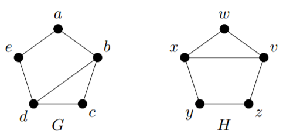
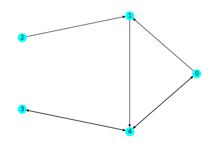
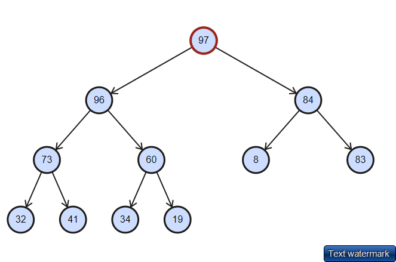

# Content Skill Standard Final Quiz

This quiz contains *new versions* of **all content standards** except the ones that all students have met. 

**Instructions**

* Work only the problems that you **need to work** and **feel ready to work**. 
* **For this final quiz, you are to do all your work on paper.** Do your work on separate pages with **each Content Skill Standard on its own separate page**. *Please do not put work for multiple Standards on the same page.* 
* Make sure to read the **Success Criteria** on each problem you are attempting to know what is expected of a successful demonstration of skill. 
* **The only technology allowed on this final quiz is a handheld calculator** for doing numerical computations. *No other technology is allowed.* 

---

## Content Skill Standard P.2

:::warning
★ P.2: Given a conditional statement, I can state the assumptions and conclusions for a direct proof, proof by contrapositive, and proof by contradiction. 
:::

Consider the statement: 

>Suppose $a$ and $b$ are integers. If $a$ is odd and $b$ is odd, then $a+b$ is even. 


1. Clearly state what you would assume and what you would prove, if proving this statement with a *direct proof*. 
2. Clearly state what you would assume and what you would prove, if proving this statement with a *proof by contrapositive*.
3. Clearly state *all* the assumptions you would make, if proving this statement *by contradiction*. 

**Success criteria:** All parts of each of the three items here are correctly and clearly stated. 

## Content Skill Standard P.3

:::warning
P.3: I can conduct a critical analysis of a proposed proof of a logical proposition.
:::

Below is a proposition and a proposed proof. Read both carefully and then categorize them in one of the following ways: 

- *The proposition is false.* If this is the case, give a specific counterexample that shows the proposition is false. 
- *The proposition is true but the proof has a fundamental flaw.* If this is the case, find at least one of those fundamental flaws and explain why it makes the proof incorrect. 
- *The proposition is true and there are no fundamental flaws in the proof.* If this is the case, say so, and then give one possible suggestion for improving the clarity or correctness of the proof. 

Be sure to state which of the three categories to which you believe the proposition and proposed proof belong. 

:::success
**Proposition:** Suppose $a$ and $b$ are integers. If $a$ is odd and $b$ is odd, then $a+b$ is even.


**Proposed proof:** We prove this by proving the contrapositive instead. So suppose that $a$ is even but $b$ is odd. Then there exist integers $k$ and $m$ such that $a = 2k$ and $b = 2m + 1$. If we add these together we get $a+b = 2k + 2m + 1 = 2(k+m) + 1$. Since $k+m$ is an integer, $2(k+m) + 1$ is odd. This is what we wanted to show, so that ends the proof. 
:black_medium_small_square: 
:::

**Success criteria:** The work clearly states which of the three categories the proposition and proof belong to. If there is a counterexample, it is specifically and clearly stated. If there is a fundamental flaw, it is specifically and clearly stated, and the nature of the flaw is clearly explained. If there are no fundamental flaws, this is clearly stated and a plausible suggestion for improvement is given. 

## Content Skill Standard G.3

:::warning
G.3: I can give examples of graphs having combinations of various properties or explain why no such example exists, and I can draw examples of special ("named") graphs.
:::

1. Draw (by hand) the following graphs. Be sure to draw neatly and label which one is which: 
    (a) $K_{2,4}$
    (b) $K_5$
    (c) $P_3$
    
2. For each item below, give an example of a graph (or pair of graphs, if appropriate) that has the stated combination of properties. If it is not possible to give an example, explain why. 
    (a) A graph with degree sequence 2, 2, 1, 1, 1
    (b) A graph that is connected but which is not a tree

    
**Success criteria:**  All parts are correct with specific, correct examples given, or in the case of an impossible situation a correct and clear explanation is given. 
    
## Content Skill Standard G.4

:::warning
G.4: I can determine whether two graphs are isomorphic; I can give an explicit isomorphism if they are, and an explanation if they are not. 
:::
    
Determine whether the following two graphs are isomorphic: 



If the graphs are isomorphic, give an explicit isomorphism that shows the outputs for each input. If they are not, give a complete and clear explanation in **specific** terms (not general )

Remember we have [a list of isomorphism invariant properties](https://gist.github.com/RobertTalbert/2dadae14f8f42c3654a8a77ef5a038f1) that you can use if necessary. 


**Success criteria:** The response to the example (that it is possible, or not possible to construct an example) is correct; and the explanation is correct, clear, and convincing. 
 

## Content Skill Standard G.5

:::warning
G.5:  I can give a valid vertex coloring for a graph and determine a graph's chromatic number.
::: 

Consider the following graph: 


Determine the chromatic number of this graph by doing the following: 

1. Give a proper vertex coloring (either by labeling the vertices, or by actually coloring them) that uses a number of colors equal to the chromatic number; and 
2. Explain why the chromatic number is *exactly* this quantity and not greater or lesser. 

**Success criteria:** In part 1, a proper coloring is explicitly stated that uses the stated amount of colors. In part 2, the chromatic number is correct; a proper coloring with the right number of colors is given; and there is an explanation for why a smaller coloring is impossible. 

## Content Skill Standard G.6

:::warning
G.6: I can determine whether a graph has an Euler path or Euler circuit, and whether a graph has a Hamiltonian path or cycle.
:::


Consider the graph $G$: 


1. Determine if $G$ has an Euler path; if it does, state that path as a sequence of nodes, and if not, clearly explain why not. Then, repeat this task for Euler cycles. *Do these without referring to visual representations of the graph.* 

2. Determine if $G$  has a Hamilton path (not necessarily a cycle). If it does, state that path as a sequence of nodes. If not, explain why not. *Do these without referring to visual representations of the graph.* 

**Success criteria:** If a graph has a structure (Euler path, Euler cycle, Hamilton path --- whatever is requested in the problem) then a correct example is stated as a node sequence. If not, a correct and *specific* explanation is given. Also, the explanations do not refer to or depend on a visual representation of the graph.  

## Content Skill Standard G.7

:::warning
G.7: I can use Prim's Algorithm and Kruskal's Algorithm to construct a minimum spanning tree for a weighted graph.
:::

Consider the weighted graph: 


1. Using **Prim's Algorithm starting at node $b$**, construct a minimum spanning tree for this graph. Your answer here should be a list of edges in the MST, given in the order in which they are added to the tree by Prim's Algorithm. 

2. Using **Kruskal's Algorithm**, construct a minimum spanning tree for this graph. Your answer here should be a list of edges in the MST, given in the order in which they are added to the tree by Kruskal's Algorithm. 

**Success criteria:** In each part, the minimum spanning tree is given as a correct list of edges, in the correct order of addition into the tree. 

## Content Skill Standard G.8

:::warning
G.8: I can use Dijkstra's Algorithm to find a minimum-weight path between two vertices in a connected weighted graph.
:::

Consider the weighted graph: 


**Starting at node $b$**, use Dijkstra's Algorithm to create the table of shortest-distance information given by the algorithm. Remember the heading for this table looks like this: 

| Vertex | Distance from $b$| Previous vertex | 
| ----- | ----- | ----- | 

**Success criteria:** No more than one error is present in the table. (Errors that "cascade" from a single error count as multiple errors.)


## Content Skill Standard DR.1

:::warning
★ DR.1: I can determine information about a directed graph and its individual vertices and edges using different representations.
:::

Consider the directed graph given by this Python dictionary:

```
{0: [1, 2, 4, 5], 1: [0, 4, 5], 2: [1, 3], 3: [1], 
4: [0, 1, 5], 5: [0, 1, 2, 3, 4]}
```

1. Give the in-degree and out-degree of each vertex. 
2. Write the edge list for the graph. 

**Success criteria:** The degrees in part 1 are all correct with *no errors*. The edge list is correct with *up to one error*. 

## Content Skill Standard DR.2

:::warning
DR.2: I can give examples of relations on a set that have combinations of the properties of reflexivity, symmetry, antisymmetry, and transitivity.
:::

For each item below, draw a directed graph for a relation on the set $\{0,1,2,3\}$ that has the indicated combination of properties. If no such example is possible, explain why. (You do not need to provide explanations for examples that are possible.)

1. Both reflexive and transitive
2. Transitive but not antisymmetric  
3. Transitive but not symmetric

**Success criteria:** All examples have the correct combination of properties. Explanations in the event that an example is impossible clearly express why the example is impossible. All relations are on the set $\{0,1,2,3\}$. 


## Content Skill Standard DR.3

:::warning
DR.3: I can determine if a relation is an equivalence relation; I can determine the equivalence class of an element under an equivalence relation and determine whether two elements belong to the same equivalence class. 
:::

1. Let $W$ be the set of all English words, and place a relation on this set by saying $\text{word1} \sim \text{word2}$ if word1 starts with the same letter as word2. Is this an equivalence relation? If so, give a complete and clear explanation of why. If not, give a *specific* example that explains why not. 
2. Consider the relation on the set of all integers (including negatives and zero), in which $a \sim b$ if and only if $a$ and $b$ have the same "ones" digit. (That is, if both $a$ and $b$ "end in" the same digit.) It can be shown (but don't do it here) that this is an equivalence relation. Write out three elements of $[3922]$. 

**Success criteria:** The explanation in the first item is clear, correct, and specific. The elements listed in the second part are all correct. 

##  Content Skill Standard DR.4

:::warning
DR.4: I can find the $n$th order composition of a relation with itself. 
:::

Consider the relation $r$ on the set $\{0,1,2,3,4,5\}$ given below as an edge list: 

```python=
[(0, 1), (0, 3), (0, 4), (1, 4), (2, 5), (4, 5)]
```

1. State the complete edge list for the relation $r^2$. 
2. State three edges that belong to $r^3$. (If there are fewer than three, state them all; if there are none, explain why.)

**Success criteria:** The edge list in the first part is correct except for one mistake or omission allowed. The three edges in the second part are all correct members of $r^3$. 

## Content Skill Standard DR.5

:::warning
DR.5: I can sketch the transitive closure of a relation as a directed graph. 
:::

Consider the relation $r$ on the set $\{0,1,2,3,4,5\}$ given below as directed graph:




State the transitive closure of $r$, as an *edge list*. (You can draw the directed graph if you like, but your answer must include a correct edge list.) 

**Success criteria:** The edge list is correct with up to two mistakes or omissions allowed. 

## Content Skill Standard DR.6

:::warning
DR.6: I can determine when a set with a relation is a partially ordered set; I can draw the Hasse diagram of a poset and identify maximal/minimal elements and/or greatest/least elements, if they exist.
:::

Let $S = \{1, 3, 4, 6, 9, 12, 24, 36, 96\}$ and say that $a \sim b$ in this set if $a$ divides $b$.  This relation makes $S$ a partially ordered set.  

1. Draw the Hasse diagram for this poset. 
2. State the maximal and minimal elements, if they exist. If either of these does not exist, say so. 
3. State the greatest and least elements, if they exist. If either of these does not exist, say so. 

**Success criteria:** The Hasse diagram is correct with no errors or omissions. The maximal, minimal, greatest, and least elements are all correct with no omissions or errors; if any of these does not exist, that fact is clearly stated. 


## Content Skill Standard T.1

:::warning
T.1: I can determine whether a description of a graph (list of vertex and edge sets, degree sequence, a drawing, or list of properties) represents a tree.
:::

Each part below states a specific condition on a graph $G$. For each case, determine if the graph *must* be a tree, *might or might not* be a tree, or *cannot* be a tree. 

In each case, if the graph *must* be a tree or *cannot* be a tree, give a specific, clear, and correct explanation of why (that does not merely state the definition of a tree). If the graph *might or might not* be a tree, give a concrete, specific example of a graph that is a tree that satisfies the conditions given and a concrete, specific example of a graph that is not a tree that satisfies the conditions. 

1. $G$ is a graph with 5 vertices and 5 edges
2. $G$ is a graph with 5 vertices and 4 edges 
3. $G$ is a graph with degree sequence $4, 4, 4, 2, 2, 2$


**Success criteria:** Each part has a correct basic answer (must be a tree, cannot be a tree, might or might not be a tree). If the basic answer is "must be" or "cannot be", the explanation is clear, correct, and convincing. If the answer is "might or might not be" then two correct examples are given -- one where the condition is satisfied and the graph is a tree, and another where the condition is satisfied and the graph is not a tree. 

## Content Skill Standard T.2

:::warning
T.2: Given a list with a total ordering, I can construct the binary search tree.
:::

Consider this ordered list of words: 
>gusty, night, accurate, fog, grandiose, learn, sound, spoon, unpack, pedal, sun, weight

Using alphabetical/lexicographic ordering, construct a binary search tree for this list. 

**Success criteria:** The binary search tree is completely correct. 

## Content Skill Standard T.3

:::warning
T.3: I can list the vertices of a tree in the order they are visited using preorder, inorder, and postorder traversals.
:::

Consider the tree: 



(Note: This is a binary tree, but not a binary search tree.) List the vertices that are visited, in the proper order when done using: 

1. A preorder traversal
2. An inorder traversal
3. A postorder traversal

Please **number your answers correctly**: the preorder traversal in part 1, the inorder in part 2, the postorder in part 3. If the answers are not numbered or otherwise labelled, I'll assume the first list is preorder, second is inorder, and the third is postorder. 

**Success criteria:** Each list is in the correct order relative to the traversal that is being done. Up to two mistakes are allowed; mistakes that result from prior mistakes are counted separately. 