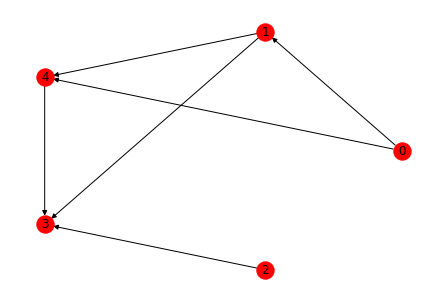

# Updates and tutorials for Content Skill Standards

Grading on your work from Quiz 10 is now complete! As we head into the final last-chance quiz on Tuesday and the mini-quiz on Friday, here are some notes for you that might be useful if you will be participating in either of those. 

## Where we are

Here is a chart that shows your current status (as of Thursday afternoon) on each of the learning targets. This is a combined chart with both Sections 03 and 04: 

Green means the standard has been met. Blue means that one successful demonstration of skill has happened, but not a second one. Yellow means that there have beem attempts at the standard but none have been successful so far. And gray means that the standard has no attempts so far. 

Two takeaways from this chart: 

- Standards P.1 through DR.1 are in good shape. All students have now met standards P.1, G.1, and G.2 (so you will not be seeing those on any more quizzes). 
- But we're having some issues with the DR standards, particularly DR.2 (giving examples of relations with different properties), DR.4 (finding the square and cube of a relation), and DR.6 (Hasse diagrams and maximal etc. elements); and standard T.1 (determining whether a graph is/is not a tree) is also giving some of us headaches.  

So I wanted to give some coaching notes and thoughts about the four standards I just mentioned. 

## How to think about DR.2

>DR.2: I can give examples of relations on a set that have combinations of the properties of reflexivity, symmetry, antisymmetry, and transitivity.

In this standard, you are given a set (typically a four-element set) and asked to produce digraphs of relations that have different combinations of being/not being *reflexive*, *symmetric*, *antisymmetric*, and *transitive*. 

I'm seeing two main issues: 

1. *Not being totally clear on what antisymmetry is*. A relation on a set $R$ is antisymmetric if, for every $a,b \in R$, $a \sim b$ and $b \sim a$ implies $a = b$. If you think of the $\sim$ symbol as a directed edge in a digraph, this would say: $a \rightarrow b$ and $b \rightarrow a$ means $a = b$. Another way to put that is: **If $a$ and $b$ are different nodes, we cannot have two-way edges between them.** So an antisymmetric relation cannot have any double-headed arrows in its digraph. That's a fairly simple way to draw such a relation. (Importantly, please remember that *antisymmetric is not the opposite of symmetric*. That was pointed out in the video for the Daily Prep for this lesson.)
2. *Dealing with digraphs that have no edges or just a single edge*. In Quiz 10 for example, this problem asks for a graph that is not transitive. A number of folks draw four vertices and just one edge. But that *is* a transitive relation! To see why, look at the definition of transitive: 

> A relation on a set $R$ is transitive if, for every $a,b,c \in R$, if $a \sim b$ and $b \sim c$, then $a \sim c$. 

Notice that transitivity is defined by an if-then statement: **IF** $a \sim b$ and $b \sim c$, **THEN** $a \sim c$. Now, remember what happens with an if-then statement when the "if" part is false: The conditional statement is true! 

In a relation with just a single edge, the "if" part of the transitivity definition ("if $a \sim b$ and $b \sim c$") is *false* because this is referring to *two* edges, but the relation has just one. Since the hypothesis is false, transitivity holds, because the conditional statement in the definition is true. 

The same thing is true for relations with no edges at all: They are transitive by default because the definition of "transitive" always holds, since the hypothesis is false. They are also symmetric for the same reason, and also antisymmetric for the same reason. But not reflexive, because there's no conditional statement in the definition of reflexive. 

**TL;DR**: Be careful of relations with one or zero edges, because the logic in those cases has some anomalies. 

## How to think about DR.4

This one is about higher powers of relations. Let's start with a relation $r$ and look at the definition of $r^2$: 

>If $r$ is a relation on a set $S$, then $r^2$ is the set $\{(a,c) \, : \, \exists b \, \text{such that} \,  (a,b) \in r \, \text{and} \, (b,c) \in r\}$. 

In graph terms, if you have three vertices $a,b,c$ and there's an edge $a \rightarrow b$ and an edge $b \rightarrow c$, then the edge $a \rightarrow c$ goes in $r^2$. 

But notice: **This is the same thing as there being a path of length 2 from $a$ to $c$.** So a good way to think about the square is: 

>If $r$ is a relation on a set $S$, then $(a,c) \in r^2$ if and only if there is a path of length 2 from $a$ to $c$. 

We defined $r^3$ similarly: We say $(a,d) \in r^3$ if there are vertices $b,c$ and edges $a \rightarrow b$, $b \rightarrow c$, and $c \rightarrow d$. But this is just saying that there is a path of length 3 from $a$ to $d$. 

This makes it fairly easy to pick out the edges in these powers. Here's the graph from standard DR.5 on Quiz 10: 

If this graph is $r$, then what's in $r^2$? Answer: **Any edge $(a,b)$ if there is a path of length 2 from $a$ to $b$.** So $r^2$ would be the set: $\{(0,4), (0,3), (1,3)\}$. 

Likewise, $(0,3) \in r^3$ because there is a path of length 3 from 0 to 3. (Namely the sequemce 0, 1, 4, 3.) But $(0,2)$ is not in $r^3$ because there's no path of length 3 --- in fact no path at all of any length --- from 0 to 2. 

Two other notes on this standard: 

- Watch out for double-headed edges! These create edges in powers that you might not expect. For example if $r$ is a relation that has edges $(0,4)$ and $(4,0)$, then the square contains the loops $(0,0)$ and $(4,4)$ because there is a path of length 2 from 0 to itself (0,4,0) and from 4 to itself (4,0,4). And $(0,4) \in r^3$ --- in addition to being in the original $r$ --- because there is a path of length 3 from 0 to 4 (0,4,0,4). 
- This principle of the existence of paths is also a good way to think about standard DR.5 where you are asked to come up with the transitive closure. The transitive closure is the set union of $r$, $r^2$, $r^3$, $r^4$, and so on. An edge $(a,b)$ is in the transitive closure if and only if there is *some path of any length at all* from $a$ to $b$. That's because if there is such a path of length $n$, then $(a,b)$ belongs to $r^n$ and therefore to the union that gives the transitive closure. 

## How to think about DR.6

I think most folks have the idea of minimal, maximal, least, and greatest elements of a poset fairly well understood. The issue that comes up is in drawing the Hasse diagrams. There are two issues to watch for: 

- *Messing up the edges*. For example, in Quiz 10 you were working with the set $S = \{2, 3, 4, 12, 23, 48, 72\}$ and the "divides" relation. A few folks mistakenly said $23$ divides $72$ or forgot to say that $4$ divides $12$, so there were extra edges or omitted edges. You're allowed one such error without penalty, but these can crop up. Double check your work when making these diagrams. 
- Forgetting to remove transitive edges. In a Hasse diagram, if $a \sim b$ and $b \sim c$ then $a \sim c$ as well because all posets are transitive by definition. But, because the transitivity is implied, we don't draw the transitive edge -- we'd put in an edge between $a$ and $b$ and then $b$ and $c$ but leave the transitive edge from $a$ to $c$ up to the reader's imagination. 

## How to think about T.1

Finally, how do you tell if something is a tree? Well, a tree is a graph that is connected and has no cycles. So if you have information about a graph's connectedness and whether it has cycles, you can decide. For example $K_{3,3}$ is connected but there is a 4-cycle (draw it to see) so this is not a tree. 

What if all you have is info about the number of edges and the number of vertices --- or, alternatively, its degree sequence? We have a theorem for this, that says: 

>Suppose the graph $G$ has $e$ edges and $v$ vertices. If $G$ is a tree, then $e = v-1$. 

**BUT: Notice the direction of the logic.** *If* it's a tree, *then* $e = v-1$. Here's how the logic works: 

- If you know $G$ is a tree, then you can conclude $e = v-1$. 
- But **if $e = v-1$, it doesn't mean automatically that $G$ is a tree**. This is the *converse* of the theorem, and the converse of a conditional statement is not always true even if the original statement is. As a very simple example, look at the graph that consists of two pieces: A 3-cycle (triangle) and a disconnected vertex. Then there are four vertices and three edges --- so $e = v-1$! But, this is not a tree because it's disconnected and it has a cycle. 
- However: **If $e \neq v-1$, then $G$ is definitely not a tree.** That's the *contrapositive* of the theorem, and as you know, the contrapositive of a conditional statement is equivalent to the original. 

So for example a graph whose degree sequence is 4, 2, 2, 1, 1 cannot be a three. This is because there are $v=5$  vertices, but the number of edges is given by the Handshaking theorem: 

$$e = \frac{4+2+2+1+1}{2} = \frac{10}{2} = 5$$

And since $e \neq v - 1$, this is not a tree. 

**Important takeaway**: If you are working this problem and you determine that $e = v-1$, the answer is likely "maybe this is a tree and maybe it isn't". And in such cases, your job is to find an example of each case: One example where the graph is a tree, and one example where it isn't, and show each one of the examples. A lot of times a non-example can be found by considering disconnected graphs, like the simple example above. 
