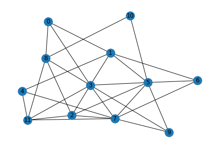

# Prototype Skills Quiz 

>Skill: I can find a spanning tree for a graph, and a minimal spanning tree for a weighted graph. 

1. Find a spanning tree for the following (unweighted) graph and fully explain your process. Give the resulting tree as an edge list. 

2. Using Kruskal's Algorithm, find a minimum spanning tree for the following weighted graph. Clearly show each step of the algorithm and clearly indicate your final answer. 

(Figure out how to generate nice-looking random weighted graphs)

>Success criteria: Both results are spanning trees for their respective graphs; the tree in the second item is a correct output of Kruskal's algorithm and the process correctly implements Kruskal's algorithm; and all steps in each part are correct and clearly stated. Up to two simple errors allowed. 

---

**The feedback loop:**
- Correct answers would be provided on a separate key. 
- Run-of-the-mill errors would be given response "See the key for a correct answer; practice with this problem until you are getting a correct result." 
- Other errors will be given more detailed feedback. 
- They can try again on a later quiz, through a video, or through a live drop-in hours quiz. 