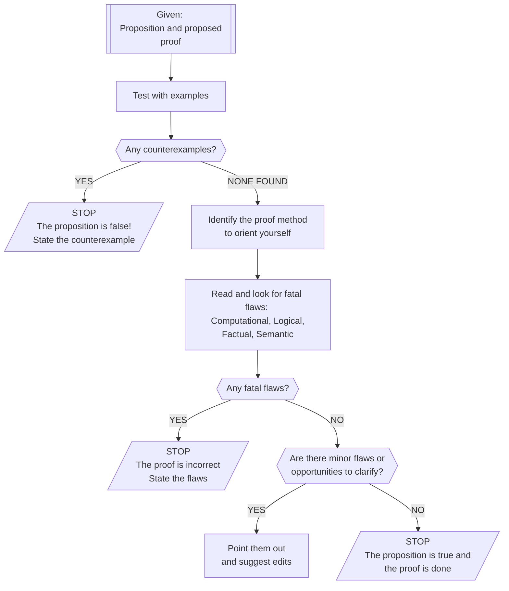

# Critical analyses of proofs 

## What is a critical analysis of a proof?

A **critical analysis** of a proof is a process of taking a mathematical proposition and a proposed proof for it, and coming to a solid understanding of both by thoroughly examining them for errors and opportunities for improvement. We have very high standards for mathematical proofs: They must be mistake-free in every way and as clear and understandable as possible. Critical analysis is a structured process for finding and (if possible) repairing all errors and points of unclearness. 

Critical analysis follows this checklist: 

- [ ] First reality **check the proposition itself by looking at variety of examples and searching for counterexamples**.  
- [ ] If there are no counterexamples that you can find, **identify the proof technique** being used. 
- [ ] Then, read the proposed proof carefully, guided by your knowledge of the method being used, and **look for fatal flaws** -- errors in *computation*, *logic*, *facts*, or *semantics* that render the proof unworkable. 
- [ ] If the proposed proof is free of fatal flaws, go back and read the proof again and **look for minor errors** (mistakes that need to be fixed but don't derail the proof) and **opportunities to make the writing clearer and simpler**. 

In actual practice, we accept proofs that are completely free of fatal flaws, have no minor errors, and have resolved all major editing suggestions for improved clarity. This is the basis for the description of a "Successful" proof as found in the [Specifications for Student Work in MTH 325](https://hackmd.io/@rtalbert235/BkWoCLt0c) document.

You can visualize critical analysis in a flowchart:

Let's look at each step one at a time. 

## Reality checking the proposition

It's always a good idea to **check the proposition itself by generating several examples**. This will help you understand the proposition and build a proof later. In some cases, it may also uncover that the proposition itself is false (or needs to have the statement tweaked), if you find a counterexample! 

**Example:** Suppose we were given the proposition "For all positive integers $n > 1$, the number $2^n - 1$ is a prime number"[^1] . We shouldn't just take this statement for granted just because a professor or textbook said so. Let's make a table of examples from $n=2$ to, say, $n=6$ and see whether the proposition holds up: 

| $n$  | $2^n - 1$      | Prime?                                  |
| ---- | -------------- | --------------------------------------- |
| 2    | $2^2 - 1 = 3$  | Yes                                     |
| 3    | $2^3 - 1 = 7$  | Yes                                     |
| 4    | $2^4 - 1 = 15$ | **NO**: $15$ factors into $3 \times 5$  |
| 5    | $2^5 - 1 = 31$ | Yes                                     |
| 6    | $2^6 - 1 = 63$ | **NO**: $63$ factors into $3 \times 21$ |

So this proposition is false, because we found a counterexample (two, actually). Therefore **any attempt at a proof of this statement must be fundamentally flawed in some way** because you cannot prove a false statement to be true. You can read through the "proof" and try to find the flaws if you want, but there's no point taking it too seriously because it cannot possibly be a correct proof. 

Another reason to work out examples of a proposition before proving it, is that even if you find a counterexample you might uncover something else worth exploring. For example, while it's not the case that $2^n-1$ is a prime number *for every* $n$, you might notice that *If $n$ is itself a prime number* (like 2, 3, or 5) then $2^n-1$ is prime. We can make that into a new proposition: 

> If $n$ is a prime number, then $2^n-1$ is a prime number. 

But hold on -- does *this* have a counterexample? Let's make another table, this time just using prime values of $n$:[^2] 

| $n$  | $2^n-1$ | Prime? |
| ---- | ------- | ------ |
| 2    | 3       | Yes    |
| 3    | 7       | Yes    |
| 5    | 63      | Yes    |
| 7    | 127     | Yes    |
| 11   | 2047    | Yes    |
| 13   | 8191    | Yes    |
| 17   | 131071  | Yes    |
| 19   | 524287  | Yes    |

([You can use Wolfram|Alpha](https://www.wolframalpha.com/input?i=factor+524287) or some other computer tool to check that a number is prime.) This looks very good for the new proposition! All the examples we tried checked out. So the proposition is true, right? 

Well... not quite. Look at the number $n = 23$, which is a prime number: 

$$2^{23} - 1 = 8388607 = 47 \times 178481$$ 

So there *was* a counterexample -- and if we'd looked at *one more example* in our table, we would have found it. (Don't feel bad; one of the greatest mathematicians of all time, [Marin Mersenne](https://en.wikipedia.org/wiki/Marin_Mersenne), thought this proposition was true as well. But he came up with it in the 16th century, when computing a number that large wasn't easy.) This example reminds us that **just because we tested a proposition out on several examples and found no counterexamples, doesn't mean the proposition is true**. We just might not have done enough examples., or the right ones. 

## Analyzing the proof structure 

If you've tried out lots of examples and found no counterexamples, the proposition *might* be true. We say "proposed proof" because it's not a *real* proof until it survives our analysis. 

The first thing is to **x-ray the proof to determine what method is being used**. This is not always easy. But often, you can quickly scan the proof and tell if it is a proof by induction, by direct proof, by proof of the contrapositive, or by contradiction. Some telltale signs: 

* If there is a base case being established and an inductive hypothesis being assumed: It's an induction proof. (Beware, there are several flavors of induction that we will meet during the course that are all slightly different.) Also, if you see that recursion is being used in some form or another, it's probably an induction proof.
* If the proposition is a conditional statement and the proposed proof starts off with the hypothesis: It's a direct proof.
* If the proposition is a conditional statement and the proposed proof starts off with the negation of the conclusion: It's proving the contrapositive. 
* If the proposed proof starts off by assuming the negation of the entire proposition itself: It's a proof by contradiction. 

Having a sense of the method being used will help you know what to expect as you read, and will make you better able to spot errors. 

## Finding flaws

Your job as the proof-analyzer is to **seek out fatal flaws** in the proposed proof and point them out. This sounds mean-spirited but in fact, pointing out fatal flaws is doing the author a favor, because it's super embarrassing to publish a proof with a fatal flaw[^3]. Once you understand the structure of the proof, you're in position to find these. And notice, it can very easily be the case that a proposition is true but a proposed proof of the proposition is fundamentally wrong.

A "fatal" flaw is **an error that renders the entire proof unworkable**. It's more than something minor -- it derails the entire argument. There are at least **four kinds of errors** that can be fatal: 

1. **Computational error**. This is simply when a computation is done incorrectly, like taking $3+4$ and getting $12$, or taking $(1+x)^n$ and "using algebra" to get $1^n + x^n$. (You know that second one is wrong... right?) Some computation errors might be non-fatal (see below) but sometimes (actually most of the time) a computation error kills a proof. Any reasoning that is done based on an incorrect computation is not something we can trust. 
2. **Logical error**. This is when you draw incorrect conclusions from information or a set of data. For example, if you are told that the statement “All math professors are over 40 years old” is false but conclude that *no* math professors are over 40, that’s a logical error. (You can only conclude that *there exists* a math professor who isn’t over 40). Logic errors also can appear when the proof doesn't stick to the form dictated by its method. For example, if you've determined that a proposed proof is being done using induction, but there is no base case in the proof, this is a fatal (but fixable) logic error. 
3. **Factual error.** This results from misstating definitions, theorems, or steps of an algorithm. For example, stating that the negation of “If A then B” is “If A, then not B” is a factual error. (It’s “A and not B”.)
4. **Semantic error**. This happens when you make a statement that is grammatically correct, but the statement itself has no meaning. The statement "[Colorless green ideas sleep furiously](https://www.wikidoc.org/index.php/Colorless_green_ideas_sleep_furiously)". So is the statement “This number is empty” because there is no such thing as an “empty number”. (*Sets* can be empty, but not numbers.) Semantic errors often happen when applying a concept to the wrong kind of object (like using the word “empty” to describe a number, when that term only applies to things like sets or lists).

> *Note*: The above is taken directly from the [Specifications for Student Work in MTH 325 document](https://hackmd.io/lD6oyEN5RdiUi_wdg-rkZg#fn1) where they are listed as things to avoid when submitting Proof or Application Problem solutions.

A special kind of fatal error that happens quite often in proofs by novices to proof-writing is **assuming the conclusion**. This is just what it says: The proof assumes the very statement that it is trying to prove. For example, if the proposition says *If $n$ is even then $n^2$ is even", and the proposed proof is being done using the direct proof technique, if the proof ever assumes that $n^2$ is even, it's game over: That statement ($n^2$ is even) is the goal of the proof, and assuming it renders the argument invalid. **Be careful never to assume what you are trying to prove.** 

Finding flaws in someone else's proposed proof can be fun but it is also hard work. Scrutinize every computation, every transition from one step in a proof to the next, every use of a definition. Assume that the author's logic and math are guilty until proven innocent. Then: When you are writing a proof yourself, apply the same level of scrutiny to your work! 

If you find a fatal flaw in a proof, the proof is incorrect; find all the flaws you can and list them, but there's no need to continue with the proposed proof otherwise. 

## Finding ways to clarify and simplify

If you have determined that the proposition appears to be true and that the proposed proof doesn't appear to have any fatal flaws, then your job is to find *minor* flaws and point those out; and to find ways the author could simplify and clarify their presentation. 

**Minor flaws** are errors that are *errors*, but which do not render the proof useless. For example, if the author makes a math mistake in one line but then fixes it in the next line -- they should go back and revise their work to fix the error, but it didn't render the proof useless. Or if there is a typographical error, and so on. Notice that some errors can be major in some contexts but minor in others. For example a missed minus sign in a math calculation could be a slip of the pen, or a serious conceptual error, depending on the problem. 

**Opportunities for simplifying and clarifying** are always present. It's always best to focus on *simplifying* -- usually proofs (like all writing) are improved by taking things out rather than putting things in. 

**But here is an important exception to that rule:** If a person gives you a proof that consists only of computations, and there is no narrative text in it explaining what is happening -- then the math and reasoning in the proof might be correct, but the proof needs to be redone to make it clearer, by adding verbal descriptions. **A truly finished proof is one that balances the use of mathematical notation and the use of plain English**. A proof that is all math, and a proof that is all words with no math, is probably very difficult to understand. 

## Example

Here's a proposition: 

> For each natural number $n$, $3$ divides $n^3 + 23n$. 

Before we look at a proposed proof of this, let's get clear on the terms: 

* A "natural number" is a nonnegative integer, something from the list $0,1,2,3,\dots$
* Given two integers $a$ and $b$, we say "$a$ divides $b$" if there is an integer, $k$, such that $b = ak$. That is, $a$ divides $b$ if $b$ is a multiple of $a$ (by an integer). 

First, **test the proposition with several examples** to see if the proposition itself appears to be true. Remember, if we find a counterexample, the proposed proof cannot be correct. We just need to look at $n^3 + 23n$ for several natural number values of $n$ and see if $3$ divides the results: 

| $n$  | $n^3 + 23n$ | Does $3$ divide this? |
| ---- | ----------- | --------------------- |
| 0    | 0           | Yes*                  |
| 1    | 24          | Yes                   |
| 2    | 54          | Yes                   |
| 3    | 96          | Yes                   |
| 4    | 156         | Yes                   |
| 5    | 240         | Yes                   |

*3 divides 0 because there is an integer $k$ such that $0 = 3k$. That integer is $k=0$. 

There are no obvious counterexamples here. We could continue with the examples quite easily using a spreadsheet or a quick script. At any rate, the proposition is not obviously false, so let's look at a proposed proof: 

> **Proposed Proof**: Since $3$ divides $n^3 + 23n$ then $3$ divides $n(n^2 + 23)$ which means that $3$ divides $n$ and $3$ divides $n^2 + 23$ which can only happen if $n$ is a natural number. :black_medium_square:

Stop and read that again. What do you make of it? What kind of proof technique appears to be used? Any obvious fatal errors? 

---

In this proposed proof, you can actually stop after the first clause: "Since $3$ divides $n^3 + 23n$...". Stop there, because the author has **assumed the conclusion**. There is no valid argument that can be made by assuming the conclusion. 

There's also a logical error here: The author seems to be saying that if $3$ divides the product of two numbers, then it has to divide both of the numbers individually. But that's not necessarily correct -- can you find a counterexample? 

So what we should do, is politely point out to the author that they have assumed the conclusion of their proposition and so their argument needs to be redone (pretty much from the ground up). 

## Example, round 2

The author returns with this revision, which represents a complete reboot of the proof: 

> **Proposed proof 2:** Suppose that $3$ divides $k^3 + 23k$ for some natural number $k$. Then there exists an integer $k$ such that $k^3 + 23k = 3 \cdot k$ because of the definition of "divides". 
>
> $$(k+1)^3 + 23(k+1) = k^3 + 1^3 + 23k + 23 = k^3 + 23k + 24 = 3k + 24 = 3(k+8)$$
>
> So the proposition is true for $k+1$. :black_medium_square:

**What method of proof is being used?** It appears that this is a *proof by induction*, which we can tell because of the assumption in the first line and the statement about $k+1$ in the second line. 

**What fatal flaws are there?** There are still several: 

- If this is an induction proof, there would need to be a base case to begin with, and there isn't one. 
- The author is using the letter $k$ to represent two different things. In the first sentence, it's being used as the variable for the inductive hypothesis. In the second sentence, it's being used as the integer mentioned in the definition of "divides". But these are two different things and should be represented by two different variables. The fact that they are using the same letter leads to a computational mistake in the third line: In the third equals sign, the author replaced $k^3 + 23k$ with $3k$. 
- There's a computational error in the third line as well: $(k+1)^3$ does not equal $k^3 + 1^3$. 

We can stop here, but it's worth noting that this is not very clearly written, either. That long string of equations in line 3 would be better broken up into smaller units and explained in words; and the final sentence is a little ambiguous. 

## Example, round 3

Undeterred, the author makes another revision: 

> **Proposed proof 3:** We will prove this using induction. First, let $n = 0$. Then $n^3 + 23n = 0$. This is divisible by 3 so the base case holds. 
>
> Now suppose $3$ divides $k^3 + 23k$ for some natural number $k$. Then there exists an integer $q$ such that $n^3 + 23n = 3q$. Then looking at $n+1$, 
>
> $$(n+1)^3 + 23(n+1) = n^3 + 3n^2 + 3n + 1 + 23n + 23 = n^3 + 3n^2 + 26n + 24$$
>
> This last part is divisible by $3$ since each of the terms is divisible by $3$, so the proposition is true for $k+1$. :black_medium_square:

This draft is considerably better! First of all, the author is explicitly stating what method is being used, which helps orient the reader. There is now a base case. And the integer from the definition of "divides" is no longer the same variable as the one in the induction hypothesis. 

However... there are still some issues, at least one of which is fatal. Before we point it out, notice that there's something here that raises a red flag: *The induction hypothesis* (that $3$ divides $k^3 + 23k$) *is never used*. Induction proofs that make, but do not then use, the induction hypothesis are highly suspect. 

You might have noticed one error: The author switched from $k$ back to $n$ in the second paragraph and never looked back! That's *not* a fatal error, but it's a significant one. The author should stick with the variable that they picked in the induction hypothesis, whatever it is. 

But the *fatal* error in this proof happens in the last sentence. The author tries to claim that because $3$ divides each of the terms of the four-term sum just above, that $3$ divides the entire expression. If it were actually the case that $3$ divided each of those terms, then the author would be right. But $3$ *doesn't* divide all four of those terms: $3$ does not divide $26$, on the third term. All of the algebra done in this line is OK, but the author has made a logical error. 

So it's back to the drawing board. 

## Example, round 4

Here's the next revision: 

> **Proposed proof 4:** We will prove this using induction. First, let $n = 0$. Then $n^3 + 23n = 0$. This is divisible by 3 so the base case holds. 
>
> Now suppose $3$ divides $k^3 + 23k$ for some natural number $k$. Then there exists an integer $q$ such that $k^3 + 23k = 3q$. Then: 
>
> $$(k+1)^3 + 23(k+1) = k^3 + 3k^2 + 3k + 1 + 23k + 23 = (k^3 + 23k) + 3k^2 + 3k + 24$$
>
> (Above, we just grouped off $k^3 + 23k$ and left the rest alone.) Now $3$ divides the expression in parentheses by the induction hypothesis. We also note that $3k^2 + 3k + 24 = 3(k^2 + k + 8)$ so that the remaining terms are divisible by $3$. Therefore $3$ divides each term of the results above, meaning that $3$ divides $(k+1)^3 + 23(k+1)$. :black_medium_square:

*This* time, there do not appear to be any fatal errors! The parts of the induction proof are present and correct; the algebra is correctly set up and executed; and the logic appears to be sound. 

You might agree, though, that this could be clearer. Some suggestions for improvement could include: 

- After making the induction hypothesis in the second paragraph, the author could follow it up by stating explicitly what they are going to prove. 
- The second sentence of the second paragraph ("Then there exists an integer...") doesn't seem necessary. We never used that integer $q$, only the fact that $3$ divides $k^3 + 23k$. We might be able to cut that sentence. 
- We could end the proof by affirming that we have proven what we wanted to show. 

So, here would be a complete, correct, and clear proof: 

> **Proof:** We will prove this using induction. First, let $n = 0$. Then $n^3 + 23n = 0$. This is divisible by 3 so the base case holds. 
>
> Now suppose $3$ divides $k^3 + 23k$ for some natural number $k$. We want to show that $3$ divides $(k+1)^3 + 23(k+1)$. If we expand that expression, we get: 
>
> $$(k+1)^3 + 23(k+1) = k^3 + 3k^2 + 3k + 1 + 23k + 23 = (k^3 + 23k) + 3k^2 + 3k + 24$$
>
> (Above, we just grouped off $k^3 + 23k$ and left the rest alone.) Now $3$ divides the expression in parentheses by the induction hypothesis. We also note that $3k^2 + 3k + 24 = 3(k^2 + k + 8)$ so that the remaining terms are divisible by $3$. Therefore $3$ divides each term of the results above, meaning that $3$ divides $(k+1)^3 + 23(k+1)$. This is what we wanted to show, so the proof is done. :black_medium_square:

## Postmortem of this example

Some important lessons about writing proofs: 

* **It takes time.** Proofs are not like basic algebra or calculus problems, where you can start at the beginning and proceed in a straight line to the end without really needing to think about the process in the middle. Even in hard algebra or calculus problems, *you still basically know what you need to do*, it's just a matter of following the steps. But in a proof, *you have to figure out the steps themselves*. 
* **It takes revision.** Like non-trivial computer programs, proofs generally never "compile" the first time. There's usually some collection of major and minor errors in your first few drafts. This is not a sign of a deficiency in your skills! It's just how it is. So be prepared to not only *write* proofs but *rewrite* them several times before they're truly done. 
* **It takes feedback.** You should try to perform a critical analysis on your own work before you turn it in -- it will save you a lot of time and effort. But you may still miss some kind of mistake. If that's the case, then *look at the feedback* you will get. This is the best and easiest way to make improvements quickly. It can be hard to read a criticism of your work! But if the goal is to do that work well, then feedback is a gift. 

---

## Bonus example

The author of the proof examples above might at some point wonder whether induction is truly the best approach. Here's a proof (which is complete, probably the result of a 2-3 rounds of feedback) that doesn't use induction: 

> **Proof**: Suppose we divide $n$ itself by $3$. Then $3$ will go in a certain number of times, with a remainder. There are three possibilities for that remainder: It's either 0, 1, or 2. We'll do three mini-proofs here, one for each of these cases. 
>
> * Case 1: The remainder is 0. Then $n = 3q$ for some integer $q$. Therefore 
>
>   $$n^3 + 23n = (3q)^3 + 23(3q) = 9q^3 + 69q = 3(3q^3 + 23q)$$
>
>   So in this case $n^3 + 23n$ is divisible by $3$. 
>
> * Case 2: The remainder is 1. Then $n = 3q+1$ for some integer $q$. Therefore 
>
>   $$n^3 + 23n = (3q+1)^3 + 23(3q+1) = 27 q^3 + 27 q^2 + 78 q + 24 = 3((3 q + 1) (3 q^2 + 2 q + 8))$$
>
>   So in this case, too, $n^3 + 23n$ is divisible by $3$. 
>
> * Case 3: The remainder is 2. Then $n = 3q+2$ for some integer $q$. Therefore 
>
>   $$n^3 + 23n = (3q+2)^3 + 23(3q+2) = 3 ((3 q + 2) (3 q^2 + 4 q + 9))$$
>
>   Once again, $n^3 + 23n$ is divisible by $3$. 
>
> (Note: All algebra above was done on Wolfram|Alpha. [Here's the computation for Case 2](https://www.wolframalpha.com/input?i=factor%28%283q%2B1%29%5E3+%2B+23%283q%2B1%29%29) and [here's the computation for Case 3](https://www.wolframalpha.com/input?i=factor%28%283q%2B2%29%5E3+%2B+23%283q%2B2%29%29).)
>
> These three cases cover all possible values of $n$. In each case, $3$ divides $n^3 + 23n$. :black_medium_square:

This is a technique known as [proof by cases](https://calcworkshop.com/proofs/proof-by-cases/), and it can be used in conjunction with other proof techniques. 

[^1]: "Prime numbers" are positive integers bigger than 1 that have no factors other than 1 and themselves. For example, 7 and 19 are prime numbers; 6 and 20 are not. 
[^2]: You can find a list of the first fifty million prime numbers [here](https://primes.utm.edu/lists/small/millions/). There are infinitely many prime numbers, so we will never run out!  
[^3]: Ask Prof. Talbert how he knows this. 

