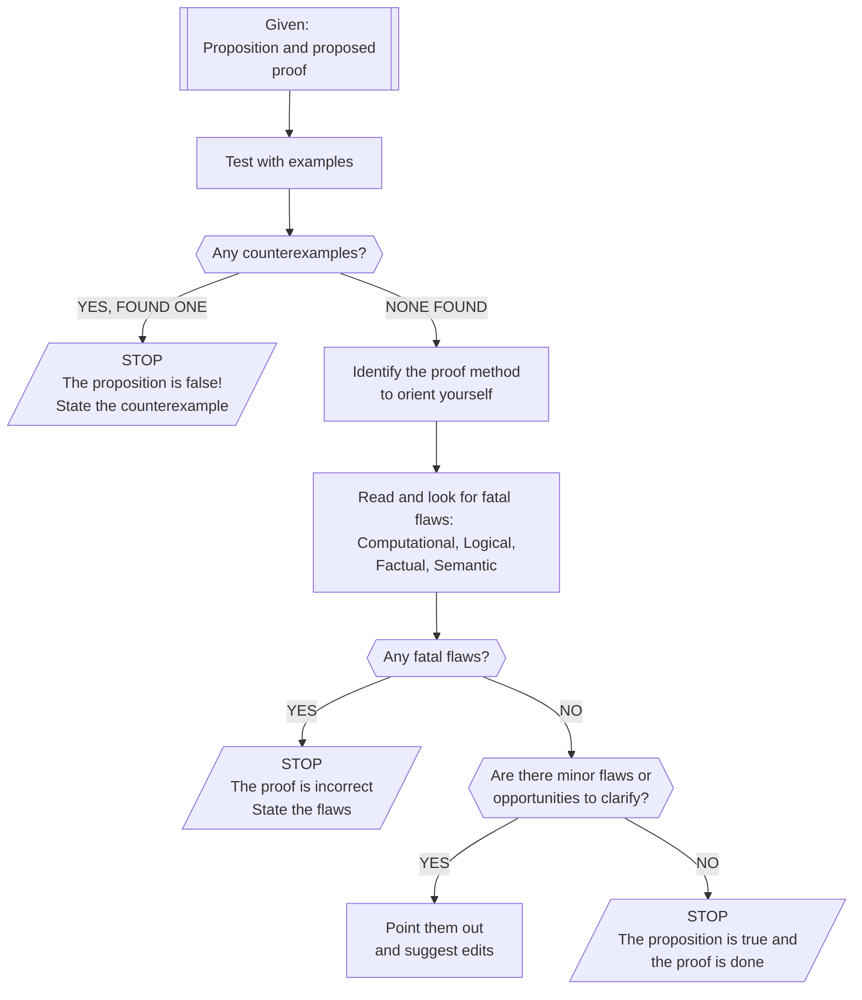

# Critical analyses of proofs 

## What is a critical analysis of a proof?

A **critical analysis** of a proof is a process of thoroughly examining a proposition and a proposed proof for fatal errors as well as less-serious errors and opportunities to make the writing clearer. We have very high standards for mathematical proofs: They must be mistake-free in every way and as clear and understandable as possible. Critical analysis is a structured process for moving in that direction, if not achieving the result. 

Critical analysis follows this checklist: 

- [ ] First check the proposition itself, apart from the proof. Reality check the proposition by looking at variety of examples. Is the proposition itself true, or is there a counterexample? 
- [ ] If there are no counterexamples that you can find, identify the proof technique being used. 
- [ ] Then, read the proposed proof carefully, guided by your knowledge of the method being used, and look for **fatal flaws** -- errors in *computation*, *logic*, *facts*, or *semantics* that render the proof unworkable. 
- [ ] If the proposed proof is free of fatal flaws, go back and read the proof again and look for minor errors (mistakes that need to be fixed but don't derail the proof) and opportunities to make the writing clearer and simpler. 

In actual practice, we accept proofs that are completely free of fatal flaws, have no minor errors, and have resolved all major editing suggestions for improved clarity.

You can visualize this in a flowchart:

Let's look at each step one at a time. 

## Reality checking the proposition

It's always a good idea to **check the proposition itself by generating several examples**. This will help you understand the proposition and build a proof later. In some cases, it may also uncover that the proposition itself is false (or needs to have the statement tweaked), if you find a counterexample! 

**Example:** Suppose we were given the proposition "For all positive integers $n > 1$, the number $2^n - 1$ is a prime number"[^1] . We shouldn't just take this statement for granted just because a professor or textbook said so. Let's make a table of examples from $n=2$ to, say, $n=6$ and see whether the proposition holds up: 

| $n$  | $2^n - 1$      | Prime?                                  |
| ---- | -------------- | --------------------------------------- |
| 2    | $2^2 - 1 = 3$  | Yes                                     |
| 3    | $2^3 - 1 = 7$  | Yes                                     |
| 4    | $2^4 - 1 = 15$ | **NO**: $15$ factors into $3 \times 5$  |
| 5    | $2^5 - 1 = 31$ | Yes                                     |
| 6    | $2^6 - 1 = 63$ | **NO**: $63$ factors into $3 \times 21$ |

So this proposition is false, because we found a counterexample (two, actually). Therefore **any attempt at a proof of this statement must be fundamentally flawed in some way** because you cannot prove a false statement to be true. You can read through the "proof" and try to find the flaws if you want, but there's no point taking it too seriously because it cannot possibly be a correct proof. 

Another reason to work out examples of a proposition before proving it, is that even if you find a counterexample you might uncover something else worth exploring. For example, while it's not the case that $2^n-1$ is a prime number *for every* $n$, you might notice that *If $n$ is itself a prime number* (like 2, 3, or 5) then $2^n-1$ is prime. We can make that into a new proposition: 

> If $n$ is a prime number, then $2^n-1$ is a prime number. 

But hold on -- does *this* have a counterexample? Let's make another table, this time just using prime values of $n$:[^2] 

| $n$  | $2^n-1$ | Prime? |
| ---- | ------- | ------ |
| 2    | 3       | Yes    |
| 3    | 7       | Yes    |
| 5    | 63      | Yes    |
| 7    | 127     | Yes    |
| 11   | 2047    | Yes    |
| 13   | 8191    | Yes    |
| 17   | 131071  | Yes    |
| 19   | 524287  | Yes    |

([You can use Wolfram|Alpha](https://www.wolframalpha.com/input?i=factor+524287) or some other computer tool to check that a number is prime.) This looks very good for the new proposition! All the examples we tried checked out. So the proposition is true, right? 

Well... not quite. Look at the number $n = 23$, which is a prime number: 

$$2^{23} - 1 = 8388607 = 47 \times 178481$$ 

So there *was* a counterexample -- and if we'd looked at *one more example* in our table, we would have found it. (Don't feel bad; one of the greatest mathematicians of all time, [Marin Mersenne](https://en.wikipedia.org/wiki/Marin_Mersenne), thought this proposition was true as well. But he came up with it in the 16th century, when computing a number that large wasn't easy.)

## Analyzing the proof structure 

Once we are reasonably convinced that the proposition itself is true, it's time to check out the proposed proof. We say "proposed proof" because it's not a *real* proof until it survives our analysis. 

The first thing is to **x-ray the proof to determine what method is being used**. This is not always easy. But often, you can quickly scan the proof and tell if it is a proof by induction, by direct proof, by proof of the contrapositive, or by contradiction. Some telltale signs: 

* If there is a base case being established and an inductive hypothesis being assumed: It's an induction proof. (Beware, there are several flavors of induction that we will meet during the course that are all slightly different.)
* If the proposition is a conditional statement and the proposed proof starts off with the hypothesis: It's a direct proof.
* If the proposition is a conditional statement and the proposed proof starts off with the negation of the conclusion: It's proving the contrapositive. 
* If the proposed proof starts off by assuming the negation of the entire proposition itself: It's a proof by contradiction. 

Having a sense of the method being used will help you know what to expect as you read, and will make you better able to spot errors. 

## Finding flaws

Your job as the proof-analyzer is to **seek out fatal flaws** in the proposed proof and point them out. This sounds mean-spirited but in fact, pointing out fatal flaws is doing the author a favor, because it's super embarrassing to publish a proof with a fatal flaw[^3]. Once you understand the structure of the proof, you're in position to find these. And notice, it can very easily be the case that a proposition is true but a proposed proof of the proposition is fundamentally wrong.

A "fatal" flaw is **an error that renders the entire proof unworkable**. It's more than something minor -- it derails the entire argument. There are at least **four kinds of errors** that can be fatal: 

1. **Computational error**. This is simply when a computation is done incorrectly, like taking $3+4$ and getting $12$, or taking $(1+x)^n$ and "using algebra" to get $1^n + x^n$. (You know that second one is wrong... right?) Some computation errors might be non-fatal (see below) but sometimes (actually most of the time) a computation error kills a proof. Any reasoning that is done based on an incorrect computation is not something we can trust. 
2. **Logical error**. This is when you draw incorrect conclusions from information or a set of data. For example, if you are told that the statement “All math professors are over 40 years old” is false but conclude that *no* math professors are over 40, that’s a logical error. (You can only conclude that *there exists* a math professor who isn’t over 40.)
3. **Factual error.** This results from misstating definitions, theorems, or steps of an algorithm. For example, stating that the negation of “If A then B” is “If A, then not B” is a factual error. (It’s “A and not B”.)
4. **Semantic error**. This happens when you make a statement that is grammatically correct, but the statement itself has no meaning. The statement "[Colorless green ideas sleep furiously](https://www.wikidoc.org/index.php/Colorless_green_ideas_sleep_furiously)". So is the statement “This number is empty” because there is no such thing as an “empty number”. (*Sets* can be empty, but not numbers.) Semantic errors often happen when applying a concept to the wrong kind of object (like using the word “empty” to describe a number, when that term only applies to things like sets or lists).

Note: The above is taken directly from the [Specifications for Student Work in MTH 325 document](https://hackmd.io/lD6oyEN5RdiUi_wdg-rkZg#fn1) where they are listed as things to avoid when submitting Proof or Application Problem solutions.

Finding flaws in someone else's proposed proof can be fun but it is also hard work. Scrutinize every computation, every transition from one step in a proof to the next, every use of a definition. Assume that the author's logic and math are guilty until proven innocent. Then: When you are writing a proof yourself, apply the same level of scrutiny to your work! 

If you find a fatal flaw in a proof, the proof is incorrect; find all the flaws you can and list them, but there's no need to continue with the proposed proof otherwise. 

## Finding ways to clarify and simplify

If you have determined that the proposition appears to be true and that the proposed proof doesn't appear to have any major, deal-killing flaws, then your job is to find *minor* flaws and point those out; and to find ways the author could simplify and clarify their presentation. 

**Minor flaws** are errors that are *errors*, but they do not render the proof useless. For example, if the author makes a math mistake in one line but then fixes it in the next line -- they should go back and revise their work to fix the error, but it didn't render the proof useless. Or if there is a typographical error, and so on. Notice that some errors can be major in some contexts but minor in others. For example a missed minus sign in a math calculation could be a slip of the pen, or a serious conceptual error, depending on the problem. 

**Opportunities for simplifying and clarifying** are always present. It's always best to focus on *simplifying* -- usually proofs (like all writing) are improved by taking things out rather than putting things in. 

**But here is an important exception to that rule:** If a person gives you a proof that consists only of computations, and there is no narrative text in it explaining what is happening -- then the math and reasoning in the proof might be correct, but the proof needs to be redone to make it clearer, by adding verbal descriptions. **A truly finished proof is one that balances the use of mathematical notation and the use of plain English**. A proof that is all math, and a proof that is all words with no math, is probably very difficult to understand. 

## Example

Let's go back to that proposition we stumbled upon earlier: 

> If $n$ is a prime number, then $2^n-1$ is a prime number. 

Here is a proposed proof: 

> **Proof**: The smallest prime number is $n=2$, so that's the base case. Checking, we see that $2^2 - 1 = 3$. The number $3$ is also prime, so the base case works. 
>
> Now suppose $2^k-1$ is prime for some prime number $k$. Look at $2^{k+1} - 1$. This is equal to $2 \cdot 2^k - 1$. Factoring off a $2$ gives us $2(2^k - 1)$. Since we assumed $2^k - 1$ is prime, doubling this number gives us another prime. Therefore $2^{k+1} - 1$ is prime. :black_medium_square:

 Before reading on, go through the critical analysis flowchart. What do you make of this proposed proof? 

---

There's a lot to unpack here. 

* We tested the proposition out on several examples already, and it looks like the proposition is true. We need a proof but the early signs are positive. 
* There's a base case in the first paragraph and some kind of assumption taking place in the second. So it looks like this is an induction proof. 

From here, things sort of fall apart. 

* It's definitely true that $2^{k+1} - 1$ equals $2 \cdot 2^k - 1$. But we cannot factor off a 2, because there's no factor of 2 on the second term (the "-1"). So that's a fatal **computational error**. 
* The next-to-last sentence -- that says doubling a prime number gives another prime number -- is flat-out wrong. For example, $5$ is prime but $10$ is not. In fact, doubling *any* number other than 1 makes the result even, and therefore *not* prime! So this statement is pure wishful thinking, and a fatal **logical error**. 
* These two would be enough to say the proof is incorrect. But also, you really can't use induction with prime numbers because they are not *consecutive* like the rungs of a ladder. There are jumps in between them: 2, 3, 5, 7, 11, 13, 17, 19, 23, ... 

So the proposition might be true, but the proof is wrong. 

## Example revisited

The author of that proposed proof probably just needs to rethink the whole thing. Let's say they do, and here's their second attempt: 

> **Proof**: Assume that $n$ is a prime number. This means that $n$ has no factors other than $1$ and $n$. When you raise 2 to the nth power, you get an even number, and then subtracting 1 from that gives you something odd. Since every prime number is odd, this means that the result of all that is a prime number. :black_medium_square: 

Again, run this new proposed proof through the analysis flowchart and see what you think. 

---

The first red flag here is that it's all words, no math. Remember, good proofs are usually a mixture of these. Having no computation whatsoever isn't *wrong* but it's a bad omen. 

Otherwise: We appear to have switched away from induction (probably a good idea) and now it looks like we are doing a direct proof. The first sentence is fine; assuming the hypothesis is the standard start of direct proofs. The second sentence is just the definition of "prime" so no worries there. Even the third sentence is correct and stated clearly enough. 

But that fourth sentence has a fatal **logical error**. It's true that every prime number (greater than 2) is odd. But it does not therefore follow that all odd numbers are prime. For example, look at the number 15. That error kills the proof. 

But, honorable mention here for keeping the proposed proof short and simple, at least. 

## Example revisited again

Undeterred, the author tries again: 

> **Proof:** We prove this by proving the contrapositive. Suppose that $2^n-1$ is not prime. 
>
> $$\begin{eqnarray*}
>
> 
>
> \end{eqnarray*}

[^1]: "Prime numbers" are positive integers bigger than 1 that have no factors other than 1 and themselves. For example, 7 and 19 are prime numbers; 6 and 20 are not. 
[^2]: You can find a list of the first fifty million prime numbers [here](https://primes.utm.edu/lists/small/millions/). There are infinitely many prime numbers, so we will never run out!  
[^3]: Ask Prof. Talbert how he knows this. 

