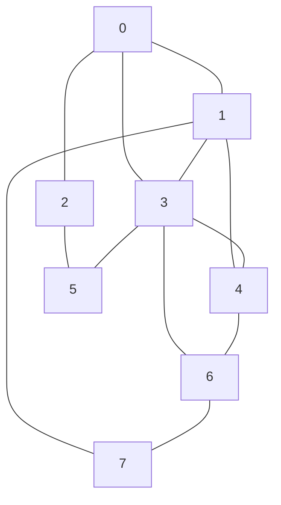
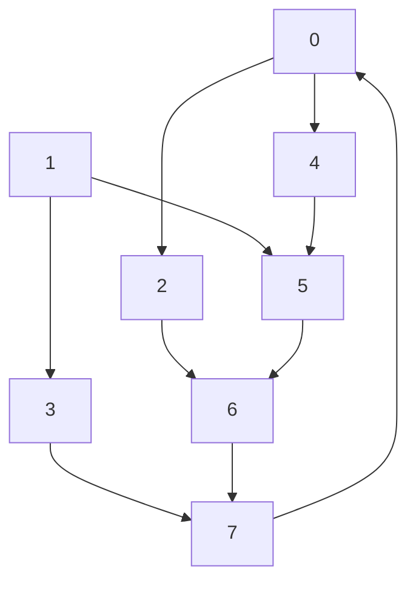

# Mini Exam on Core Skills, answer key

## Skill 1

1. $n=1$ is the base case. If a set has 1 element, let's call that set $X = \lbrace x \rbrace$. Then there are 2 subsets: $\emptyset$, and the entire set $X$. So the base case holds. 
2. Assume that every set with $k$ elements has $2^k$ subsets. 
3. Now prove that a set with $k+1$ elements has $2^{k+1}$ subsets. 

## Skill 2

1. Assume that $x \geq 10$. Prove that $x^2 \geq 25$. 
2. Assume that $x^2 < 25$. Prove that $x < 10$. 
3. Assume that $x \geq 10$ but also that $x^2 < 25$. 

## Skill 3

1. 

$$\begin{pmatrix}
0 & 1 & 1 & 1 & 0 & 0 & 0 & 0 \\
1 & 0 & 0 & 1 & 1 & 0 & 0 & 1 \\
1 & 0 & 0 & 0 & 0 & 1 & 0 & 0 \\
1 & 1 & 0 & 0 & 1 & 1 & 1 & 0 \\
0 & 1 & 0 & 1 & 0 & 0 & 1 & 0 \\
0 & 0 & 1 & 1 & 0 & 0 & 0 & 0 \\
0 & 0 & 0 & 1 & 1 & 0 & 0 & 1 \\
0 & 1 & 0 & 0 & 0 & 0 & 1 & 0
\end{pmatrix}$$

2.

1. 

| Vertex | Degree |
|--------|--------|
| 0 | 3 |
| 1 | 4 |
| 2 | 2 |
| 3 | 5 |
| 4 | 3 |
| 5 | 2 |
| 6 | 3 |
| 7 | 2 | 

4. The sum of the degrees is $3+4+2+5+3+2+3+2 = 24$. The Handshake Lemma says this is twice the number of edges, so there are 12 edges. 

## Skill 7

1. This graph **cannot be a tree**. There are five vertices. However the degree sum is 10, which means there are 5 edges. A tree with 5 vertices must have 4 edges, so this can't be a tree. 

2. 
    (a) 5 and 6 
    (b) 3
    (c) 4
    (d) 9, 10, 11, 12 

## Skill 11

1
`{0: [2, 4], 1: [3, 5], 2: [6], 3: [7], 4: [5], 5:[6], 6:[7], 7:[0]}`

2. The number of edges is equal to the sum of the out-degrees of the vertices. (It's also the sum of the in-degrees, but the out-degrees are easier to see in the dictionary). The out-degrees are 2, 2, 1, 1, 1, 1, 1, 1 and the sum of those is 10, so that is the number of edges. 

3

4

| Vertex | In-Degree | Out-Degree |
|--------|-----------|------------|
| 0 | 1 | 2 |
| 1 | 0 | 2 |
| 2 | 1 | 1 |
| 3 | 1 | 1 |
| 4 | 1 | 1 |
| 5 | 2 | 1 |
| 6 | 2 | 1 |
| 7 | 2 | 1 |