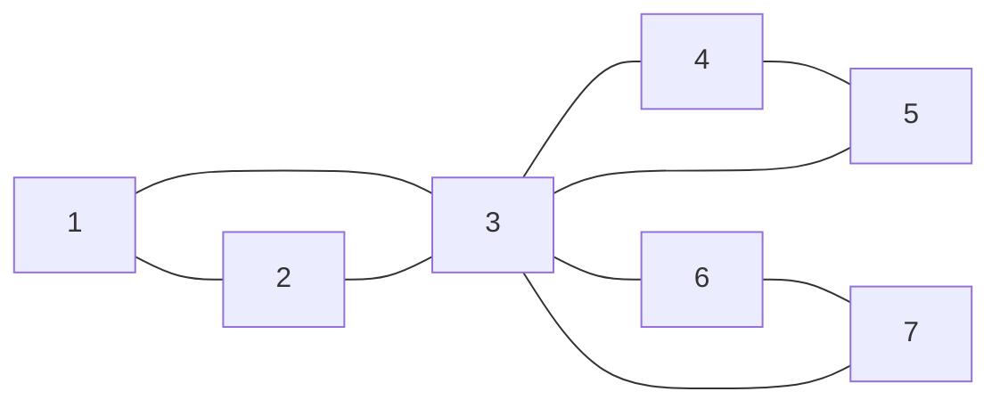
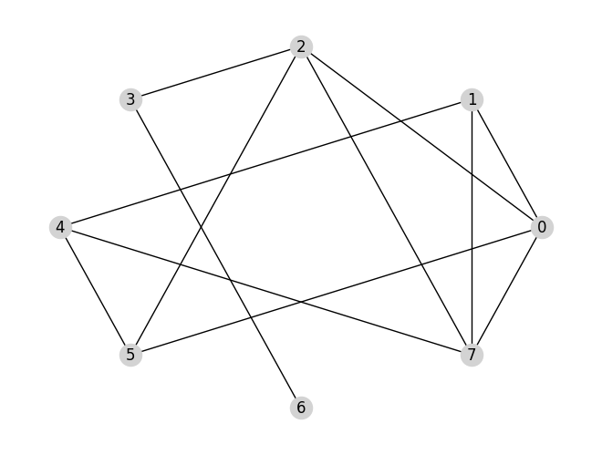
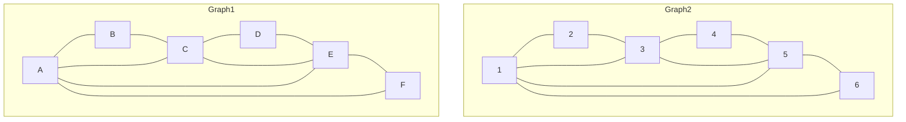
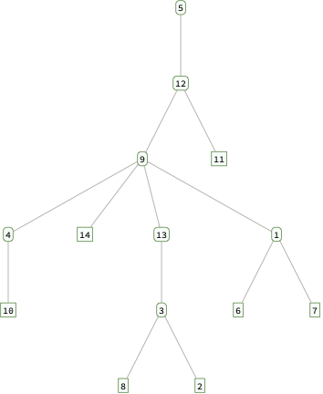
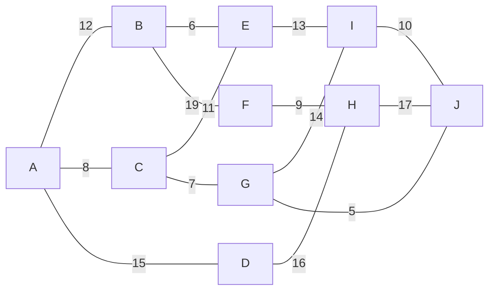
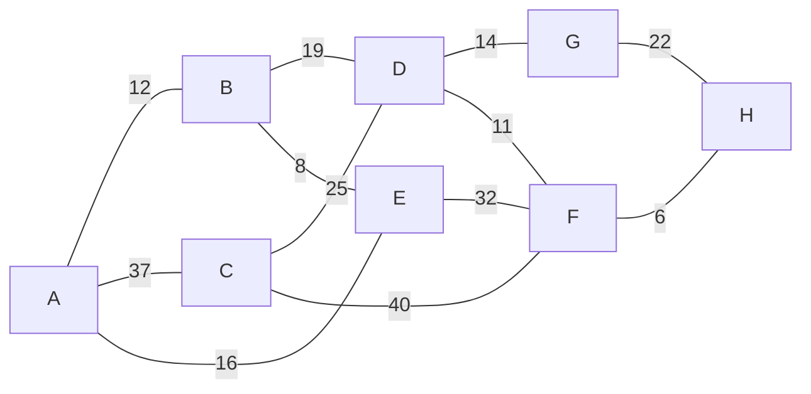
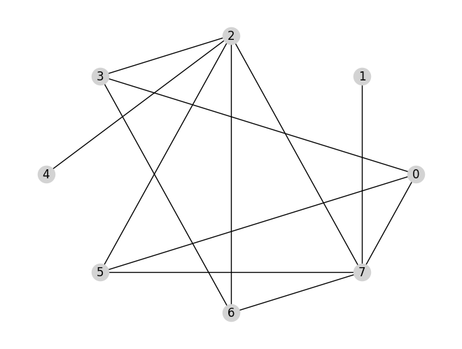

# MTH 325: Exam 4

- Please **put all work on separate pages**. You may put more than one problem on a page, but please **submit your work in numerical order** (Skill 3 before Skill 5, for example). Extra paper is provided if you need it. 
- **Do not submit work on any Skill where you have already received a *Master* rating.** Doing so will result in a 5-point engagement credit reduction per problem submitted. 

---

## Skill 1

> **(CORE)** I can outline a proof by mathematical induction.

Consider the following proposition, and suppose we want to prove it with mathematical induction: 

**For any integer $n \geq 1$, the number $n^3 + 2n$ is an integer multiple of $3$.** 

1.	State the value of $n$ that corresponds to the base case, then prove that the base case holds. 
2.	Clearly state the inductive hypothesis. Your answer should be phrased as a complete sentence. (No explanation is required here; simply state the inductive hypothesis.) 
3.	Clearly state what you would need to prove, after assuming the inductive hypothesis. Your answer should be phrased as a complete sentence. (You do not need to give a completed proof the statement; simply state what you would need to prove.) 

## Skill 2

> **(CORE)** I can outline a proof using direct, contrapositive, and indirect approaches. 

Consider the proposition: **If a polygon has three sides, then the polygon is a triangle.** 

1. Clearly state what you would assume and what you would prove if you were to prove this statement with a *direct proof*. 
2. Clearly state all the assumptions you would make if you were to prove this statement with a *proof by contradiction*. 
3. Clearly state what you would assume and what you would prove if you were to prove this statement with a *proof by contrapositive.*

## Skill 3

> **(CORE)** I can represent a graph in different ways, determine information (degree, degree sequence, paths of given length, etc.) about a graph using different representations, and give examples of graphs with specified properties. 

Suppose $G$ is a graph with this Python dictionary: `{0: [2, 3, 5], 1: [3, 4, 5], 2: [0], 3: [0, 1], 4: [1, 5], 5: [0, 1, 4]}`. 

1. Give the adjacency matrix for $G$. 
2. Give the edge list for $G$. 
3. State the degree of each vertex. 
4. Give an example of a cycle of of length 4 in $G$. If no such cycle exists, say so. 
5. Give an example of a path of length 5 in $G$. If no such path exists, say so. 

## Skill 4

> I can determine whether a graph has an Euler path or Euler circuit, and whether a graph has a Hamiltonian path or circuit.

Consider the graph below: 

**Note: this version of the problem contains new instructions. Read carefully.** 

1. Determine if this graph has an Euler trail, and explain how you know. If it does have an Euler trail, state it as a sequence of vertices. 
2. Determine if this graph has an Euler circuit, and explain how you know. If it does have an Euler circuit, state it as a sequence of vertices.
3. Determine if this graph has a Hamilton path, and explain how you know. If it does have a Hamilton path, state it as a sequence of vertices. 
4. Determine if this graph has a Hamilton cycle, and explain how you know. If it does have a Hamilton cycle, state it as a sequence of vertices.

## Skill 5

> I can use a greedy algorithm to find a vertex coloring for a graph, and I can determine a graph's chromatic number. 

1. Implement the greedy coloring algorithm to find a valid vertex coloring for this graph. For the ordering of the vertices, use the degree of the vertices from high to low, and use increasing numerical order in the case of a tie. (For example, if 3 and 7 had the same degree, you would color 3 first.) Your work should consist of a list of vertices in the order in which they are considered; and the color assigned to each one, given **as a non-negative integer** (*not* as an actual color, like blue or red).
2. State the chromatic number of the graph, and explain your reasoning. 

## Skill 6

> I can determine whether two graphs are isomorphic; I can give an explicit isomorphism if they are, and an explanation if they are not.

Consider the two graphs below: 

Determine if these graphs are isomorphic. If they are isomorphic, give an explicit function between the vertex sets and prove that the edges are preserved. If they are not isomorphic, give a specific isomorphism invariant property that one has but the other does not have. 

## Skill 7

> **(CORE)** I can determine whether a graph is a tree and state information about it. 

1. A graph $G$ has the following dictionary representation: `{0: [1, 2, 7], 1: [0, 4, 6], 2: [0], 3: [7], 4: [1], 5: [6], 6: [1, 5], 7: [0, 3]}`. Which of the following statements is true? (a) $G$ **must** be a tree; (b) $G$ **might** be a tree but might not be one; or  (c) $G$ **cannot** be a tree? Clearly state your choice, then explain your reasoning. 
2. Consider the following tree with vertex $5$ designated as the root: 

(a) State the child or children of vertex $1$. 

(b) State the parent(s) of vertex $9$. 

(c) State the leaves of the tree. 

## Skill 8

> I can use Prim's Algorithm and Kruskal's Algorithm to construct a minimum spanning tree for a weighted graph.

Using the weighted graph above: 

1. Using Prim's Algorithm and starting at vertex $A$, construct a minimum spanning tree for this graph. Your work should consist of a list of edges in the tree, given in the order in which they are added.
2. Repeat part 1 except using Kruskal's Algorithm. 

## Skill 9

>  I can use Dijkstra's Algorithm to find a minimum distance spanning tree for a weighted graph. 

In the weighted graph above, implement Dijkstra’s Algorithm to find the shortest paths from vertex A to all other vertices in the graph. Your work should consist of two things: A list of visited vertices given in the order that they are visited in the algorithm, and a table showing the distances from A to the other vertices with the updates to distances specified in Dijkstra’s Algorithm. 

## Skill 10

> I can execute a breadth-first and depth-first search in a graph.

Using the graph above: 

1. Execute a depth-first search starting with node $0$. Your final submission should consist of two things: a list of visited vertices in the order in which they are visited, and a history of the stack or queue used to implement the search. Use numerical ordering (low to high) to add vertices into the stack or queue.
2. Repeat the first question but use a breadth-first search. 

## Skill 11

> **(CORE)** I can represent a directed graph in different ways, and determine information about a graph using different representations. 

Let $G$ be a directed graph with this adjacency matrix: 

$$\begin{bmatrix}
0 & 0 & 0 & 0 & 1 & 1 & 0 & 1 \\
0 & 0 & 0 & 0 & 0 & 0 & 0 & 0 \\
0 & 0 & 0 & 0 & 0 & 0 & 0 & 0 \\
0 & 1 & 0 & 0 & 0 & 0 & 1 & 1 \\
1 & 0 & 1 & 0 & 0 & 0 & 0 & 0 \\
0 & 0 & 1 & 0 & 0 & 0 & 0 & 0 \\
1 & 0 & 1 & 0 & 0 & 0 & 0 & 1 \\
1 & 0 & 0 & 1 & 0 & 0 & 0 & 0
\end{bmatrix}$$

Assume that the vertices are $0,1,2,3,4,5,6,7$ and the rows and columns of the matrix are indexed in that order. 

1. Give the edge list for $G$. 
2. Give the Python dictionary for $G$. 
3. State the in-degree and out-degree of each vertex. 
4. Without drawing the graph, state the number of edges. 

## Skill 12

> I can use the Floyd-Warshall algorithm to construct the transitive closure of a directed graph. 

Consider the adjacency matrix below: 

$$\left(
\begin{array}{cccc}
 0 & 0 & 1 \\
 1 & 0 & 0  \\
 1 & 0 & 1  \\
\end{array}
\right)$$

Assume that the vertices are 0, 1, 2 and that the rows and columns correspond to those vertices in this order. 

1. Complete the table below for the first six steps of Warshall’s algorithm. The first two rows have the values for the counters in the loops filled in for you. The other values of the loop counters must be done in the correct order given by the pseudocode for Warshall’s algorithm given in class. 

| $k$  | $i$  | $j$  | $W[i,j]$ | $W[i,k]$ | $W[k,j]$ | Result |
| ---- | ---- | ---- | -------- | -------- | -------- | ------ |
| 0    | 0    | 0    |          |          |          |        |
| 0    | 0    | 1    |          |          |          |        |
|      |      |      |          |          |          |        |
|      |      |      |          |          |          |        |
|      |      |      |          |          |          |        |
|      |      |      |          |          |          |        |
|      |      |      |          |          |          |        |

2. Complete the step in Warshall’s algorithm correspoinding to k = 1, i = 2, and j = 2. 

| $k$  | $i$  | $j$  | $W[i,j]$ | $W[i,k]$ | $W[k,j]$ | Result |
| ---- | ---- | ---- | -------- | -------- | -------- | ------ |
| 1    | 2    | 2    |          |          |          |        |

## Skill 13

> I can determine whether a relation is reflexive, symmetric, antisymmetric, and/or transitive, and whether it is an equivalence relation; and if so, I can determine the equivalence class of a point. 

1. Let $S = \lbrace 1, 2, 3, \dots, 10 \rbrace$. Here are two relations on $S$: 
    - Relation 1: $a \sim b$ if $a \leq  b$  
    - Relation 2: $a \sim b$ if $b-a$ is even (Recall that the even integers are $\dots, -4, -2, 0, 2, 4, 6, \dots$)

In the table below, put a checkmark in the appropriate column if the relation has that property. For example, if you think Relation 2 is symmetric, put a checkmark in Relation 2's row in the "Symmetric" column. 

| Relation | Reflexive | Symmetric | Antisymmetric | Transitive | Equivalence Relation | 
| ---- | ---- | ---- | ---- | ----- | --- | 
| Relation 1 | | | | | | 
| Relation 2 | | | | | | 

2. Let $\mathbb{R}^2$ be the set of all points in the $xy$-plane. That is, $\mathbb{R}^2 = \{ (x,y) \, : \, x,y \ \text{are real numbers}\}$. Define a relation on $\mathbb{R}^2$ by $(a,b) \sim (c,d)$ if $b = d$. This is an equivalence relation; state at least five elements of $[(2, 7)]$. 

## Skill 14

> I can determine whether a relation is a partial ordering; if so, I can draw its Hasse diagram and identify maximal/minimal elements and/or greatest/least elements, if they exist.

1. Let $\mathbb{R}^2$ be the set of all points in the $xy$-plane. That is, $\mathbb{R}^2 = \{ (x,y) \, : \, x,y \ \text{are real numbers}\}$.  Here are three relations on $\mathbb{R}^2$. For each, state whether the relation is a partial ordering. If a relation *is* a partial order, you do not need to explain why; just state that it is a partial ordering. But, if a relation is *not* a partial ordering, state at least one property of partial orderings that is not satisfied. 
   
   (a) $(a,b) \sim (c,d)$ if $a=c$ 

   (b) $(a,b) \sim (c,d)$ if the point $(a,b)$ is the same distance from the origin (that is, the point $(0,0)$) as $(c,d)$

   (c) $a \sim b$ if either $a \leq b$ or $c \leq d$

2. Let $S$ be the set of words {whisper, cascade, frenzy, illuminate, breeze, wandering, spark, cat}. Let $\sim$ be the relation on $S$ defined by $a \sim b$ if either $a = b$ or the length of $a$ is strictly less than the length of $b$. This is a partial ordering; draw its Hasse diagram. 