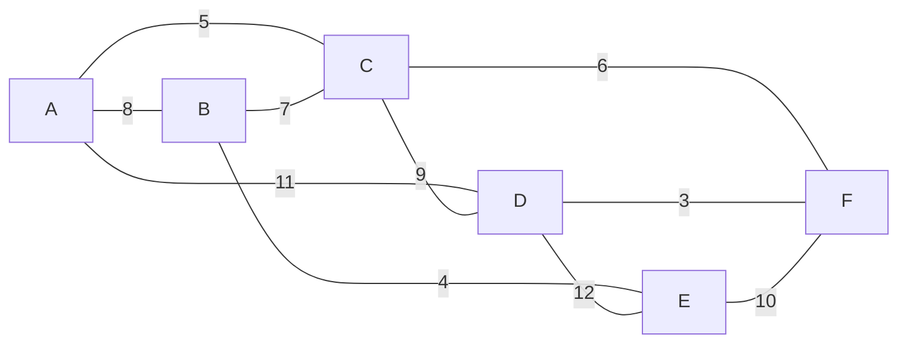
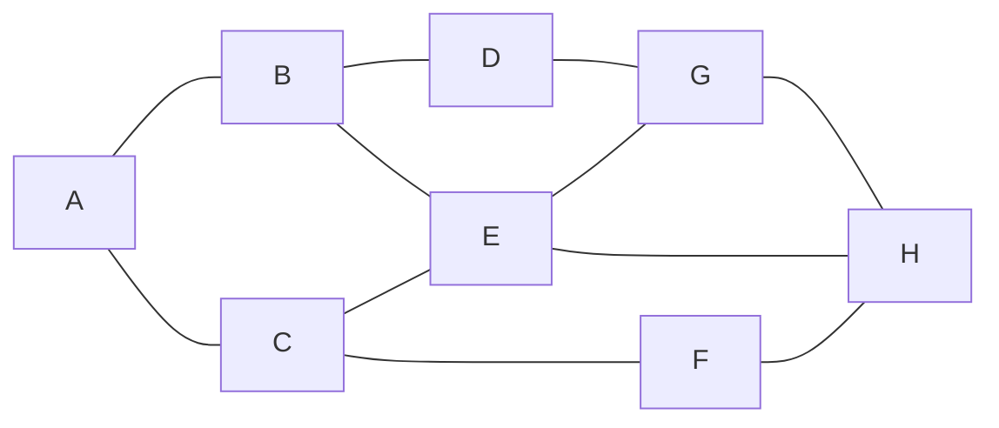
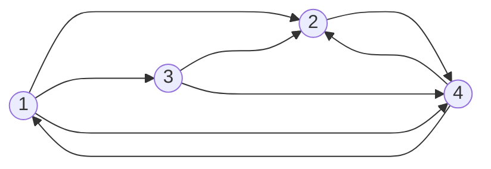
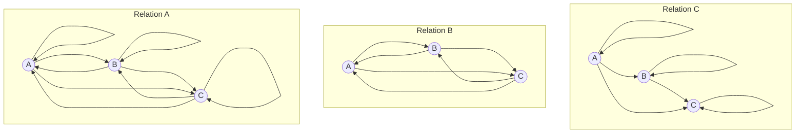

# MTH 325: Mini Exam 

Before starting, make sure you know which Skills you need to attempt. Skills 13 and 14 are new; if you have Mastery on any of the others, **do not attempt these**. Starting with today's Mini Exam, **if you attempt a problem on which you have already attained a rating of Master, then 5 engagement credits per attempted problem will be deducted from your total.**

---

## Skill 9

>  I can use Dijkstra's Algorithm to find a minimum distance spanning tree for a weighted graph. 

In the weighted graph above, implement Dijkstra’s Algorithm to find the shortest paths from vertex A to all other vertices (B, C, D, E and F) in the graph. Your work should consist of two things: A list of visited vertices given in the order that they are visited in the algorithm, and a table showing the distances from F to the other vertices with the updates to distances specified in Dijkstra’s Algorithm. 

## Skill 10 

> I can execute a breadth-first and depth-first search in a graph.

Using the graph above: 

1. Execute a depth-first search starting with node $A$. Your final submission should consist of two things: a list of visited vertices in the order in which they are visited, and a history of the stack or queue used to implement the search. Use numerical ordering (low to high) to add vertices into the stack or queue.
2. Repeat the first question but use a breadth-first search. 

## Skill 11

> **(CORE)** I can represent a directed graph in different ways, and determine information about a graph using different representations. 

Let $G$ be this directed graph: 

1. Write the adjacency matrix for $G$. 
2. Write the Python dictionary for $G$. Be sure to use correct Python dictionary syntax, for example `{a:[b,c], b:[c,d]}`. 
3. State the in-degree and out-degree of each node. Make sure to clearly indicate which is the in-degree and which is out-degree. 

## Skill 12

> I can use the Floyd-Warshall algorithm to construct the transitive closure of a directed graph. 

Consider the adjacency matrix below: 

$$\left(
\begin{array}{cccc}
 0 & 1 & 1 & 1 \\
 1 & 0 & 0 & 0 \\
 0 & 0 & 0 & 1 \\
 1 & 1 & 1 & 0 \\
\end{array}
\right)$$

Assume that the vertices are 0, 1, 2, 3 and that the rows and columns correspond to those vertices in this order. 

1. Complete the table below for the first six steps of Warshall’s algorithm. The first two rows have the values for the counters in the loops filled in for you. The other values of the loop counters must be done in the correct order given by the pseudocode for Warshall’s algorithm given in class. 

| $k$  | $i$  | $j$  | $W[i,j]$ | $W[i,k]$ | $W[k,j]$ | Result |
| ---- | ---- | ---- | -------- | -------- | -------- | ------ |
| 0    | 0    | 0    |          |          |          |        |
| 0    | 0    | 1    |          |          |          |        |
|      |      |      |          |          |          |        |
|      |      |      |          |          |          |        |
|      |      |      |          |          |          |        |
|      |      |      |          |          |          |        |
|      |      |      |          |          |          |        |

2. Complete the step in Warshall’s algorithm correspoinding to k = 2, i = 3,, and j = 1. 

| $k$  | $i$  | $j$  | $W[i,j]$ | $W[i,k]$ | $W[k,j]$ | Result |
| ---- | ---- | ---- | -------- | -------- | -------- | ------ |
| 2    | 3    | 1    |          |          |          |        |

## Skill 13

> I can determine whether a relation is reflexive, symmetric, antisymmetric, and/or transitive, and whether it is an equivalence relation; and if so, I can determine the equivalence class of a point. 

1. Below are three relations on the set $\{A,B,C\}$ labelled "Relation A", "Relation B", and "Relation C". For each one, state which of the reflexive, symmetric, and transitive properties it has, and state whether it is an equivalence relation.

2. Let $\mathbb{R}$ be the set of all real numbers, and let $\sim$ be the following relation on $\mathbb{R}$: Given $x,y \in \mathbb{R}$, let $x \sim y$ if $x-y$ is an integer. State five different elements of $[0.5]$. 

## Skill 14

> I can determine whether a relation is a partial ordering; if so, I can draw its Hasse diagram and identify maximal/minimal elements and/or greatest/least elements, if they exist.

1. Let $X = \{2, 3, 6, 8, 12, 15\}$. Below are three relations on $X$. State which, if any, are partial orderings. If a relation is a partial order, you do not need to explain why; just state that it is a partial ordering. But, if a relation is *not* a partial ordering, state at least one property of partial orderings that is not satisfied. 

   ​	(a) $a \sim b$ if $a$ divides $b$ 

   ​	(b) $a \sim b$ if $a$ and $b$  have the same number of digits 

   ​	(c) $a \sim b$ if $a \leq b$ 

2. Let $X = \{a,b,c\}$ and recall that the *power set* of $X$ is the set of all subsets of $X$: $\{ \emptyset, \{a\}, \{b\}, \{c\}, \{a,b\}, \{b,c\}, \{a,c\}, \{a,b,c\}\}$. Place a relation on $X$ where $A \sim B$ if $A \subseteq B$. In class, we discussed why this is a partial ordering. Draw its Hasse diagram. 

