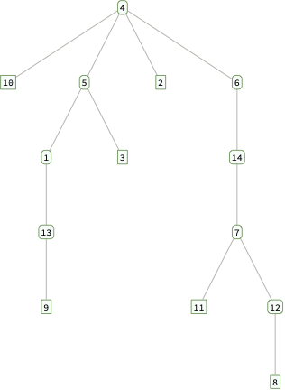

# MTH 325: Final Exam (Fall 2024) -- Core Skills

## Instructions

The final exam consists of new variants of problems for all 14 course Skills. If there are any skills you have not yet Mastered at least once, this exam gives you one more opportunity to do so. Please note, additionally: 

- **All students are expected to attempt the Core skills: Skill 1, 2, 3, 7, and 11.** If you have not yet earned "Master" rating on all five of these, there will be a one-letter-grade penalty on your course grade if you don't do that today. If you have earned "Master" rating on all five of these at this point, you must do Master-level work on them a second time on this exam or there will be a "minus" attached to your course grade. 
- **If you have mastered all five of the Core skills and at least two others**, doing Master-quality work on those a second time on this exam will earn a "plus" on your course grade. 
- **If you have mastered all five Core skills, master them a second time today, but do not master two other skills**, your grade from the syllabus will be un modified. (For example if you have a B coming in, you'll have a B in the end.)

**Bottom line: Today, you should definitely try to master all five Core skills, and it's highly encouraged to master two others.** Please refer to the informational handout on the Final Exam that was posted in the announcements and on the Class Page for full details. 

**This handout has only the Core skills on it.** Since each student is expected to attempt the Core skills, this handout contains those problems and gives you space to provide your solutions. **Put all work on the Core skills in the space provided**, not on separate pages, and be sure to attach your name to the front. **A separate handout has the non-Core skills, with a separate set of instructions**. 

Please note, the only technology you are allowed to use on the final exam is a basic scientific or graphing calculator. No smartphones are allowed. 

---

## Skill 1

> **(CORE)** I can outline a proof by mathematical induction.

Consider the following proposition, and suppose we want to prove it with mathematical induction: 

**For any integer $n \geq 1$, the number $n^3 + 2n$ is an integer multiple of $3$.** 

1.	State the value of $n$ that corresponds to the base case, then prove that the base case holds. 
2.	Clearly state the inductive hypothesis. Your answer should be phrased as a complete sentence. (No explanation is required here; simply state the inductive hypothesis.) 
3.	Clearly state what you would need to prove, after assuming the inductive hypothesis. Your answer should be phrased as a complete sentence. (You do not need to give a completed proof the statement; simply state what you would need to prove.) 

## Skill 2

> **(CORE)** I can outline a proof using direct, contrapositive, and indirect approaches. 

Consider the proposition: **If a tree $T$ has $n$ edges, then $T$  has $n+1$ vertices.** 

1. Clearly state what you would assume and what you would prove if you were to prove this statement with a *direct proof*. 
2. Clearly state all the assumptions you would make if you were to prove this statement with a *proof by contrapositive*. 
3. Clearly state what you would assume and what you would prove if you were to prove this statement with am *indrect proof*, also known as a *proof by contradiction.*

     

## Skill 3

> **(CORE)** I can represent a graph in different ways, determine information (degree, degree sequence, paths of given length, etc.) about a graph using different representations, and give examples of graphs with specified properties. 

Suppose $G$ is a graph with this Python dictionary: `{0: [1, 4, 6], 1: [0, 3, 4], 2: [3, 4, 6], 3: [1, 2, 5], 4: [0, 1, 2, 6], 5: [3], 6: [0, 2, 4]}`. 

1. Give the adjacency matrix for $G$. 
2. Give the edge list for $G$. 
3. State the degree of each vertex. 
4. Give an example of a cycle of of length 4 in $G$. If no such cycle exists, say so. 

## Skill 7

> **(CORE)** I can determine whether a graph is a tree and state information about it. 

1. A graph $G$ has the following adjacency matrix: 

$$\begin{bmatrix}
0 & 0 & 0 & 0 & 1 & 1 & 0 & 0 & 1 & 0 \\
0 & 0 & 0 & 0 & 1 & 0 & 0 & 0 & 0 & 0 \\
0 & 0 & 0 & 0 & 0 & 1 & 0 & 0 & 0 & 0 \\
0 & 0 & 0 & 0 & 0 & 0 & 0 & 0 & 1 & 0 \\
1 & 1 & 0 & 0 & 0 & 0 & 0 & 0 & 0 & 0 \\
1 & 0 & 1 & 0 & 0 & 0 & 1 & 0 & 0 & 0 \\
0 & 0 & 0 & 0 & 0 & 1 & 0 & 1 & 0 & 0 \\
0 & 0 & 0 & 0 & 0 & 0 & 1 & 0 & 0 & 0 \\
1 & 0 & 0 & 1 & 0 & 0 & 0 & 0 & 0 & 1 \\
0 & 0 & 0 & 0 & 0 & 0 & 0 & 0 & 1 & 0
\end{bmatrix}$$

Which of the following statements is true? (a) $G$ **must** be a tree; (b) $G$ **might** be a tree but might not be one; or  (c) $G$ **cannot** be a tree? Clearly state your choice, then explain your reasoning. 

2. Consider the following tree with vertex $4$ designated as the root: 

(a) State the child or children of vertex $1$. 

(b) State the parent or parents of vertex $9$. 

(c) State the leaves of the tree. 

## Skill 11

> **(CORE)** I can represent a directed graph in different ways, and determine information about a graph using different representations. 

Let $G$ be a directed graph with this dictionary representation: `{0: [0, 1], 1: [0], 2: [0, 1], 3: [2], 4: [], 5: [0, 1, 4,5]}`

1. State the edge list for $G$. 
2. State the adjacency matrix for $G$. 
3. State the in-degree and out-degree of each vertex. 
4. Draw a picture of the directed graph. 