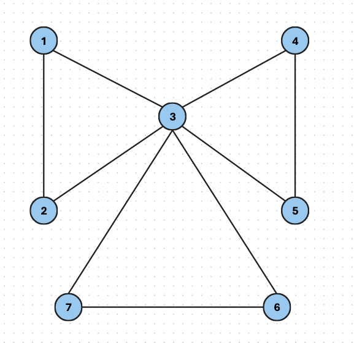
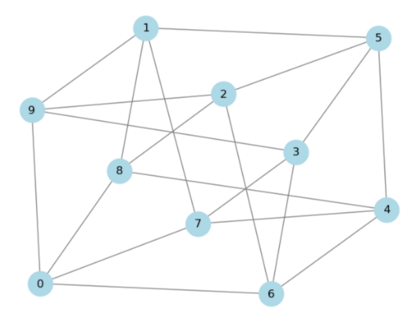
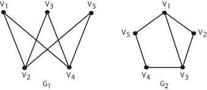
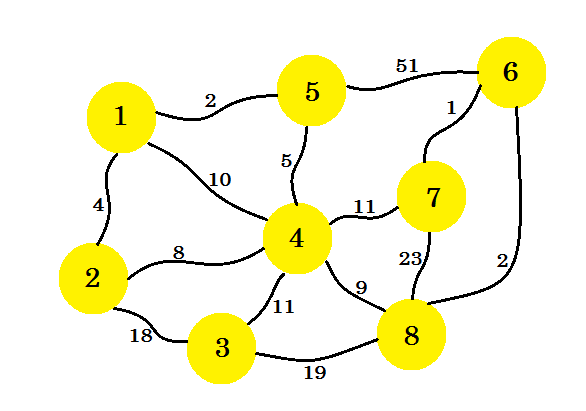
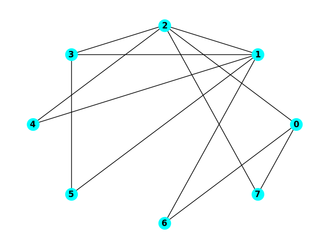

# MTH 325: Final Exam (Fall 2024) -- Non-Core Skills

## Instructions

The final exam consists of new variants of problems for all 14 course Skills. If there are any skills you have not yet Mastered at least once, this exam gives you one more opportunity to do so. For the rules about how skill mastery on the final exam works, please refer to the instructions on the other handout that has the Core skills on it, or see the informational document on the Final Exam that was posted to the announcements and to the Class Page. 

**This handout has only the NON-Core skills on it.** There is no space provided here for your responses -- please put those on separate pages, in numerical order, with your name on each page you submit. 

Please note, the only technology you are allowed to use on the final exam is a basic scientific or graphing calculator. No smartphones are allowed. 

---

## Skill 4

> I can determine whether a graph has an Euler path or Euler circuit, and whether a graph has a Hamiltonian path or circuit.

Consider the graph below: 

**Note: this version of the problem contains new instructions. Read carefully.** 

1. Determine if this graph has an Euler trail, and explain how you know. If it does have an Euler trail, state it as a sequence of vertices. 
2. Determine if this graph has an Euler circuit, and explain how you know. If it does have an Euler circuit, state it as a sequence of vertices.
3. Determine if this graph has a Hamilton path, and explain how you know. If it does have a Hamilton path, state it as a sequence of vertices. 
4. Determine if this graph has a Hamilton cycle, and explain how you know. If it does have a Hamilton cycle, state it as a sequence of vertices.

## Skill 5

> I can use a greedy algorithm to find a vertex coloring for a graph, and I can determine a graph's chromatic number. 

1. Implement the greedy coloring algorithm to find a valid vertex coloring for this graph. For the ordering of the vertices, **<u>all of them have the same degree in this graph</u>**, so use this order: 0, 5, 1, 6, 2, 7, 3, 8, 4, 9.  Your work should consist of a table (or dictionary) giving the color assigned to each one, given **as a non-negative integer** (*not* as an actual color, like blue or red).
2. State the chromatic number of the graph, and explain your reasoning. 

## Skill 6

> I can determine whether two graphs are isomorphic; I can give an explicit isomorphism if they are, and an explanation if they are not.

Consider the two graphs below: 

Determine if these graphs are isomorphic. If they are isomorphic, give an explicit function between the vertex sets and prove that the edges are preserved. If they are not isomorphic, give a specific isomorphism invariant property that one has but the other does not have. 

## Skill 8

> I can use Prim's Algorithm and Kruskal's Algorithm to construct a minimum spanning tree for a weighted graph.

Using the weighted graph above: 

1. Using Prim's Algorithm and starting at vertex $1$, construct a minimum spanning tree for this graph. Your work should consist of a list of edges in the tree, given in the order in which they are added.
2. Repeat part 1 except using Kruskal's Algorithm. 

## Skill 9

>  I can use Dijkstra's Algorithm to find a minimum distance spanning tree for a weighted graph. 

In the weighted graph above, implement Dijkstra’s Algorithm to find the shortest paths from vertex 0 to all other vertices in the graph. Your work should consist of two things: A list of visited vertices given in the order that they are visited in the algorithm, and a table showing the distances from 0 to the other vertices with the updates to distances specified in Dijkstra’s Algorithm. 

## Skill 10

> I can execute a breadth-first and depth-first search in a graph.

Using the graph above: 

1. Execute a depth-first search starting with node $0$. Your final submission should consist of two things: a list of visited vertices in the order in which they are visited, and a history of the stack or queue used to implement the search. Use numerical ordering (low to high) to add vertices into the stack or queue.
2. Repeat the first question but use a breadth-first search. 

## Skill 12

> I can use the Floyd-Warshall algorithm to construct the transitive closure of a directed graph. 

Consider the adjacency matrix below: 

$$\left(
\begin{array}{cccc}
 0 & 0 & 1 \\
 1 & 1 & 0  \\
 1 & 0 & 0  \\
\end{array}
\right)$$

Assume that the vertices are 0, 1, 2 and that the rows and columns correspond to those vertices in this order. 

1. Complete the table below for the first six steps of Warshall’s algorithm. The first two rows have the values for the counters in the loops filled in for you. The other values of the loop counters must be done in the correct order given by the pseudocode for Warshall’s algorithm given in class. **Copy the table to your work and complete it there, not on this page!** 

| $k$  | $i$  | $j$  | $W[i,j]$ | $W[i,k]$ | $W[k,j]$ | Result |
| ---- | ---- | ---- | -------- | -------- | -------- | ------ |
| 0    | 0    | 0    |          |          |          |        |
| 0    | 0    | 1    |          |          |          |        |
|      |      |      |          |          |          |        |
|      |      |      |          |          |          |        |
|      |      |      |          |          |          |        |
|      |      |      |          |          |          |        |
|      |      |      |          |          |          |        |

2. Complete the step in Warshall’s algorithm correspoinding to k = 1, i = 2, and j = 2. 

| $k$  | $i$  | $j$  | $W[i,j]$ | $W[i,k]$ | $W[k,j]$ | Result |
| ---- | ---- | ---- | -------- | -------- | -------- | ------ |
| 1    | 2    | 2    |          |          |          |        |

## Skill 13

> I can determine whether a relation is reflexive, symmetric, antisymmetric, and/or transitive, and whether it is an equivalence relation; and if so, I can determine the equivalence class of a point. 

1. Let $S = \lbrace 1, 2, 3, \dots, 10 \rbrace$. Here are two relations on $S$: 
    - Relation 1: $a \sim b$ if $a \leq b$  
    - Relation 2: $a \sim b$ if $|b-a| \leq 3$ 

For each relation state whether or not the relation has these properties: reflexive, symmetric, antisymmetric, or transitive. Then state whether or not the relation is an equivalence relation. **This means you will be giving five yes/no responses for each relation, and each yes/no response is labelled with the property you are referring to.** Omitting a yes/no response will not be interpreted as a "yes", it will be interpreted as an incomplete answer. 

2. Let $S = \{ (a,b) \, : \, a,b \, \text{are positive integers} \}$ be the set of all pairs (or tuples) of positive integers. Examples of elements of this set include $(2,3)$ and $(100,200)$, but not $(0,1)$ (because $0$ is not positive) or $(1.1, 2.4)$ (because the entries aren't integers). Define a relation on $S$ by $(a,b) \sim (c,d)$ if $\frac{a}{b} = \frac{c}{d}$. This is an equivalence relation; state at least three elements of $[(1,2)]$. 

## Skill 14

> I can determine whether a relation is a partial ordering; if so, I can draw its Hasse diagram and identify maximal/minimal elements and/or greatest/least elements, if they exist.

1. Let $S = \{ (a,b) \, : \, a,b \, \text{are positive integers} \}$ be the set of all pairs (or tuples) of positive integers. Examples of elements of this set include $(2,3)$ and $(100,200)$, but not $(0,1)$ (because $0$ is not positive) or $(1.1, 2.4)$ (because the entries aren't integers). For each, state whether the relation is a partial ordering. If a relation *is* a partial order, you do not need to explain why; just state that it is a partial ordering. But, if a relation is *not* a partial ordering, state at least one property of partial orderings that is not satisfied. 
   
   (a) $(a,b) \sim (c,d)$ if $a = c$ 

   (b) $(a,b) \sim (c,d)$ if $a < c$

   (c) $(a,b) \sim (c,d)$ if either $a \leq b$ or $c \leq d$

2. Let $S = \{65, 26, 10, 130, 13, 5, 1, 2\}$. Let $\sim$ be the relation on $S$ defined by $a \sim b$ if $b$ is an integer multiple of $a$. (For example, $35$ is an integer multiple of $7$, but $200$ is not.)  This is a partial ordering; draw its Hasse diagram. 