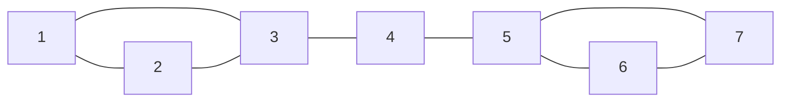
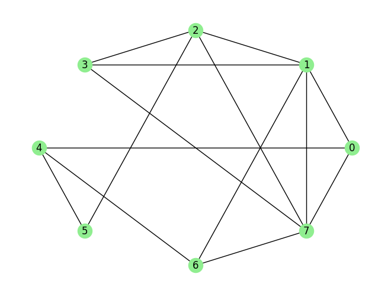
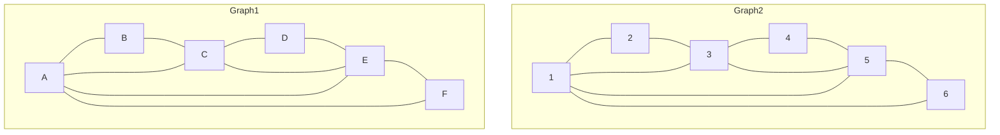
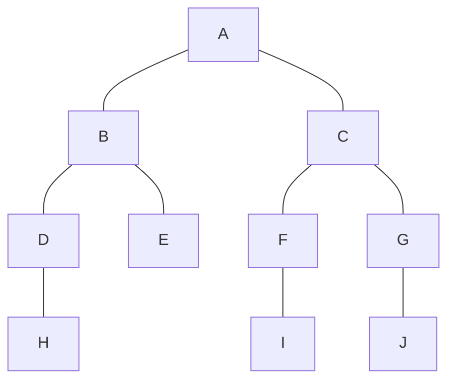
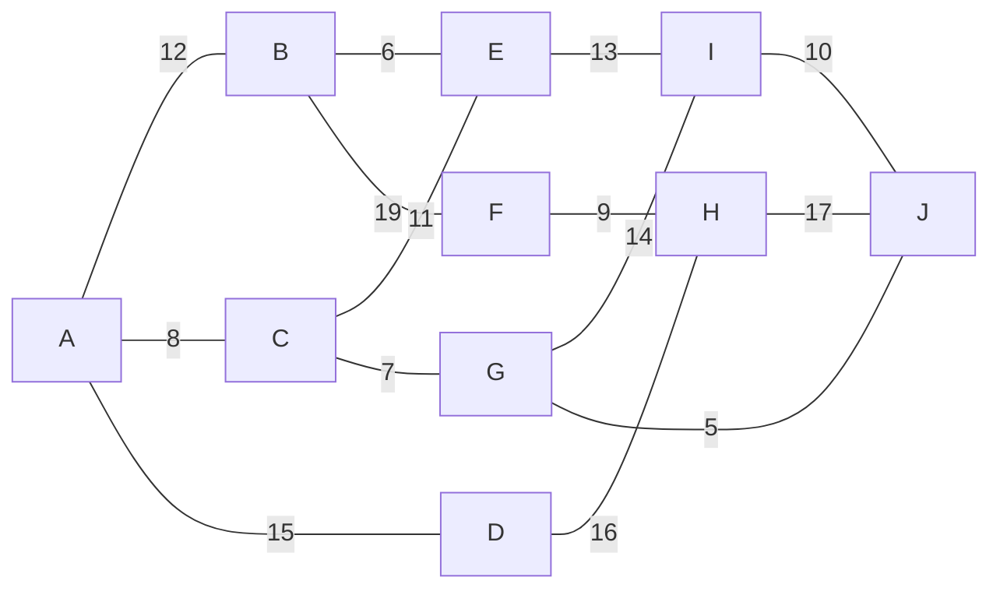
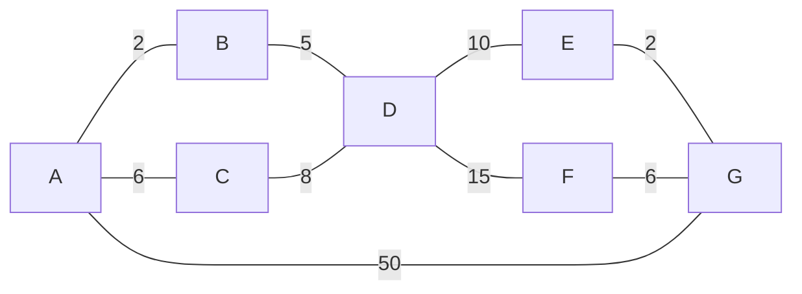
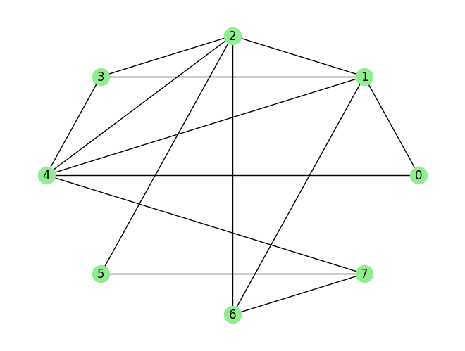

# MTH 325: Makeup Exam, November 25

**Check ONE of the following:**

- [ ] I am using this attempt as a makeup for Exam 3. **I understand that I may only attempt Skills 1-12**. 
- [ ] I am using this attempt as a makeup for the Mini-Exam from Monday November 18. **I understand that I may only attempt Skills 9-12**. 
- [ ] I am using this attempt as a makeup for the Mini-Exam from Wednesday November 20 that covered the Core skills. **I understand that I may only attempt Skills 1, 2, 3, 7, and 11**. 
- [ ] I am not using this attempt as a makeup for anything. **I am using it instead to attempt two Skills: ____ and  _______     .** (Fill in the blanks)

**Please note, on this Makeup:** 

- If you turn in work that is not included in the the box you checked above (for example if you check the first box but turn in work on Skill 13) you will be docked 5 engagement credits. 
- If you turn in work on a Skill where your rating is already "Master", you will be docked 5 engagement credits. 

---

## Skill 1

> **(CORE)** I can outline a proof by mathematical induction.

Consider the following proposition, and suppose we want to prove it with mathematical induction: 

**Let $x$ be a positive real number. Then for any integer $n \geq 1$, we have $(1+x)^n \leq 1 + nx$.** 

1.	State the value of $n$ that corresponds to the base case, then prove that the base case holds. 
2.	Clearly state the inductive hypothesis. Your answer should be phrased as a complete sentence. (No explanation is required here; simply state the inductive hypothesis.) 
3.	Clearly state what you would need to prove, after assuming the inductive hypothesis. Your answer should be phrased as a complete sentence. (You do not need to give a completed proof the statement; simply state what you would need to prove.) 

## Skill 2

> **(CORE)** I can outline a proof using direct, contrapositive, and indirect approaches. 

Consider the proposition: Suppose $T$ is a tree. **If $T$ has $n$ edges, then it has $n+1$ vertices.** 

1. Clearly state what you would assume and what you would prove if you were to prove this statement with a *direct proof*. 
2. Clearly state all the assumptions you would make if you were to prove this statement with a *proof by contradiction*. 
3. Clearly state what you would assume and what you would prove if you were to prove this statement with a *proof by contrapositive.*

## Skill 3

> **(CORE)** I can represent a graph in different ways, determine information (degree, degree sequence, paths of given length, etc.) about a graph using different representations, and give examples of graphs with specified properties. 

Suppose $G$ is a graph with this edge list: `[(0, 3), (0, 6), (0, 7), (1, 5), (1, 6), (2, 3), (3, 4), (3, 5), (3, 6), (3, 7), (4, 6), (4, 7), (5, 6), (6, 7)]`. 

1. Give the adjacency matrix for $G$. 
2. Give the Python dictionary for $G$. 
3. State the degree of each vertex. 
4. Give an example of a cycle of of length 5 in $G$. If no such cycle exists, say so. 
5. Give an example of a walk in $G$ that is not a path. 

## Skill 4

> I can determine whether a graph has an Euler path or Euler circuit, and whether a graph has a Hamiltonian path or circuit.

Consider the graph below: 

**Note: this version of the problem contains new instructions. Read carefully.** 

1. Determine if this graph has an Euler trail, and explain how you know. If it does have an Euler trail, state it as a sequence of vertices. 
2. Determine if this graph has an Euler circuit, and explain how you know. If it does have an Euler circuit, state it as a sequence of vertices.
3. Determine if this graph has a Hamilton path, and explain how you know. If it does have a Hamilton path, state it as a sequence of vertices. 
4. Determine if this graph has a Hamilton cycle, and explain how you know. If it does have a Hamilton cycle, state it as a sequence of vertices.

## Skill 5

> I can use a greedy algorithm to find a vertex coloring for a graph, and I can determine a graph's chromatic number. 

1. Implement the greedy coloring algorithm to find a valid vertex coloring for this graph. For the ordering of the vertices, use the degree of the vertices from high to low, and use increasing numerical order in the case of a tie. (For example, if 3 and 7 had the same degree, you would color 3 first.) Your work should consist of a list of vertices in the order in which they are considered; and the color assigned to each one, given **as a non-negative integer** (*not* as an actual color, like blue or red).
2. State the chromatic number of the graph, and explain your reasoning. 

## Skill 6

> I can determine whether two graphs are isomorphic; I can give an explicit isomorphism if they are, and an explanation if they are not.

Consider the two graphs below: 

Determine if these graphs are isomorphic. If they are isomorphic, give an explicit function between the vertex sets and prove that the edges are preserved. If they are not isomorphic, give a specific isomorphism invariant property that one has but the other does not have. 

## Skill 7

> **(CORE)** I can determine whether a graph is a tree and state information about it. 

1. A graph $G$ has degree sequence 3, 2, 2, 2, 1. Which of the following statements is true? (a) $G$ **must** be a tree; (b) $G$ **might** be a tree but might not be one; or  (c) $G$ **cannot** be a tree? Clearly state your choice, then explain your reasoning. 
2. Consider the following tree with vertex $A$ designated as the root: 

(a) State the children of vertex $B$. 

(b) State the parent(s) of vertex $J$. 

(c) State the leaves of the tree. 

## Skill 8

> I can use Prim's Algorithm and Kruskal's Algorithm to construct a minimum spanning tree for a weighted graph.

Using the weighted graph above: 

1. Using Prim's Algorithm and starting at vertex $A$, construct a minimum spanning tree for this graph. Your work should consist of a list of edges in the tree, given in the order in which they are added.
2. Repeat part 1 except using Kruskal's Algorithm. 

## Skill 9

>  I can use Dijkstra's Algorithm to find a minimum distance spanning tree for a weighted graph. 

In the weighted graph above, implement Dijkstra’s Algorithm to find the shortest paths from vertex A to all other vertices (B, C, D, E and F) in the graph. Your work should consist of two things: A list of visited vertices given in the order that they are visited in the algorithm, and a table showing the distances from F to the other vertices with the updates to distances specified in Dijkstra’s Algorithm. 

## Skill 10

> I can execute a breadth-first and depth-first search in a graph.

Using the graph above: 

1. Execute a depth-first search starting with node $0$. Your final submission should consist of two things: a list of visited vertices in the order in which they are visited, and a history of the stack or queue used to implement the search. Use numerical ordering (low to high) to add vertices into the stack or queue.
2. Repeat the first question but use a breadth-first search. 

## Skill 11

> **(CORE)** I can represent a directed graph in different ways, and determine information about a graph using different representations. 

Let $G$ be a directed graph with this edge list: `[(0, 3), (1, 3), (1, 4), (1, 5), (2, 1), (2, 3), (2, 5), (3, 2), (3, 5), (4, 0), (4, 1), (4, 3), (4, 5), (5, 0), (5, 3), (5, 4)]`. 

1. Give the adjacency matrix for $G$. 
2. Give the Python dictionary for $G$. 
3. State the in-degree and out-degree of each vertex. 
4. Draw a picture of $G$. 

## Skill 12

> I can use the Floyd-Warshall algorithm to construct the transitive closure of a directed graph. 

Consider the adjacency matrix below: 

$$\left(
\begin{array}{cccc}
 0 & 1 & 1 & 0 \\
 1 & 0 & 0 & 0 \\
 0 & 0 & 0 & 0 \\
 1 & 0 & 0 & 0 \\
\end{array}
\right)$$

Assume that the vertices are 0, 1, 2, 3 and that the rows and columns correspond to those vertices in this order. 

1. Complete the table below for the first six steps of Warshall’s algorithm. The first two rows have the values for the counters in the loops filled in for you. The other values of the loop counters must be done in the correct order given by the pseudocode for Warshall’s algorithm given in class. 

| $k$  | $i$  | $j$  | $W[i,j]$ | $W[i,k]$ | $W[k,j]$ | Result |
| ---- | ---- | ---- | -------- | -------- | -------- | ------ |
| 0    | 0    | 0    |          |          |          |        |
| 0    | 0    | 1    |          |          |          |        |
|      |      |      |          |          |          |        |
|      |      |      |          |          |          |        |
|      |      |      |          |          |          |        |
|      |      |      |          |          |          |        |
|      |      |      |          |          |          |        |

2. Complete the step in Warshall’s algorithm correspoinding to k = 0, i = 3, and j = 2. 

| $k$  | $i$  | $j$  | $W[i,j]$ | $W[i,k]$ | $W[k,j]$ | Result |
| ---- | ---- | ---- | -------- | -------- | -------- | ------ |
| 0    | 3    | 2    |          |          |          |        |

## Skill 13

> I can determine whether a relation is reflexive, symmetric, antisymmetric, and/or transitive, and whether it is an equivalence relation; and if so, I can determine the equivalence class of a point. 

1. Let $S = \lbrace 1, 2, 3, \dots, 10 \rbrace$. Here are two relations on $S$: 
    - Relation 1: $a \sim b$ if $a < b$   (Note, this is a strict inequality, not "less than or equal to")
    - Relation 2: $a \sim b$ if $|b - a| \leq 3$   (Note, this one uses "less than or equal to")

In the table below, put a checkmark in the appropriate column if the relation has that property. For example, if you think Relation 2 is symmetric, put a checkmark in Relation 2's row in the "Symmetric" column. 

| Relation | Reflexive | Symmetric | Antisymmetric | Transitive | Equivalence Relation | 
| ---- | ---- | ---- | ---- | ----- | --- | 
| Relation 1 | | | | | | 
| Relation 2 | | | | | | 

2. Let $W$ be the set of all English words of length four or greater, and put the following relation on $W$: $a \sim b$ if and only if $a$ and $b$ end in the same three letters. State at least three elements of $[\text{university}]$. 

## Skill 14

> I can determine whether a relation is a partial ordering; if so, I can draw its Hasse diagram and identify maximal/minimal elements and/or greatest/least elements, if they exist.

1. Let $W$ be the set of all words in English. Here are two relations on $W$. For each, state whether the relation is a partial ordering. If a relation *is* a partial order, you do not need to explain why; just state that it is a partial ordering. But, if a relation is *not* a partial ordering, state at least one property of partial orderings that is not satisfied. 
   
   (a) $a \sim b$ if the length of $a$ is less than or equal to the length of $b$. (Here, "length" means the number of characters in the word.)

   (b) $a \sim b$ if $a$ is equal to $b$ or is contained in $b$ as a substring. (For example, "cat" is contained in the word "concatenate" as a substring. The letters must stay in order and may not be split up, for example "cat" is not contained in "carrot".)

   (c) $a \sim b$ if the length of $a$ divides the length of $b$

2. Let $S = \{4, 6, 10, 12, 20, 24, 30\}$ and let $\sim$ be the relation on $S$ defined by $a \sim b$ if $b$ is an integer multiple of $a$. (For example, the number 100 is an integer multiple of the number 20 and the number 25; but not an integer multiple of the number 30.) This is a partial ordering; draw its Hasse diagram. 