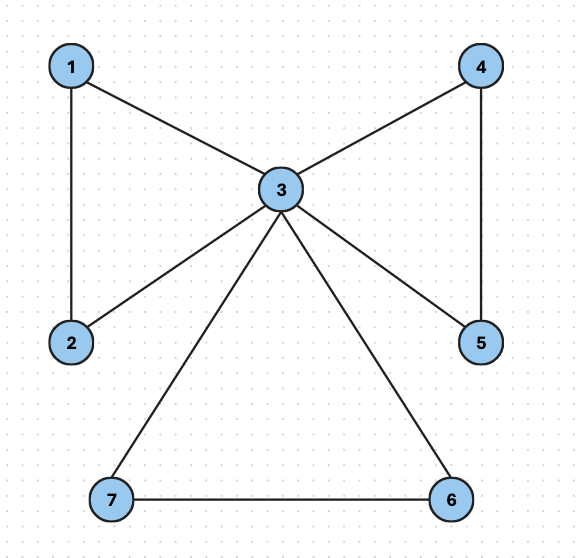
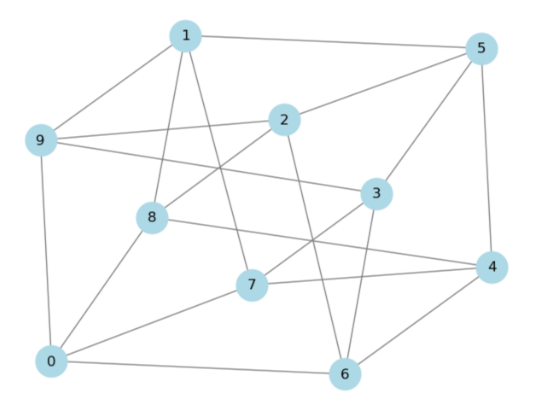
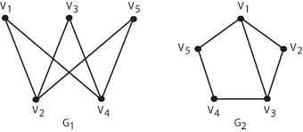
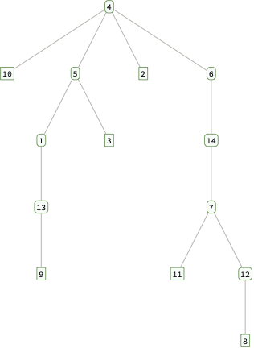
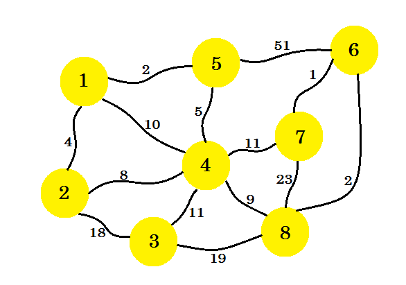
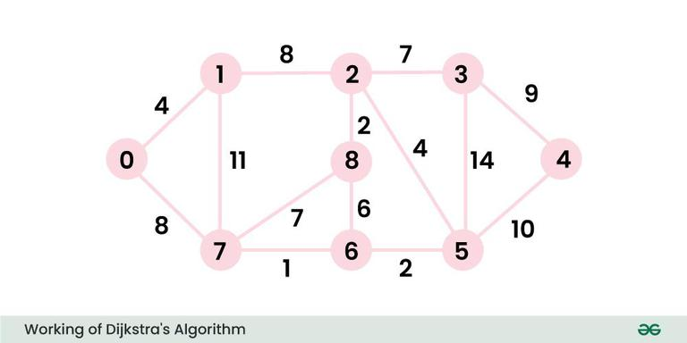
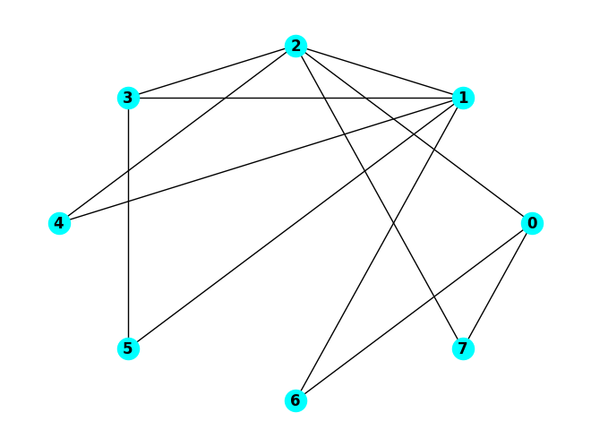
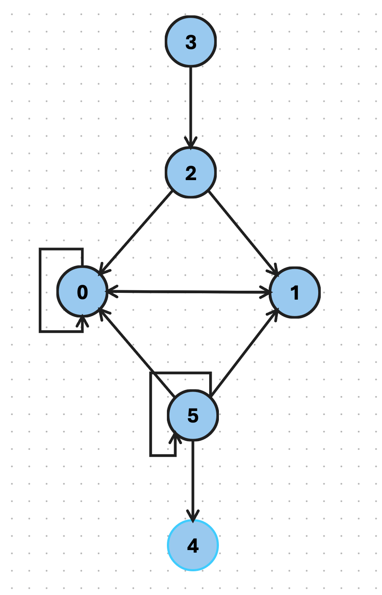
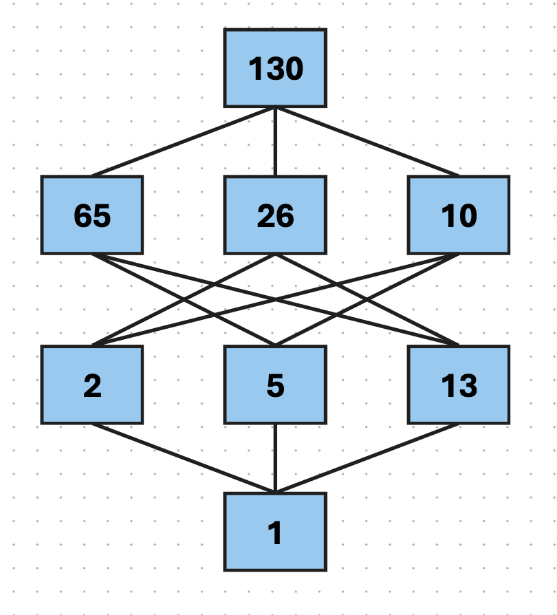

# MTH 325 Fall 2024 Final Exam Key

## Skill 1

> **(CORE)** I can outline a proof by mathematical induction.

Consider the following proposition, and suppose we want to prove it with mathematical induction: 

**For any integer $n \geq 1$, the number $n^3 + 2n$ is an integer multiple of $3$.** 

1.	State the value of $n$ that corresponds to the base case, then prove that the base case holds. 
2.	Clearly state the inductive hypothesis. Your answer should be phrased as a complete sentence. (No explanation is required here; simply state the inductive hypothesis.) 
3.	Clearly state what you would need to prove, after assuming the inductive hypothesis. Your answer should be phrased as a complete sentence. (You do not need to give a completed proof the statement; simply state what you would need to prove.)

Answers: 
1. The base case is $n=1$. In this case, $1^3 + 2(1) = 3$ and since this is a multiple of $3$, the base case holds. 
2. Assume that for some $k \geq 1$, $k^3 + 2k$ is an integer multiple of $3$. 
3. Prove that $(k+1)^3 + 2(k+1)$ is a multiple of $3$. 

---

## Skill 2

> **(CORE)** I can outline a proof using direct, contrapositive, and indirect approaches. 

Consider the proposition: **If a tree $T$ has $n$ edges, then $T$  has $n+1$ vertices.** 

1. Clearly state what you would assume and what you would prove if you were to prove this statement with a *direct proof*. 
2. Clearly state all the assumptions you would make if you were to prove this statement with a *proof by contradiction*. 
3. Clearly state what you would assume and what you would prove if you were to prove this statement with a *proof by contrapositive*. 

Answers:
1. Assume that $T$ has $n$ edges. Prove that $T$ has $n+1$ vertices. 
2. Assume that $T$ has $n$ edges but does not have $n+1$ vertices. 
3. Assume that $T$ does not have $n+1$ vertices. Prove that $T$ does not have $n$ edges. 

**Common mistakes:**

- Any response to the contradiction proof that says we will assume one statement and then prove something else, is incorrect. This is not how contradiction proofs work: We instead assume two things, the hypothesis, and the negation of the conclusion. Then we deduce that there must be a contradiction. It's OK to say that you assume the hypothesis and the negation of the conclusion and then state that you will prove a contradiction. But a correct setup must involve assuming both the hypothesis, and the negation of the conclusion.
- At your exam session it was announced that there was a correction to this problem: Part 2 should be the setup for a *contradiction* proof and Part 3 should be the setup for *contrapositive*. (It was switched on the exam form but appears correctly on this key.) The correction was announced verbally and placed on the whiteboard. However there were several instances of students either not making the correction, or making that correction in the problem statement but then giving responses to the uncorrected version. **Giving the contrapositive setup in part 2 and the contradiction setup in part 3, was considered an incorrect response** since the correction to the problem was clearly announced in the exam session. The exception to this, were students taking the exam in alternate locations due to SAR accommodations, and were therefore not in the room to receive the correction to the problem; I'm handling those exams on a case by case basis. 

---

## Skill 3

> **(CORE)** I can represent a graph in different ways, determine information (degree, degree sequence, paths of given length, etc.) about a graph using different representations, and give examples of graphs with specified properties. 

Suppose $G$ is a graph with this Python dictionary: `{0: [1, 4, 6], 1: [0, 3, 4], 2: [3, 4, 6], 3: [1, 2, 5], 4: [0, 1, 2, 6], 5: [3], 6: [0, 2, 4]}`. 

1. Give the adjacency matrix for $G$. 
2. Give the edge list for $G$. 
3. State the degree of each vertex. 
4. Give an example of a cycle of of length 4 in $G$. If no such cycle exists, say so. 

Answers: 
1. Below:
 
$$\begin{bmatrix}
0 & 1 & 0 & 0 & 1 & 0 & 1 \\
1 & 0 & 0 & 1 & 1 & 0 & 0 \\
0 & 0 & 0 & 1 & 1 & 0 & 1 \\
0 & 1 & 1 & 0 & 0 & 1 & 0 \\
1 & 1 & 1 & 0 & 0 & 0 & 1 \\
0 & 0 & 0 & 1 & 0 & 0 & 0 \\
1 & 0 & 1 & 0 & 1 & 0 & 0
\end{bmatrix}$$

2. `[(0, 1), (0, 4), (0, 6), (1, 3), (1, 4), (2, 3), (2, 4), (2, 6), (3, 5), (4, 6)]`
3. Given in this dictionary: `{0: 3, 1: 3, 2: 3, 3: 3, 4: 4, 5: 1, 6: 3}`. Any format that identifies the degree of each vertex specifically is OK. (But just a list of degrees, like a degree sequence, is not OK -- see below.)
4. There are several, for example 2, 4, 1, 3, 2. 

**Common mistakes:**

- Giving the degree sequence (4,3,3,3,3,3,1) in part 3 instead of "the degree of each vertex", which is an error because the degree sequence doesn't say which vertex has which degree. The point of the question is to see if you can identify the degree of a particular vertex. If this was the ONLY error in the problem, and if the sequence was correct, the problem was marked as Master. 

---

## Skill 4

> I can determine whether a graph has an Euler path or Euler circuit, and whether a graph has a Hamiltonian path or circuit.

Consider the graph below: 

1. Determine if this graph has an Euler trail, and explain how you know. If it does have an Euler trail, state it as a sequence of vertices. 
2. Determine if this graph has an Euler circuit, and explain how you know. If it does have an Euler circuit, state it as a sequence of vertices.
3. Determine if this graph has a Hamilton path, and explain how you know. If it does have a Hamilton path, state it as a sequence of vertices. 
4. Determine if this graph has a Hamilton cycle, and explain how you know. If it does have a Hamilton cycle, state it as a sequence of vertices.

Answers: 
1. This graph has an Euler trail because all of its vertices are of even degree. An example is  1, 2, 3, 4, 5, 3, 6, 7, 3, 1. 
2. This graph has an Euler circuit because all of its vertices are of even degree. An example is  1, 2, 3, 4, 5, 3, 6, 7, 3, 1. 
3. This graph *does not* have a Hamitlon path. Here is a "proof": Suppose for a contradiction that it did have a Hamilton path. That path either starts at 3, or does not start at 3. If it did start at 3, Then it must go to a vertex in one of the 3-cycles that are shown, then to the other vertex in that 3-cycle -- but then it must return to 3, and this is not the end of the path because there are still four vertices remaining to visit. Therefore vertex 3 would be visited multiple times, making it not a Hamilton path. If the Hamilton path started somewhere else, it would be in one of the 3-cyles; to visit all vertices, the path would eventually go through 3; but then it would go through 3 again after visiting the vertices in the other 3-cycles. 
4. This graph *does not* have a Hamilton cycle because there's no Hamilton path, as described. 

**Common mistakes:**

- Claiming the graph has no Hamilton path or cycle "because it has more than one odd cycle". There is no connection between the number of odd cycles in a graph and whether it has a Hamilton structure in it. For example [here is a graph with three 3-cycles that has both a Hamilton path and a Hamilton cycle](https://shottr.cc/s/1RtY/SCR-20241212-hli.png). 

---

## Skill 5

> I can use a greedy algorithm to find a vertex coloring for a graph, and I can determine a graph's chromatic number. 

1. Implement the greedy coloring algorithm to find a valid vertex coloring for this graph. For the ordering of the vertices, **<u>all of them have the same degree in this graph</u>**, so use this order: 0, 5, 1, 6, 2, 7, 3, 8, 4, 9.  Your work should consist of a table (or dictionary) giving the color assigned to each one, given **as a non-negative integer** (*not* as an actual color, like blue or red).
2. State the chromatic number of the graph, and explain your reasoning. 

Answers: 
1. First give vertex 0 the color 0. Now color vertex 5; we can use color 0 again. Now color vertex 1: This must be colored with 1 since this vertex is adjacent to 5. Continuing, we get this table of colors by applying the greedy algorithm: 

| Vertex | 0 | 5 | 1 | 6 | 2 | 7 | 3 | 8 | 4 | 9 | 
| --- | -- | -- | -- | -- | -- | -- | -- | -- | -- | -- | 
| Color | 0 | 0 | 1 | 1 | 2 | 2 | 3 | 3 | 4 | 4 | 

2. The chromatic number of the graph is **2**. This is because we can do a coloring directly with just 2 colors: Use one color for vertices 0, 1, 2, 3, and 4 and another color for vertices 5, 6, 7, and 8. And a coloring with 1 color is impossible because that would require the graph to have no edges. 

**Common mistakes:**

- *Coming up with a coloring that is valid but which would not result from the greedy algorithm as shown above*. The problem is asking you to run through the greedy algorithm, not just come up with a coloring.
- *Stating that the chromatic number is 5 because this is the number of colors used in the greedy algorithm*. It is true that the greedy algorithm uses 5 colors, but [this very problem was used in class](https://docs.google.com/presentation/d/1VYnPu_0l5Bq3i3wT5iXOgvNKwdRzUv-KeJndC3hbM8Q/edit?usp=sharing) to illustrate the fact that the greedy algorithm does not always produce the smallest coloring.
- *Stating that the chromatic number is 4*. There were several incorrect justifications for this incorrect answer, for example: 
  - *Because the greedy algorithm result uses four colors*. Seen above, the greedy algorithm uses 5 colors, not 4. 
  - *Because there is a clique of size 4 in the graph.* This is not the case; there are no cliques at all in this graph except "size 2" which is just an edge.  
  - *Because the degree of each vertex is 4*. The only connection we have between the degrees of vertices in a graph and its chromatic number is [Brooks' Theorem](https://publish.obsidian.md/discretecs/Graphs/Brooks'+Theorem) which states that the chromatic number is *less than or equal to* the *maximum degree* in the graph. So we know that the chromatic number is less than or equal to 4; but we can't conclude that it equals 4. 
- Stating that the chromatic number is 2, *because there are no 3-cycles.* It's true there are no 3-cycles in this graph but this does not mean the chromatic number is 2. For example, the cycle graph $C_5$ has no 3-cycles but its chromatic number is 3. 

---

## Skill 6

> I can determine whether two graphs are isomorphic; I can give an explicit isomorphism if they are, and an explanation if they are not.

Consider the two graphs below: 

Determine if these graphs are isomorphic. If they are isomorphic, give an explicit function between the vertex sets and prove that the edges are preserved. If they are not isomorphic, give a specific isomorphism invariant property that one has but the other does not have.

Answer: These two graphs **are not isomorphic** because the graph $G_2$ has a cycle of length 3, but $G_1$ does not. ($G_1$ is actually the complete bipartite graph $K_{3,2}$ and we proved in class that no complete bipartite graph has an odd cycle.) 

(Other isomorphism invariant properties might also be violated.) 

**Common mistakes:**

- *Saying that the graphs are not isomorphic because $\lbrace v_1, v_4 \rbrace$ is an edge in $G_1$ but not in $G_2$*. Isomorphisms allow for relabelling vertices, in fact that's what an isomorphism is by definition; so just because there's an edge in one graph and the vertices with those labels aren't adjacent in the other, doesn't mean that the graphs aren't isomorphic --- relabelling the vertices could create the edge. 
- *Saying that the graphs are not isomorphic because $v_2$ has degree 3 in $G_1$ but degree 2 in $G_2$*. Again, relabeling is the key here, see above. 
- *Saying that the graphs are not isomorphic because their degree sequences are the same.* We saw examples in class, and this problem is another, where having the same degree sequence does not guarantee isomorphism. 

---

## Skill 7

> **(CORE)** I can determine whether a graph is a tree and state information about it. 

A graph $G$ has the following adjacency matrix: 

$$\begin{bmatrix}
0 & 0 & 0 & 0 & 1 & 1 & 0 & 0 & 1 & 0 \\
0 & 0 & 0 & 0 & 1 & 0 & 0 & 0 & 0 & 0 \\
0 & 0 & 0 & 0 & 0 & 1 & 0 & 0 & 0 & 0 \\
0 & 0 & 0 & 0 & 0 & 0 & 0 & 0 & 1 & 0 \\
1 & 1 & 0 & 0 & 0 & 0 & 0 & 0 & 0 & 0 \\
1 & 0 & 1 & 0 & 0 & 0 & 1 & 0 & 0 & 0 \\
0 & 0 & 0 & 0 & 0 & 1 & 0 & 1 & 0 & 0 \\
0 & 0 & 0 & 0 & 0 & 0 & 1 & 0 & 0 & 0 \\
1 & 0 & 0 & 1 & 0 & 0 & 0 & 0 & 0 & 1 \\
0 & 0 & 0 & 0 & 0 & 0 & 0 & 0 & 1 & 0
\end{bmatrix}$$

1. Which of the following statements is true? (a) $G$ **must** be a tree; (b) $G$ **might** be a tree but might not be one; or  (c) $G$ **cannot** be a tree? Clearly state your choice, then explain your reasoning. 

**Answer**: There are 10 vertices in the graph (because the matrix is $10 \times 10$). By counting the number of 1's in each row we can determine the degree of each vertex: 

| Vertex | 0 | 1 | 2 | 3 | 4 | 5 | 6 | 7 | 8 | 9 | 
| --- | -- | -- | -- | -- | -- | -- | -- | -- | -- | -- | 
| Degree | 3 | 1 | 1 | 1 | 2 | 3 | 2 | 1 | 3 | 1 | 

So the sum of degrees is 18, and the Handshake Lemma then says there are $18/2 = 9$ edges. Since the number of edges is one less than the number of vertices, a theorem from class states that **$G$ must be a tree**. 

You can also simply draw the graph and point out that it's a tree, but this is quite a bit more work than the above solution IMO. 

2. Consider the following tree with vertex $4$ designated as the root: 

(a) State the child or children of vertex $1$. 

(b) State the parent or parents of vertex $9$. 

(c) State the leaves of the tree. 

**Answers:** (a) 13. (b) 13. (c) 10, 9, 3, 2, 11, 8. (Note: The "10" was printed small, and some people read it as "16", "18" or "19" because there's a slash through the 0. I counted anything that reasonably could look like a 10, as correct, as long as 10 itself was not also listed.)

**Common mistakes:**

- Forgetting to divide the degree sum by 2 in the first part. 
- Stating that the graph in part 1 is a tree without giving specific reasoning. For example, saying "we can see from the matrix that the graph is connected and has no cycles", without further explanation, is not sufficient -- this is simply stating the definition of a tree without explaining how we know that the graph satisfies all the conditions. (This is called "circular reasoning", where we argue that something is X by stating the definition of X.)

---

## Skill 8

> I can use Prim's Algorithm and Kruskal's Algorithm to construct a minimum spanning tree for a weighted graph.

Using the weighted graph above: 

1. Using Prim's Algorithm and starting at vertex $1$, construct a minimum spanning tree for this graph. Your work should consist of a list of edges in the tree, given in the order in which they are added.
2. Repeat part 1 except using Kruskal's Algorithm. 

Answers: 
1. `[(1,5), (1,2), (5,4), (4,8), (8,6), (6,7), (4,3)]`. 
2. `[(6,7), (1,5), (6,8), (1,2), (5,4), (4,8), (4,3)]`. The second and third edges could come in the opposite order. 

---

## Skill 9

>  I can use Dijkstra's Algorithm to find a minimum distance spanning tree for a weighted graph. 

In the weighted graph above, implement Dijkstra’s Algorithm to find the shortest paths from vertex 0 to all other vertices in the graph. Your work should consist of two things: A list of visited vertices given in the order that they are visited in the algorithm, and a table showing the distances from 0 to the other vertices with the updates to distances specified in Dijkstra’s Algorithm. 

Answer: 

Visited list: `[0, 1, 7, 6, 5, 2, 8, 3, 4]`. 

| Vertex | Distance from 0 | 
| ----- | -------------- | 
| 0 | 0 | 
| 1 | infinity $\rightarrow$ 4|
| 2 | infinity $\rightarrow$ 12|
| 3 | infinity $\rightarrow$ 25 $\rightarrow$ 19|
| 4 | infinity $\rightarrow$  21|
| 5 | infinity $\rightarrow$ 11 |
| 6 | infinity $\rightarrow$ 9 | 
| 7 | infinity $\rightarrow$ 8 |
| 8 | infinity $\rightarrow$ 15 $\rightarrow$ 14|

---

## Skill 10

> I can execute a breadth-first and depth-first search in a graph.

Using the graph above: 

1. Execute a depth-first search starting with node $0$. Your final submission should consist of two things: a list of visited vertices in the order in which they are visited, and a history of the stack or queue used to implement the search. Use numerical ordering (low to high) to add vertices into the stack or queue.
2. Repeat the first question but use a breadth-first search. 

DFS: Visited list is `[0, 7, 6, 1, 5, 3, 2, 4]`. Stack history below:

| Step | Stack contents | 
| --- | --- | 
| 1 | 0 | 
| 2 | 2, 6, 7 | 
| 3 | 2, 6 | 
| 4 | 2, 1 | 
| 5 | 2, 3, 5 | 
| 6 | 2, 3 | 
| 7 | 2 | 
| 8 | 4 | 
| 9 | (empty) | 

BFS: Visited list is `[0, 2, 6, 7, 1, 3, 4, 5]`. Queue history below: 

| Step | Queue contents | 
| --- | ----- | 
| 1 | 0 | 
| 2 | 2, 6, 7 | 
| 3 | 6, 7, 1, 3, 4 | 
| 4 | 7, 1, 3, 4 | 
| 5 | 1, 3, 4 | 
| 6 | 3, 4, 5 | 
| 7 | 4, 5 | 
| 8 | 5 | 
| 9 | (empty) | 

---

## Skill 11

> **(CORE)** I can represent a directed graph in different ways, and determine information about a graph using different representations. 

Let $G$ be a directed graph with this dictionary representation: `{0: [0, 1], 1: [0], 2: [0, 1], 3: [2], 4: [], 5: [0, 1, 4,5]}`

1. State the edge list for $G$. 
2. State the adjacency matrix for $G$. 
3. State the in-degree and out-degree of each vertex. 
4. Draw a picture of the directed graph. 

Answers: 
1. `[(0, 0), (0, 1), (1,0), (2,0), (2,1), (3,2), (5,0), (5,1), (5,4), (5,5)]` 
2. Below:
$$\begin{bmatrix}
1 & 1 & 0 & 0 & 0 & 0\\
1 & 0 & 0 & 0 & 0 & 0 \\
1 & 1 & 0 & 0 & 0 & 0 \\
0 & 0 & 1 & 0 & 0 & 0 \\
0 & 0 & 0 & 0 & 0 & 0 \\
1 & 1 & 0 & 0 & 1 & 1
\end{bmatrix}$$
3. Below:

| Vertex | 0 | 1 | 2 | 3 | 4 | 5 |
| --- | --- | ---   | ---  | ---  |  ---  | --- |
| In degree | 4 | 3 | 1 | 0 | 1 |1|
| Out degree | 2 | 1 | 2 | 1 | 0 | 4 |

4. Below: 

---

## Skill 12

> I can use the Floyd-Warshall algorithm to construct the transitive closure of a directed graph. 

Consider the adjacency matrix below: 

$$\left(
\begin{array}{cccc}
 0 & 0 & 1 \\
 1 & 1 & 0  \\
 1 & 0 & 0  \\
\end{array}
\right)$$

Assume that the vertices are 0, 1, 2 and that the rows and columns correspond to those vertices in this order. 

1. Complete the table below for the first six steps of Warshall’s algorithm. The first two rows have the values for the counters in the loops filled in for you. The other values of the loop counters must be done in the correct order given by the pseudocode for Warshall’s algorithm given in class. **Copy the table to your work and complete it there, not on this page!** 

| $k$ | $i$ | $j$ | $W[i,j]$ | $W[i,k]$ | $W[k,j]$ | Result |
| --- | --- | --- | -------- | -------- | -------- | ------ |
| 0   | 0   | 0   | 0        | 0        | 0        | 0      |
| 0   | 0   | 1   | 0        | 0        | 0        | 0      |
| 0   | 0   | 2   | 1        | 0        | 1        | 1      |
| 0   | 1   | 0   | 1        | 1        | 0        | 1      |
| 0   | 1   | 1   | 1        | 1        | 0        | 1      |
| 0   | 1   | 2   | 0        | 1        | 1        | 1      |

2. Complete the step in Warshall’s algorithm correspoinding to k = 1, i = 2, and j = 2. 

| $k$  | $i$  | $j$  | $W[i,j]$ | $W[i,k]$ | $W[k,j]$ | Result |
| ---- | ---- | ---- | -------- | -------- | -------- | ------ |
| 1    | 2    | 2    |    0      |     0     |    0      |  0      |

---

## Skill 13

> I can determine whether a relation is reflexive, symmetric, antisymmetric, and/or transitive, and whether it is an equivalence relation; and if so, I can determine the equivalence class of a point. 

1. Let $S = \lbrace 1, 2, 3, \dots, 10 \rbrace$. Here are two relations on $S$: 
    - Relation 1: $a \sim b$ if $a \leq b$  
    - Relation 2: $a \sim b$ if $|b-a| \leq 3$ 

For each relation state whether or not the relation has these properties: reflexive, symmetric, antisymmetric, or transitive. Then state whether or not the relation is an equivalence relation. 

Answers: 
- Relation 1 **is** reflexive, antisymmetric, and transitive. It **is not** symmetric and not an equivalence relation. 
- Relation 2 **is** reflexive and symmetric. It **is not** antisymmetric or transitive, and not an equivalence relation. 

2. Let $S = \{ (a,b) \, : \, a,b \, \text{are positive integers} \}$ be the set of all pairs (or tuples) of positive integers. Examples of elements of this set include $(2,3)$ and $(100,200)$, but not $(0,1)$ (because $0$ is not positive) or $(1.1, 2.4)$ (because the entries aren't integers). Define a relation on $S$ by $(a,b) \sim (c,d)$ if $\frac{a}{b} = \frac{c}{d}$. This is an equivalence relation; state at least three elements of $[(1,2)]$. 

Answer: Samples include $[(2,4)]$, $[(3,6)]$, and $[(10,20)]$. 

## Skill 14

> I can determine whether a relation is a partial ordering; if so, I can draw its Hasse diagram and identify maximal/minimal elements and/or greatest/least elements, if they exist.

1. Let $S = \{ (a,b) \, : \, a,b \, \text{are positive integers} \}$ be the set of all pairs (or tuples) of positive integers. Examples of elements of this set include $(2,3)$ and $(100,200)$, but not $(0,1)$ (because $0$ is not positive) or $(1.1, 2.4)$ (because the entries aren't integers). For each, state whether the relation is a partial ordering. If a relation *is* a partial order, you do not need to explain why; just state that it is a partial ordering. But, if a relation is *not* a partial ordering, state at least one property of partial orderings that is not satisfied. 
   
   (a) $(a,b) \sim (c,d)$ if $a = c$ 

   (b) $(a,b) \sim (c,d)$ if $a < c$

   (c) $(a,b) \sim (c,d)$ if either $a \leq b$ or $c \leq d$

Answers: 
- The first relation  **is not** a partial ordering because it is not antisymmetric; for example $(1, 2) \sim (1,3)$ and vice versa but these are not equal. 
- The second relation **is not** a partial ordering because it is not reflexive. For example $(1,1) \not \sim (1,1)$ because $1 \not < 1$. 
- The third relation **is not** a partial ordering because it is not antisymmetric. For example $(1,2) \sim (1,3)$ because $1 \leq 1$, and vice versa for the same reason, but these are not equal. 

2. Let $S = \{65, 26, 10, 130, 13, 5, 1, 2\}$. Let $\sim$ be the relation on $S$ defined by $a \sim b$ if $b$ is an integer multiple of $a$. (For example, $35$ is an integer multiple of $7$, but $200$ is not.)  This is a partial ordering; draw its Hasse diagram. 

