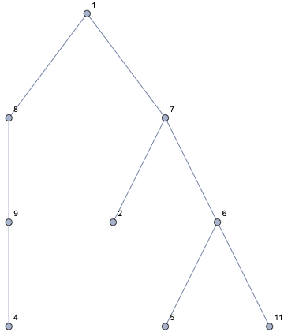

# MTH 325 Proof problems -- Fall 2024

## Instructions for all Proof Problems 


**You do not have to do all of the problems below.** You only need to complete **five (5) successful Proofs** for an A in the class, and **two (2) successful proofs** for a B. No proofs are required for a C or below. 

**Problems will be added regularly throughout the semester** as we explore more content. It is expected that we will end with about 10-14 problems in all. 

Your job is to **find problems that look interesting to you and then solve them**. "Solve" here means **write a complete, correct, and polished proof** for the statement that's given in the problem. [Please see the Standards for Students Work document](https://github.com/RobertTalbert/discretecs/blob/master/MTH325-Fall2024/course-docs/Standards%20for%20Student%20Work%20W24.md) for details of what this involves. Among the criteria for acceptable work are these important points: 

- Your work must constitute a **good-faith effort at a completed proof**. You may not write up part of a proof and leave other parts of it incomplete or blank. 
- Your work must be **free from serious errors** in computation, logic, factual knowledge, and semantics. 
- Your work must **look professional** and **explain your reasoning clearly**. Proofs that are just computations (a "wall of math") will need to be revised. 

There is no one right way to write a proof! **Proofs are highly personalized, and the same statement can be proven many different ways**. A proof is just a clear, correct, and convincing explanation why a statement is always true. It does not have to conform to any particular method like induction, contradiction, etc. If you feel you can give an argument for why a statement below is true that is clear, correct, and convincing and it doesn't look like one of the basic arguments we explored in class, give it a try. 

To see several examples of proofs that would be marked **Success**, proofs that would be marked **Revise**, and proofs that would not be considered good-faith attempts, please see [this document](https://docs.google.com/document/d/111EUAtMIBdRJao1J_g18G_adQrfviHqCtY21Eda0dns/edit?usp=sharing). (https://docs.google.com/document/d/111EUAtMIBdRJao1J_g18G_adQrfviHqCtY21Eda0dns/edit?usp=sharing) 


To submit a proof for grading, do the following: 

- **Type up** your proof using a word processor or other computer program that allows for entry of mathematical notation. Microsoft Word, Google Docs, and Open Office Writer all have built-in equation editors you can use to insert mathematical notation. **No handwritten work is accepted** -- any submission that is handwritten will be marked "Revise" and returned without any feedback on the work itself (other than a note about typing up your work). 
- **Save your work as either a PDF or Microsoft Word (`.docx`) file**. No other file format is accepted because Blackboard won't let me leave feedback on the submission if it's not PDF or Word. 
- Put **one problem per file**. If you have proofs for 2-3 different problems, submit them separately in separate files. 
- When you are ready to submit your work, **upload the PDF or Word document to Blackboard** by going to the course Blackboard site, then the *Assignments* folder, then the *Proof Problems* folder, and then to the "assignment" for that problem. (For example if you are submitting a proof for Problem 2, look for "Proof Problem 2".) 

You may make **up to three submissions per week**: Proofs of three new problems, a new proof plus two old ones, or any other combination. 

Proof problems are graded periodically through the week, often in batches on Mondays and Wednesdays. Once you submit a proof, check back to see if it has been graded or check the Grading Status Board. If it has not been graded yet, it will be soon --- all graded work will be graded within seven business days of submission. Please do not email for status updates. 


---

## Proof Problem 1

**Initial deadline: 11:59pm ET, Saturday September 28** 

Recall from MTH 225 that the [binomial coefficient](https://publish.obsidian.md/discretecs/Combinatorics/Binomial+coefficient) $\binom{n}{k}$ is the number of ways to select $k$ elements from an $n$-element set (irrespective of ordering). It can also be interpreted as the number of $k$-element subsets of an $n$-element set; or as the number of bitstrings of length $n$ that have exactly $k$ `1` bits. 

A fundamental identity for the binomial coefficient is this, which you also learned in MTH 225: 

$$\binom{n}{k} = \binom{n-1}{k} + \binom{n-1}{k-1}$$

For an explanation why this recurrence relation holds, [click here](https://vimeo.com/714228899).

**Prove** that, for all positive integers $n$, the following equality holds for the binomial coefficient: 

$$\binom{n}{0}2^0 + \binom{n}{1}2^1 + \binom{n}{2}2^2 + \cdots + \binom{n}{n}2^n = 3^n$$

**Important note (added 2024-09-11): You are not allowed to use a result called the Binomial Theorem on this problem** since it is not a standard topic in MTH 225 or in high school math, and therefore is not something that your target audience would know or understand. It's also not necessary for a proof here! 


*Pro tip*: There is a closed formula for the binomial coefficient, namely $\binom{n}{k} = \frac{n!}{(n-k)! k!}$. You are highly advised *not* to use that formula in this problem -- the algebra that results is truly awful. 


## Proof Problem 2

**Initial deadline: 11:59pm ET, Saturday September 28** 


See Problem 1 for some background on the binomial coefficient. **Prove** that for all integers $n \geq 0$ and $i \geq 0$, 

$$\binom{0}{i} + \binom{1}{i} + \binom{2}{i} + \cdots + \binom{n}{i} = \binom{n+1}{i+1}$$

Note: If $a < b$ then $\binom{a}{b} = 0$. For example $\binom{1}{3} = 0$. 


Example of what this equality is saying: Suppose $i = 3$ and $n=4$. Then on the left we have
$\binom{0}{3} + \binom{1}{3} + \binom{2}{3} + \binom{3}{3} + \binom{4}{3}$ which you can verify equals $0 + 0 + 0 + 1 + 4 = 5$. On the other hand, on the right of the equation we would have $\binom{5}{4}$, and this also equals $5$. 

**Important note (added 2024-09-11): You are not allowed to use a result called the Binomial Theorem on this problem** since it is not a standard topic in MTH 225 or in high school math, and therefore is not something that your target audience would know or understand. It's also not necessary for a proof here! 

*Pro tip:* Induction might be a good option on this one. But what is the correct variable to use for the induction? 


## Proof Problem 3

**Initial deadline: 11:59pm ET, Saturday October 5** 

Here are three propositions that are needed to complete the proof of the corollary to the Handshake Lemma discussed in class on September 16. Write complete, correct, and clear proofs of all three. 

1. Prove that an odd integer plus an even integer is an odd integer. 
2. Prove that the sum of an odd number of odd integers is an odd integer. 
3. Prove that the sum of *any* number of even integers is an even integer. 

## Proof Problem 4

**Initial deadline: 11:59pm ET, Saturday October 26**

Prove that a connected graph has an Euler trail, if and only if there are at most two vertices with odd degree. 

Notes on this problem: 

- You are allowed to use, as a proven fact, the theorem we proved in class which says **A connected graph has an Euler circuit if and only if every vertex has even degree.**
- This is a biconditional statement, which means there are two conditional statements to prove in this problem. You can see those by reviewing [the class slides from Monday, September 23](https://docs.google.com/presentation/d/1JRz1lP1MWWl954rIJwWY3FGD3wpQkiO9iM7l6pmNbEo/edit?usp=sharing). 

## Proof Problem 5

**Initial deadline: 11:59pm ET, Saturday October 26**

The **hypercube graph** $Q_n$ is defined as follows: 

- The vertices of $Q_n$ are all the $n$-bit binary strings. So, $Q_2$ has four vertices (00, 01, 10, 11), $Q_3$ has eight, $Q_4$ has sixteen, and so on. 
- Two vertices of $Q_n$ are connected by an edge, if the bitstrings differ in exactly one place. For example in $Q_4$, the vertices for `0011` and `0111` would be adjacent; so would `0111` and `1111`. But `0011` and `1111` would not be adjacent because they differ in two places, not one. 

You can generate the hypercube graph $Q_n$ and visualize it in networkX using the command `nx.hypercube_graph(n)`. For example the following code will generate $Q_3$, assign it to a variable that you can use, and visualize it: 

```python
Q = nx.hypercube_graph(3)
nx.draw(Q, with_labels=True, font_weight='bold', node_color='lightgreen')
plt.show()
```

Explore each of the following questions, then give an answer and prove (mathematically) that your answer is correct: 

1. For any integer $n$, how many edges are in $Q_n$? 
2. Under what conditions on $n$ will $Q_n$ have an Euler circuit? 
3. Under what conditions on $n$ will $Q_n$ have a Hamilton circuit?

For the second and third questions, your answers must be one of the following: "Never", "Always", or "Sometimes". If "sometimes", you will need to give precise conditions on the variable $n$ where the question is answered affirmatively. (For example, "$Q_n$ has an Euler circuit whenever $n$ is a prime number" or "$Q_n$ has a Hamilton circuit whenever $n \geq 10$".) And in each case, as indicated, give not only a clear answer but a clear, correct, complete mathematical proof that your answer is right. 


## Proof Problem 6


1. Prove that the property of having a cycle of length 3 is an isomorphism invariant property of graphs. That is, if $G$ and $H$ are isomorphic graphs and $G$ has a cycle of length 3, then $H$ also has a cycle of length 3. 
2. Explain how you might extend your proof in part 1 (but don't give a full proof, unless you want to) to show that having a cycle of length $n$, where $n$ is any positive integer, is isomorphism invariant. 

## Proof Problem 7


Prove the following pair of propositions, which are converses to the tree theorems we did in class: 

1. Prove that any connected graph that has $n$ vertices and $n-1$ edges, is a tree. 
2. Prove that any graph that has $n$ vertices and $n-1$ edges and has no cycles, is connected. 

## Proof Problem 8


Here are two useful definitions: 

- A *binary tree* is a tree is a tree in which every vertex has at most two children. 
- Given any $n \geq 0$, the $n$th level of a binary tree is the set of all vertices that have a [depth](https://publish.obsidian.md/discretecs/Trees/Rooted+tree) of $n$. 

For example, the tree below is binary (because every vertex has no more than two children), and the vertices at level 2 are 2, 6, and 9. (The root,1, is at level 0.)



**Prove:** In a binary tree, the number of vertices at level $n$ is less than or equal to $2^n$ for all $n \geq 0$. 

Pro tip: There are a lot of unclear ways to "prove" this. To make a clean, convincing argument -- consider using induction. 


## Proof Problem 9


If $G$ is a *directed* graph and $v$ is a vertex in $G$, then recall that...
- $d^{-}(v)$ is the [in-degree](https://publish.obsidian.md/discretecs/Directed+Graphs+and+Relations/In-degree+and+out-degree) of $v$, 
- $d^{+}(v)$ is the [out-degree](https://publish.obsidian.md/discretecs/Directed+Graphs+and+Relations/In-degree+and+out-degree) of $v$, and 
- $|E|$ is the number of edges in $G$. 

Prove two things about any directed graph $G$: 

1. That the sum of the in-degrees of the vertices of $G$ equals the number of edges. That is, $\sum_{v \in G} d^{-}(v) = |E|$. And, 
2. That the sum of the in-degrees of the vertices of $G$ equals the sum of the out-degrees. That is, $\sum_{v \in G} d^{-}(v) = \sum_{v \in G} d^{+}(v)$.

These two facts together will be known as the **directed Handshake Lemma** from here on out, since these are the directed version of the Handshake Lemma we proved earlier in the semester. You might benefit from studying the proof of the undirected Handshake Lemma. 


## Proof Problem 10 

Suppose $T$ is a [rooted tree](https://publish.obsidian.md/discretecs/Trees/Rooted+tree) which has $n \geq 3$ vertices, and in which any vertex that is not a leaf has exactly two children. Prove that the number of leaves is $\dfrac{n+1}{2}$. 

**Pro tip:** You probably need to draw several examples first before you're able to prove this. But, remember not to include any examples in your submission. 