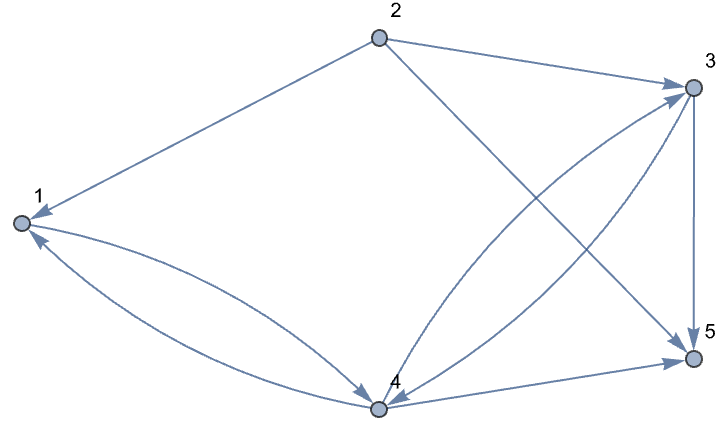

# Sample Final Examination, MTH 325 Fall 2024

## Skill 1

Consider the following proposition: 

>For all natural numbers $n$, $1+ 2 + 3 + \cdots + n = \dfrac{n(n-1)}{2}$. 

Suppose you were to write a proof of this proposition using mathematical induction. 

1. State the value of $n$ that corresponds to the base case. 
2. Prove the base case holds. 
3. Clearly state the inductive hypothesis. 
4. Clearly state what you would need to prove, after assuming the inductive hypothesis. (An actual proof is not necessary.)

## Skill 2

Consider the following proposition: 

>For all integers $n$, if $n^2$ is even then $n$ is even. 

1. Clearly state what you would assume and what you would need to prove if you proved this proposition using a *direct proof*. 
2. Clearly state what you would assume and what you would need to prove if you proved this proposition using a *proof by contrapositive*.  
3. Clearly state all assumptions you would make if you proved this proposition using a *proof by contradiction*. 

## Skill 3

Suppose $G = (V,E)$ is a graph whose vertex set is $V = \lbrace 1,2,3,4\rbrace $ and whose edge set is $E = \lbrace \lbrace 1,2\rbrace , \lbrace 1,3\rbrace , \lbrace 2,3\rbrace , \lbrace 2,4\rbrace \rbrace $. 

1. Draw a visual diagram for this graph. 
2. Write a Python dictionary that represents this graph. 
3. Write the adjacency matrix for this graph. 
4. Give an example of a walk of length 3 in this graph, that is not a path. (If no such example exists, explain why.)
5. State the degree sequence for this graph. 

## Skill 4

Consider the graph below: 

1. Determine whether this graph has an Euler path. If so, state it as a list of vertices. If not, say so. 
2. Determine whether this graph has an Euler cycle. If so, state it as a list of vertices. If not, say so. 
3. Determine whether this graph has a Hamiltonian path. If so, state it as a list of vertices. If not, say so. 
4. Determine whether this graph has a Hamiltonian cycle. If so, state it as a list of vertices. If not, say so. 

## Skill 5

Consider the graph below: 

1. Use a greedy algorithm to find a proper vertex coloring for the graph. Show all your steps. 
2. Determine the chromatic number for this graph and explain your reasoning. (Explanations consisting only of "You can't use fewer colors" are not valid.)

## Skill 6

Consider graphs $G$ and $H$ below. Each has the same number of vertices and edges; $G$ the first one shown. 

Are $G$ and $H$ isomorphic? State your answer ("yes" or "no"). Then, if they are isomorphic, give an explicit isomorphism that maps the vertex set of $G$ onto that of $H$. If they are not isomorphic, give a brief but complete explanation why that uses a particular isomorphism invariant. (Informal explanations are not valid.)

## Skill 7

1. Draw an example of a graph that has 5 vertices and 4 edges but which is *not* a tree. If no such example exists, explain why.
2. Consider the tree shown below: 

Assume that vertex 7 is the root. State the following: 
   (a) The leaves of the tree
   (b) The height of the tree
   (c) The children of vertex 5

## Skill 8

Consider the weighted graph $G$:

1. Use Prim's algorithm to find a minimum spanning tree in $G$. Show all your steps. 
2. Repeat the first item but use Kruskal's algorithm. 
   
## Skill 9  

Consider the weighted graph $G$:

Use Dijkstra's Algorithm to find a minimum-weight path from vertex 0 to vertex 4. Show all steps and clearly state the weight of the minimum path. 

## Skill 10 

Consider the graph $G$ below: 

1. Starting at vertex 0, implement a breadth-first search to find the shortest route between vertex 0 and vertex 6. Show all your steps. 
2. Repeat the previous item but use a depth-first search. Show all your steps.
 
## Skill 11

Consider the directed graph $G$: 

1. Give a Python dictionary that represents this graph. 
2. State the adjacency matrix for this graph. 
3. List the in-degree and out-degree of each vertex. 
4. Give an example of a path of length 4. If no such example exists, explain why.

## Skill 12 

Consider the direced graph $G$: 

1. Write the adjacency matrix for $G$. 
2. Use the Floyd-Warshall algorithm to find the transitive closure of $G$. Show all steps and give your result as a matrix and as a visual diagram. 

## Skill 13

Consider the relation $\sim$ on the set of all natural numbers ($\mathbb{N} = \lbrace 0,1,2,3,\dots\rbrace $) given as follows: For all natural numbers $a$ and $b$, say that $a \sim b$ if $a-b$ is a multiple of $3$. For example $10 \sim 13$ but $10 \not \sim 5$. 

1. Determine whether the relation is *reflexive*. If it is, just say so. If it is not, give a specific concrete example that explains why not. 
2. Determine whether the relation is *symmetric*. If it is, just say so. If it is not, give a specific concrete example that explains why not. 
3. Determine whether the relation is *antisymmetric*. If it is, just say so. If it is not, give a specific concrete example that explains why not. 
4. Determine whether the relation is *transitive*. If it is, just say so. If it is not, give a specific concrete example that explains why not. 
5. Determine whether the relation is an equivalence relation. If it is, say so, and rewrite the equivalence class $[10]$ as a set. If not, briefly explain why not. 

## Skill 14

1. Consider the relation $\sim$ on the set of all natural numbers ($\mathbb{N} = \lbrace 0,1,2,3,\dots\rbrace $) given as follows: For all natural numbers $a$ and $b$, say that $a \sim b$ if $a-b > 0$. Is this relation a partial ordering? If so, explain why; if not, explain why not. 

2. Consider the relation $\sim$ on the set $\lbrace 1,2,3,\dots, 9\rbrace $ given as follows: For all natural numbers $a$ and $b$, say that $a \sim b$ if $b$ is a multiple of $a$. For example $2 \sim 8$ but $2 \not \sim 5$. This relation is in fact a partial ordering. Draw the Hasse diagram of the ground set and identify the minimal elements, maximal elements, least elements, and greatest elements. 

