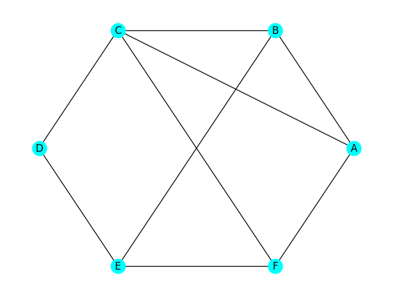

# MTH 325: Spanning trees

The university wants to lay fiber optic cable to connect 6 campus buildings. Cable is expensive, so they want every building connected (directly or indirectly) to every other building — but they don't want to lay any unnecessary cable. Your job: figure out the minimum set of connections that still keeps everyone linked.

The graph below shows the six buildings and some possible direct connections between the buildings. Note, not all pairs of buildings can be directly connected due to issues like existing infrastructure or geographic features of the campus. 

## Part 1

Highlight or circle a subset of edges such that:

- Every vertex is still reachable from every other vertex
- You've used as few edges as possible

&nbsp;

&nbsp;

&nbsp;

---

## Part 2

Compare your answer with another group's. Answer the following:

1. How many edges did you use? How many did they use?

&nbsp;

&nbsp;

2. Are your two solutions identical? If not, is one more "correct" than the other? Why or why not?

&nbsp;

&nbsp;

3. Do any of the solutions contain a cycle? Why do you think that is?

&nbsp;

&nbsp;

---

## Part 3

Here are some systematic algorithms for solving this kind of problem. Try them on the graph above and record which edges you end up with.

**Algorithm 1 — The Grower**
1. Pick any node and start there. 
2. Pick a neighbor and connect it. 
3. Pick a neighbor of any node that is already connected but not visited yet. 
4. Stop when all nodes are connected. 

**Algorithm 2 — The Explorer**
1. Pick any node and start there. 
2. Walk along a path starting at that node. Add an edge any time you go over it. 
3. Keep walking until you hit a dead end or a node you've already seen. Then backtrack and try a different direction. 
4. Stop when all nodes are connected.

**Algorithm 3 - The Pruner**
1. Find a cycle in the graph and delete one edge from it. 
2. Continue to do this until there are no more cycles left. 

Which edges did you keep in each approach?

&nbsp;

&nbsp;

Did you get the same result as Part 1? If not, is your answer still valid?

&nbsp;

&nbsp;

Could you have made different choices in the algorithm and gotten a different result? Give an example.

&nbsp;

&nbsp;
