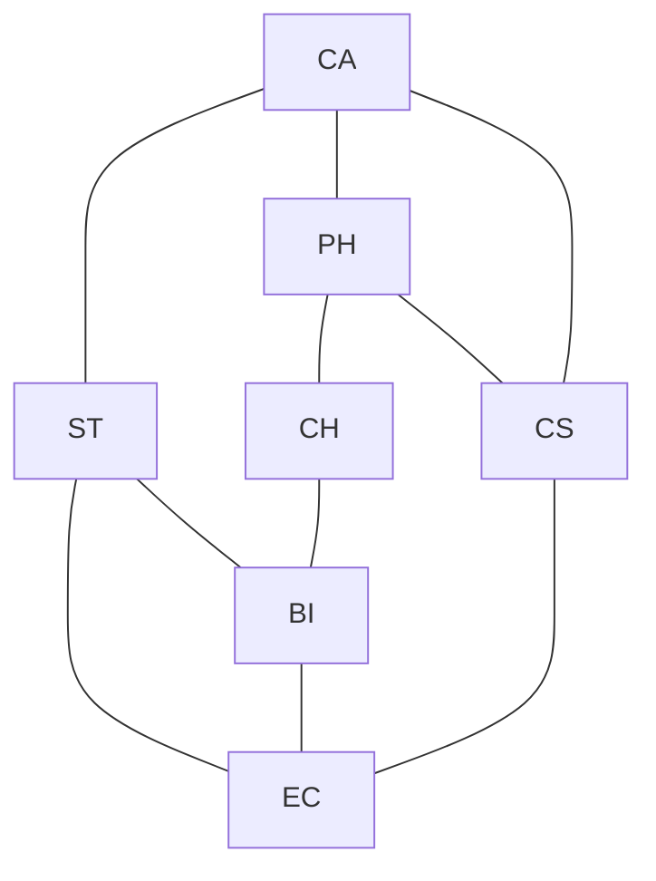
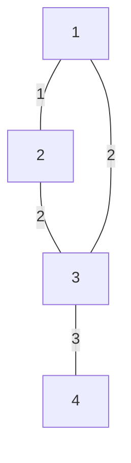

# MTH 325 Application Analysis Exam 2 solutions and notes 

## Part A -- Multiple Choice

1. D
2. B
3. B
4. B
5. B
6. B
7. A
8. C
9. E (although B, and D also work)
10. E

## Part B (Mathematical Induction)

### Option 1

The base case is $n = 7$. In this case, $3^7 = 2187$ and $7! = 5040$. Clearly $2187 < 5040$ so the base case is true. 

Now assume $3^k < k!$ for some $k$. We want to prove that $3^{k+1} < (k+1)!$. We are going to build a chain of inequalities starting from $3^{k+1}$ and ending with $(k+1)!$. 

To do this, start with the left side of this proposed inequality, $3^{k+1}$. This equals $3 \cdot 3^k$. Now, $k > 6$ by global assumption and therefore $k+1 > 7$, so $3 \cdot 3^k < (k+1) \cdot 3^k$. The induction hypothesis says $3^k < k!$ so we have $(k+1) 3^k < (k+1) k!$. The right side of this is the same as $(k+1)!$. So now we have:

$$ 3^{k+1} < (k+1) \cdot 3^k < (k+1) k! = (k+1)!$$

Which says that $3^{k+1} < (k+1)!$ and that is what we wanted to prove. 

### Option 2

[A complete proof of this one is in the vault](https://publish.obsidian.md/discretecs/Proof/Mathematical+induction).

## Part C  (Graph coloring) 

## Option 1

Here is the conflict graph:

And here is the greedy algorithm for the coloring: 

| Node | Neighbors  | Neighbors' colors | COLOR ASSIGNED |
| ---- | ---------- | ----------------- | -------------- |
| BI   | EC, CH, ST | n/a               | 1              |
| CA   | ST, PH, CS | n/a               | 1              |
| CH   | BI, PH     | 1                 | 2              |
| CS   | CA, PH     | 1                 | 2              |
| EC   | ST, BI, CS | 1, 2              | 3              |
| PH   | CA, CH, CS | 1, 2              | 3              |
| ST   | CA, EC, BI | 1, 3              | 2              |

A final exam schedule that works would be to schedule courses in the following three groups: 

- BI and CA
- CH, CS, and ST
- EC, PH

This is the smallest coloring because of the 3-cycle formed by ST, BI, and EC. 

#### Notes

- A number of submissions on this option did not show the work from the algorithm, just the results. The purpose of this part is to demonstrate your knowledge of the greedy algorithm. So just showing the results does not do that -- the results could have been obtained simply by guess and check. Show the steps that the algorithm goes through in determining neighbors and the colors of the neighbors. 

### Option 2

For any $n > 2$, $\chi(C_n) = 2$ if $n$ is even and $3$ if $n$ is odd. 

**Proof:** Note that the number of nodes and number of edges in $C_n$ is always the same and both are equal to $n$. Label the nodes of $C_n$ around the cycle as $v_0, v_1, \dots, v_{n-1}$. And recall there is an edge between consecutive nodes on the cycle as well as an edge $(v_{n-1}, v_0)$ to complete the cycle. 

If $n$ is even, then color all even-indexed nodes red and all odd-indexed nodes blue. Since $n-1$ is odd in this case, each edge connects a red node to a blue node and no two adjacent nodes have the same color. Since we cannot use just one color (adjacent vertices would conflict) this shows that $\chi(C_n) = 2$. 

If $n$ is odd, then attempt the same coloring as in the even case, except notice that $n-1$ is even and so $v_{n-1}$ and $v_0$ would both be red. But we cannot make $v_{n-1}$ blue either because then it would conflict with $v_{n-2}$. So $v_{n-1}$ must be given a third color, green. Once we do that, there are no conflicts and $\chi(C_n) = 3$. 

## Part D (Catch-all) 

### Option 1

There are possibly many examples for each. Here are a few given as edge lists: 

(a) Reflexive and symmetric, but not transitive: {(a,a), (b,b), (c,c), (d,d), (a,b), (b,a), (b,c), (c,b)}. Not transitive because (a,b) and (b,c) are edges but not (a,c). 

(b) Symmetric and transitive but not reflexive: {(a,b), (b,a), (a,a), (b,b)}. Not reflexive because (c,c) is not an edge (self-loop).

(c) Transitive but neither reflexive nor symmetric: {(a,b), (b,c), (a,c)}. Not reflexive because (c,c) is not an edge. Not symmetric because (a,b) is an edge but not (b,a). 

(d) Both symmetric and anti-symmetric:  {(a,a), (b,b)}. 

### Option 2

Assume G is a DAG with no source. Then every vertex has in-degree $\geq 1$ meaning every vertex has at least one incoming edge. 

Starting at any vertex $v_0$, since $v_0$ has an edge pointing into it, follow the edge backwards to some $v_1$ (so $(v_1, v_0)$ is an edge). Since $v_1$ also has an edge pointing into it, follow it back to $v_2$ (making $(v_2, v_1)$ an edge). Continue this process.

Since G is finite with $n$ vertices, after at most $n$ steps this backward path must revisit a vertex. That is, there exist indices i < j such that $v_i = v_j$. But then  $v_j \rightarrow v_{j-1} \rightarrow \cdots \rightarrow v_i$ forms a directed cycle in G.

This contradicts G being a DAG (which has no directed cycles). Therefore, our assumption that there was no source was wrong, so every DAG must have at least one source.

Similar reasoning will prove that $G$ must also have a sink. 

### Option 3

(a) Consider this weighted graph: 

The edges $(2,3)$ and $(1,3)$ have the same weight (2). Prim's algorithm (starting from vertex 1) might add 1–2 first, then either 2–3 or 1–3 (tie in weight), then 3–4 — yielding either MST depending on tie-breaking. Kruskal's adds 1–2 (weight 1), then hits the tie at weight 2 and may add either 2–3 or 1–3. Both results are valid MSTs.

(b) Here is a proof by contradiction. Suppose $T_1$ and $T_2$ are two different MSTs of the graph $G$. Since they are different, there is at least one edge $e = (u,v)$ that is in one but not the other. There could be several; let $e$ be the one that has the smallest weight. 

Let's say that $e \in T_1$ and $e \not in T_2$. Adding $e$ to $T_2$ would create a unique cycle, $C$, in $T_2$. Since $T_1$ is a spanning tree, the cycle must contain some edge $f \in C$ that is *not* in $T_1$ (otherwise $T_1$ would contain $C$ making it no longer a tree). 

Now compare weights. Since $e$ was chosen as the minimum-weight edge that belongs to one tree but not the other, and $f$ is another edge that is in one of the trees but not the other, we get that the weight of $e$ is less than the weight of $f$. But now let $T_2' = T_2 \cup \lbrace e \rbrace - \lbrace f \rbrace$. This is a tree because by adding $f$ we created a unique cycle in $T_2$ but then broke the cycle by removing $e$. And, it is a spanning tree for the $G$ since removing one edge from a cycle does not remove any nodes. 

However, $T'_2$ has a lower total weight than $T_2$ does because we replaced edge $f$ with a lower-weight edge $e$. This contradicts the assumption that $T_2$ was a MST. 

Therefore, our original assumption that there were two distinct MST's was wrong, meaning that the MST is unique. 

