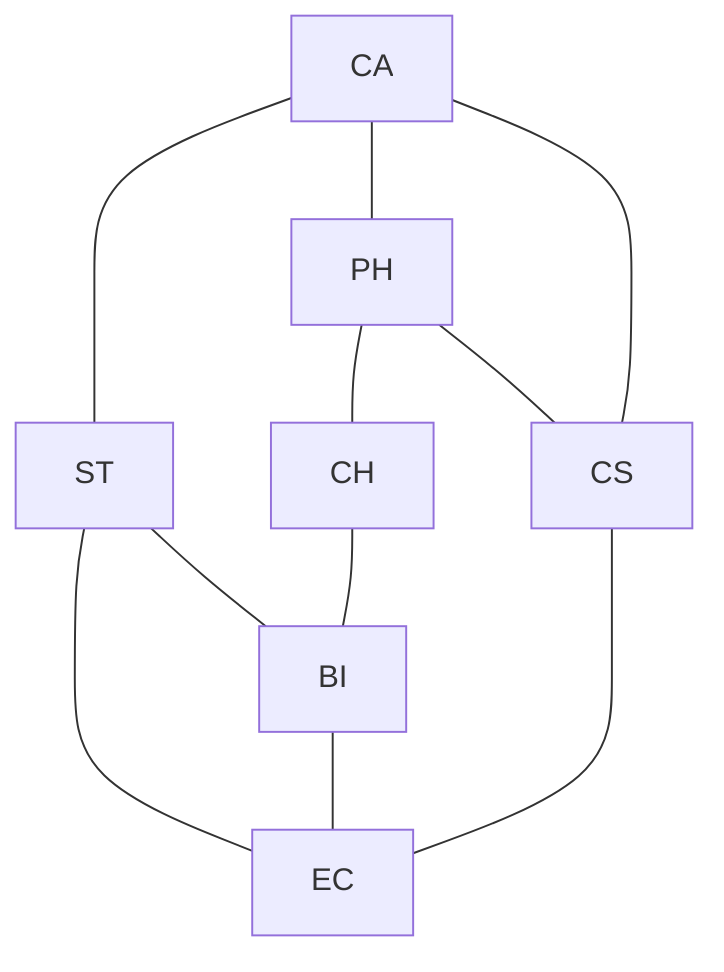

# MTH 325 Application Analysis Exam 2 solutions and notes 

## Part A -- Multiple Choice

1. D
2. B
3. B
4. B
5. B
6. B
7. A
8. C
9. E (although B, and D also work)
10. E

## Part B (Mathematical Induction)

### Option 1

The base case is $n = 7$. In this case, $3^7 = 2187$ and $7! = 5040$. Clearly $2187 < 5040$ so the base case is true. 

Now assume $3^k < k!$ for some $k$. We want to prove that $3^{k+1} < (k+1)!$. We are going to build a chain of inequalities starting from $3^{k+1}$ and ending with $(k+1)!$. 

To do this, start with the left side of this proposed inequality, $3^{k+1}$. This equals $3 \cdot 3^k$. Now, $k > 6$ by global assumption and therefore $k+1 > 7$, so $3 \cdot 3^k < (k+1) \cdot 3^k$. The induction hypothesis says $3^k < k!$ so we have $(k+1) 3^k < (k+1) k!$. The right side of this is the same as $(k+1)!$. So now we have:

$$ 3^{k+1} < (k+1) \cdot 3^k < (k+1) k! = (k+1)!$$

Which says that $3^{k+1} < (k+1)!$ and that is what we wanted to prove. 

### Option 2

[A complete proof of this one is in the vault](https://publish.obsidian.md/discretecs/Proof/Mathematical+induction).

## Part C 

## Option 1

Here is the conflict graph:

And here is the greedy algorithm for the coloring: 

| Node | Neighbors  | Neighbors' colors | COLOR ASSIGNED |
| ---- | ---------- | ----------------- | -------------- |
| BI   | EC, CH, ST | n/a               | 1              |
| CA   | ST, PH, CS | n/a               | 1              |
| CH   | BI, PH     | 1                 | 2              |
| CS   | CA, PH     | 1                 | 2              |
| EC   | ST, BI, CS | 1, 2              | 3              |
| PH   | CA, CH, CS | 1, 2              | 3              |
| ST   | CA, EC, BI | 1, 3              | 2              |

A final exam schedule that works would be to schedule courses in the following three groups: 

- BI and CA
- CH, CS, and ST
- EC, PH

This is the smallest coloring because of the 3-cycle formed by ST, BI, and EC. 