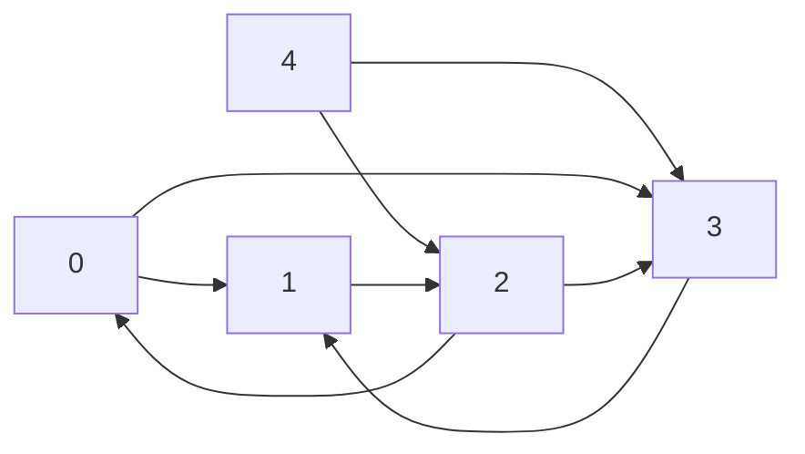

# MTH 325: Learning Target Reattempt – Solution Guide
## 2026-04-15 | Learning Targets 5, 8, 9, 10

*Instructor-facing document. Includes grading notes and common error flags.*

---

## Learning Target 5

> I can determine if a graph has an Euler or Hamiltonian structure and justify my reasoning.

**Graph $G$:**

```
Edges: A-B, A-D, B-C, B-D, C-E, D-E, D-F, E-F
```

First, note the degree of each vertex:
- A: deg 2 (connects to B, D)
- B: deg 3 (connects to A, C, D)
- C: deg 2 (connects to B, E)
- D: deg 4 (connects to A, B, E, F)
- E: deg 3 (connects to C, D, F)
- F: deg 2 (connects to D, E)

The graph is connected (can verify by tracing paths between all pairs).

---

**1. Euler trail?**

An Euler trail exists if and only if the graph is connected and has **exactly 0 or 2 vertices of odd degree**.

Odd-degree vertices: B (deg 3) and E (deg 3). That's exactly **2 odd-degree vertices**.

**Answer: YES**, an Euler trail exists. It must start at B (or E) and end at E (or B).

*Example Euler trail:* **B → A → D → B → C → E → D → F → E**

> **Verification:** Let's check each edge is used exactly once:
> B-A ✓, A-D ✓, D-B ✓, B-C ✓, C-E ✓, E-D ✓, D-F ✓, F-E ✓  
> All 8 edges used exactly once. ✓

---

**2. Euler circuit?**

An Euler circuit exists if and only if the graph is connected and **all vertices have even degree**.

Vertices B and E have odd degree (3), so no Euler circuit exists.

**Answer: NO.** The graph has two vertices of odd degree (B and E, each with degree 3). Since not all vertices have even degree, no Euler circuit exists.

---

**3. Hamiltonian path?**

A Hamiltonian path visits every vertex exactly once. The graph has 6 vertices: A, B, C, D, E, F.

**Answer: YES.** Example: **A → B → C → E → D → F**

> **Verification:** All 6 vertices appear exactly once. Edges used: A-B ✓, B-C ✓, C-E ✓, E-D ✓, D-F ✓. All are valid edges. ✓

---

**4. Hamiltonian cycle?**

A Hamiltonian cycle visits every vertex exactly once and returns to the start.

**Answer: YES.** Example: **A → B → C → E → F → D → A**

> **Verification:** All 6 vertices appear exactly once and we return to A. Edges: A-B ✓, B-C ✓, C-E ✓, E-F ✓, F-D ✓, D-A ✓. All valid. ✓

> **Grading notes:**
> - For "YES" answers, a specific valid example must be given and it must actually be correct. A student who says "yes" and gives a trail that skips a vertex or uses a non-existent edge should receive feedback.
> - For "NO" answers, the explanation must cite an appropriate theorem and explain why the conditions hold — not just restate the definition. E.g., "B and E have odd degree, and Euler circuits require all even degrees" is good. "There is no trail using all edges exactly once" just restates the definition.
> - For Hamiltonian structures, there is no clean theorem that always applies. Students demonstrating a valid example suffices for YES. For NO answers (if a student argues no Hamiltonian structure exists), watch that they don't simply assert it; they need to make a case.
> - **Common error:** Confusing Euler and Hamiltonian structures. Euler = edges; Hamiltonian = vertices.

---

## Learning Target 8

> I can find a minimum spanning tree for a weighted graph using both Prim's Algorithm and Kruskal's Algorithm.

**Graph edges with weights:**
A-B: 4, A-C: 7, B-C: 3, B-D: 6, C-E: 2, C-D: 5, D-F: 8, E-F: 6, E-G: 4, F-G: 3

Vertices: A, B, C, D, E, F, G (7 vertices, so the MST will have 6 edges)

---

### Prim's Algorithm (starting at A)

At each step, add the minimum-weight edge connecting the current tree to a new vertex.

| Step | Current tree vertices | Candidate edges | Edge added | Weight |
|------|-----------------------|-----------------|------------|--------|
| Start | {A} | A-B: 4, A-C: 7 | A-B | 4 |
| 1 | {A, B} | A-C: 7, B-C: 3, B-D: 6 | B-C | 3 |
| 2 | {A, B, C} | A-C already in tree; B-D: 6, C-E: 2, C-D: 5 | C-E | 2 |
| 3 | {A, B, C, E} | B-D: 6, C-D: 5, E-F: 6, E-G: 4 | E-G | 4 |
| 4 | {A, B, C, E, G} | B-D: 6, C-D: 5, E-F: 6, F-G: 3 | F-G | 3 |
| 5 | {A, B, C, E, G, F} | B-D: 6, C-D: 5, D-F: 8 | C-D | 5 |

**MST edge list (Prim's):** A-B, B-C, C-E, E-G, F-G, C-D  
**Total weight:** 4 + 3 + 2 + 4 + 3 + 5 = **21**

---

### Kruskal's Algorithm

Sort all edges by weight (ascending), then add edges that do not create a cycle:

| Edge | Weight | Action |
|------|--------|--------|
| C-E  | 2      | Add (connects C and E) |
| B-C  | 3      | Add (connects B to {C,E}) |
| F-G  | 3      | Add (connects F and G) |
| A-B  | 4      | Add (connects A to {A,B,C,E}) |
| E-G  | 4      | Add (connects {C,E,B,A} with {F,G}) |
| C-D  | 5      | Add (connects D to tree — all 7 vertices now in one component) |
| B-D  | 6      | Skip (would create cycle: D already reachable) |

**MST edge list (Kruskal's):** C-E, B-C, F-G, A-B, E-G, C-D  
**Total weight:** 2 + 3 + 3 + 4 + 4 + 5 = **21**

Both algorithms produce MSTs of the same total weight (21), though the edge sets are the same here.

> **Grading notes:**
> - Students only need to submit the edge list for each algorithm. If they include step-by-step work, that work is held to the same accuracy standard.
> - If a student includes work/steps: small errors in intermediate steps that are corrected later (or propagated consistently) may be treated as minor errors.
> - If a student submits only the edge list with no work: any error in the list is treated as significant, since there's no work to distinguish minor from major mistakes.
> - **Common errors:** 
>   - Prim's: forgetting to update the candidate edge set after adding a vertex (e.g., missing E-G as a candidate after adding G).
>   - Kruskal's: incorrectly determining whether an edge creates a cycle (union-find errors). A good way to check: after adding 6 edges to a 7-vertex graph, exactly one connected component should remain.

---

## Learning Target 9

> I can implement a greedy algorithm to find a valid vertex coloring for a graph and determine if the chromatic number of the graph is equal to or less than the result.

**Graph $G$:**
Edges: A-B, A-C, A-D, B-C, B-E, C-D, C-E, D-E

Vertices in alphabetical order: A, B, C, D, E

---

### Part 1: Greedy coloring (alphabetical order)

**Available colors:** 1, 2, 3, ...

| Vertex | Neighbors already colored | Colors used by neighbors | Assigned color |
|--------|--------------------------|--------------------------|----------------|
| A      | (none yet)                | (none)                   | **1**          |
| B      | A                         | {1}                      | **2**          |
| C      | A, B                      | {1, 2}                   | **3**          |
| D      | A, C                      | {1, 3}                   | **2**          |
| E      | B, C, D                   | {2, 3, 2} = {2, 3}       | **1**          |

**Greedy coloring result:** A→1, B→2, C→3, D→2, E→1

As a Python dictionary: `{'A': 1, 'B': 2, 'C': 3, 'D': 2, 'E': 1}`

**Number of colors used: 3**

> **Verification that this is a valid coloring (no two adjacent vertices share a color):**
> - A(1)–B(2) ✓, A(1)–C(3) ✓, A(1)–D(2) ✓
> - B(2)–C(3) ✓, B(2)–E(1) ✓
> - C(3)–D(2) ✓, C(3)–E(1) ✓
> - D(2)–E(1) ✓

---

### Part 2: Is $\chi(G) = 3$?

**Yes, $\chi(G) = 3$.**

Justification: First, note that A, B, and C form a triangle ($K_3$) in the graph. Since $K_3$ requires 3 colors (each vertex adjacent to both others), we need at least 3 colors. Since we found a valid 3-coloring above, $\chi(G) = 3$.

> **Grading notes:**
> - The greedy coloring must be shown step-by-step. Just writing the dictionary with no process shown does not meet Master.
> - The dictionary must use correct Python syntax: `{'A': 1, 'B': 2, ...}` with string keys (or the problem's vertex labels) and integer color values.
> - For Part 2: the student must either (a) demonstrate $\chi(G) = 3$ is optimal by citing a lower bound argument (e.g., the triangle/clique), or (b) if they used more colors than necessary, acknowledge it and give a corrected optimal coloring. 
> - **Common error:** Students sometimes assign color 3 to D (thinking D is adjacent to B when it's not — check: D's neighbors are A and C only). Carefully confirm adjacency from the edge list.
> - Another common error: visiting vertices in the wrong order, which changes the result. Alphabetical means A, B, C, D, E strictly.

---

## Learning Target 10

> (**CORE**) I can represent a directed graph in different ways, and determine information about a graph using different representations.

**Directed graph $G$ as a Python dictionary:**
```python
{0: [1, 3], 1: [2], 2: [0, 3], 3: [1], 4: [2, 3]}
```

This means:
- 0 → 1, 0 → 3
- 1 → 2
- 2 → 0, 2 → 3
- 3 → 1
- 4 → 2, 4 → 3

---

**Problem 1.** $d^-(3)$ and $d^+(3)$ for vertex 3.

- **Out-degree** $d^+(3)$: edges leaving 3. From the dictionary: $3 \to 1$. So $d^+(3) = \mathbf{1}$.
- **In-degree** $d^-(3)$: edges entering 3. Scan all entries for arrows pointing to 3:
  - 0 → 3 ✓
  - 2 → 3 ✓
  - 4 → 3 ✓
  
  So $d^-(3) = \mathbf{3}$.

---

**Problem 2.** Source and sink vertices.

- **Sources** (in-degree = 0): Check which vertices have no incoming edges.
  - Vertex 0: incoming from 2 → 0. Not a source.
  - Vertex 1: incoming from 0 → 1 and 3 → 1. Not a source.
  - Vertex 2: incoming from 1 → 2 and 4 → 2. Not a source.
  - Vertex 3: incoming from 0, 2, 4. Not a source.
  - Vertex 4: no edges point to 4. **Source: vertex 4.**

- **Sinks** (out-degree = 0): Check which vertices have no outgoing edges.
  - All vertices 0–4 appear as keys in the dictionary with non-empty lists, *except* we should check if any key maps to an empty list.
  - Every vertex has at least one outgoing edge. **No sinks exist.**

**Answer:** Source vertex: **4**. No sink vertices.

---

**Problem 3.** Visual representation (description for markdown; students draw on paper):



Note: Vertex 4 is a source with no incoming edges. There is a cycle involving 0, 1, 2 (0→1→2→0), and 3 is reachable from 0 and 2 but only points back to 1.

---

**Problem 4.** Adjacency matrix.

Vertices ordered 0, 1, 2, 3, 4. Entry $[i][j] = 1$ if there is an edge $i \to j$.

$$M = \begin{pmatrix}
0 & 1 & 0 & 1 & 0 \\
0 & 0 & 1 & 0 & 0 \\
1 & 0 & 0 & 1 & 0 \\
0 & 1 & 0 & 0 & 0 \\
0 & 0 & 1 & 1 & 0
\end{pmatrix}$$

Rows are "from" vertices (0–4), columns are "to" vertices (0–4).

> **Grading notes:**
> - The most common error is swapping rows and columns (treating $[i][j]$ as $j \to i$). If a student's matrix is the transpose of the correct answer, note this as a significant error.
> - For Problem 1, make sure students distinguish in-degree (arrows *into* the vertex) from out-degree (arrows *out of* the vertex). Swapping these is a significant error.
> - For Problem 3 (drawing), any reasonable visual that correctly shows all 5 vertices and all 8 directed edges, with correct directions, earns full credit. Aesthetics don't matter.
> - For Problem 2, note that vertex 4 does not appear as a *target* in any edge (no entry in any value list contains 4). Students might miss this because 4 appears as a key. Remind them that the key gives outgoing edges, not incoming.
