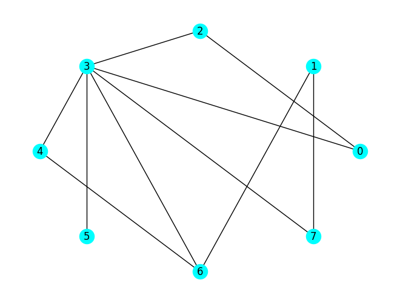

# MTH 325 Sample Learning Target Exam 

This is a SAMPLE Learning Target that is similar to your first one, coming on Wednesday February 11. Some things to notice: 

- There is one problem per Learning Target covered in the class so far. For Learning Target Exam 1, these are Learning Targets 1-4. The full list of Learning Targets is at the end of [the course syllabus](https://github.com/RobertTalbert/discretecs/blob/master/MTH325-Winter2026/course-documents/MTH%20325%20W26%20syllabus.md#appendix-a-learning-targets). 
- Each problem is graded separately, either "Master" or "Proficient" or "Beginner". The exam as a whole does not have a grade; it is just a container for the problems. 
- The standards for what earns each mark, are given in the [Standards for Student Work](https://github.com/RobertTalbert/discretecs/blob/master/MTH325-Winter2026/course-documents/MTH%20325%20Standards%20for%20Student%20Work%20Winter%2026.md). 
- You are not required to attempt every problem. If there is a problem you believe you're not prepared to attempt, you can skip it this time and try it again at the next Learning Target exam. The next one will contain new versions of all previous problems, plus new problems for any new Learning Targets. However, due to the limited number of attempts, skipping problems is not recommended. 

---

## Learning Target 1

>(CORE) I can state the predicate, prove the base case, state the inductive hypothesis, and describe the inductive step for a mathematical proposition to be proven by induction (weak or strong).

Consider the proposition: For all positive integers $n$, the number $3^n - 1$ is even. And suppose you want to prove this by weak mathematical induction. 

1. Verify the base case. 
2. State the inductive hypothesis. 
3. State the inductive step. 


## Learning Target 2

>(CORE) I can state the assumptions for a direct, contrapositive, or indirect proof of a conditional statement, and for direct or contrapositive proofs I can state what is to be proven.

Consider the proposition: If $2^p - 1$ is a prime number, then $p$ is a prime number. 

1. State the assumptions and state what you would want to prove, if you attempted a direct proof of this statement. Be sure to clearly label what you are assuming and what you want to prove. 
2. State the assumptions and state what you would want to prove, if you attempted a proof of this statement using the contrapositive. Be sure to clearly label what you are assuming and what you want to prove.
3. State the assumptions if you attempted a proof by contradiction of this statement. 

## Learning Target 3 

(CORE) I can state basic structural information about a graph and identify and draw special graphs.

1. Given the graph $G$ below: 
   (a) State the degree of node 3. 
   (b) Write the degree sequence of the graph. 
   (c) State the value of $\Delta(G)$. 



2. Draw the following: 
   (a) $K_5$ 
   (b) $P_4$
   (c) $C_6$ 

## Learning Target 4 

>I can represent a graph as a list, matrix, or dictionary.

Here is a graph $G$ represented as a dictionary: 

```
{0: [], 1: [2, 4], 2: [1, 5], 3: [4], 4: [1, 3], 5: [2]}
```


1. State the edge list for $G$. 
2. State the adjacency matrix for $G$. 
3. State the incidence matrix for $G$. 