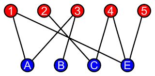
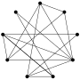

# MTH 325: Problem Set 5

Submit solutions on or before **11:59pm Eastern time on Monday April 6** in order to be eligible for engagement credits. 

## Instructions

Please remember the basic rules for Problem Sets: 

- To submit your work on a Problem Set, please TYPE up your solutions and save them as a PDF, then upload the PDF to the designated area on Blackboard (in the Problem Sets folder). **Handwritten work is not accepted.**
- These Problem Sets are **not graded directly**. They are only given formative feedback that you can use to improve your work. You may resubmit a new draft of a Problem Set at any time, by making a new draft and uploading that to the same designated area on Blackboard where the first draft went. 
- **Application/Analysis Exam problems will be selected from among problems that appear on Problem Sets**. So it is to your advantage to submit Problem Sets and use the feedback to refine your solutions. 
- You will receive 8 engagement credits for turning in a **good-faith complete attempt at a Problem Set prior to its deadline**. This means: Every part of every problem must contain an attempt that represents an honest try at a full and complete solution. 

---

## Problem 1

A **bipartite graph** is a graph (undirected) where we can partition the nodes into two disjoint sets $X$ and $Y$, such that every edge of the graph has exactly one endpoint in $X$ and one endpoint in $Y$. In other words, there are no edges incident to two nodes in $X$ or two nodes in $Y$. Here is a visual example: 

Pick ONE of the following and give a completed proof: 

1. Every tree is a bipartite graph. 
2. A graph $G$ is bipartite if and only if $\chi(G) = 2$. 
3. A graph is bipartite if and only if it does not contain a cycle of odd length. 

Note, options 2 and 3 are "if and only if" statements, also known as [biconditional statements](https://publish.obsidian.md/discretecs/Logic/Biconditional+statement). There are *two* things to prove on those, specifically there are two conditional statements involved. Please review the vault article before trying those. 

Also, please note you may not use one part of this problem to prove the other parts. 

## Problem 2

A **directed cycle** in a digraph is a sequence of (directed) edges that starts and ends at the same vertex. A **directed acyclic graph** (DAG) is a digraph that contains no directed cycles. 

Determine if the following statement is true or if it is false: **Every DAG has at least one sink and at least one source.** 

If you think this is true, give a completed proof. If you think it’s false, give a concrete, specific counterexample. 

## Problem 3

Below is a graph representing friendships between a group of students (each vertex is a student and each edge is a friendship). Is it possible for the students to sit around a round table in such a way that every student sits between two friends? Also, what does this question have to do with trails?

