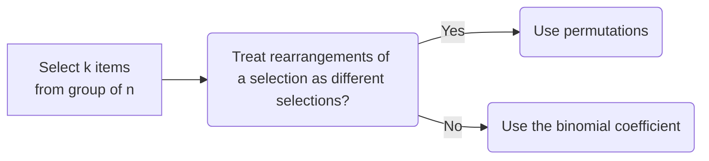

# MTH 225 Spring 2022 Class Page 

## BIG LINKS

| | | | 
| :--: | :--: | :--: |
| :blue_book: [Syllabus](https://hackmd.io/@rtalbert235/SksWU-sE9) | :calendar: [Calendar](https://calendar.google.com/calendar/u/1?cid=aWhwMG1qNG4zNzRiYW8zOXNzdXRscWRlOTBAZ3JvdXAuY2FsZW5kYXIuZ29vZ2xlLmNvbQ) | :trophy:	 [Learning Targets](https://hackmd.io/TchC8fZORJ29EgxQb1O4lQ?view#Appendix-A-Learning-Targets) | 
| :link:  [Class meeting Zoom link](https://gvsu-edu.zoom.us/j/6163318968?pwd=bnFudTBGbE4xbG1DMitDbGhtYkFGdz09) | :male-student: [Drop-in hours Zoom link](https://gvsu-edu.zoom.us/j/6163318968?pwd=bnFudTBGbE4xbG1DMitDbGhtYkFGdz09) (MTWR 2:30-3:15) |  | 
| :book: [Textbook](http://discrete.openmathbooks.org/dmoi3.html) | :tv: [Videos](https://vimeo.com/showcase/8667148) |:label: [Standards for Assessments](https://hackmd.io/@rtalbert235/Bys_sKSBc) | 
| :computer:  [WeBWorK](https://webwork-math.gvsu.edu/webwork2/MTH225-01) | :muscle: Daily Prep -- Located in your [Perusall account](http://app.perusall.com) |
| [Instructions for alternative Learning Target assessments](/gZhPoxR-QWq1g4jM9tr30A) | :ticket:  [Exit ticket](https://docs.google.com/forms/d/e/1FAIpQLSe6hA4qkqVf8julz8i-J46875xAtHmJrr0TLIYeuG5Z_el75g/viewform)  | [Grading Status board](https://trello.com/b/VmVMIC2P) :new: Changed location | 


## Week 4 (May 31-June 2)

### Day 15: June 2

**Recap:** We started with a debrief of one of the Daily Prep review questions that had a number of incorrect responses to it. Please see below for some links to practice on set theory. Then we broke down the "dots and dividers" method using the problem of putting files into folders. Afterwards we saw how dots and dividers can be used to find the number of natural number solutions to a linear equation like $x+y+z = 8$, along with variations where for example we want each variable to be positive and not just a natural number. We stopped at 2:00 to have some in-class time to work on [Learning Target Quiz 5](/8CSiEtYmTLynW-_hWCrNdA). 

**Links:**

- Miro: https://miro.com/app/board/uXjVOwVI6Ts=/?share_link_id=609889894357
- Practice on set theory: 
    - https://www.math-only-math.com/practice-test-on-sets-and-subsets.html
    - https://en.wikibooks.org/wiki/Discrete_Mathematics/Set_theory/Exercises

### Day 14: June 1

**Recap**: We started with polling activities around when to use and not use a $k$-permutation in a counting problem. Bottom line: 

We then looked at items from the Daily Prep that underscored the diagram above and emphasized that **saying "the order matters" or "the order doesn't matter" can be misleading.** For example, we saw that the number of ways to select a three-element subset of $\{1,2,\dots,10\}$ *that is in numerical order* is $\binom{10}{3}$ (select all the three-element subsets and put all the subsets that have the same elements into a group, then count the groups so that the "order doesn't matter"). Then we did an activity on counting the number of ways various outcomes from a deck of cards can occur, and then moved on to the [Mini-Quiz for June 1](/wbre--GWSOmmKP8SYVEEUw). 

**Links**: 
- Miro: https://miro.com/app/board/uXjVOwAyoeg=/?share_link_id=347646574993
- Polling: http://pollev.com/talbert
- Zoom: https://gvsu-edu.zoom.us/rec/share/uMFNb4U4u11LmQhrETp04QVQlif-SFOEcQux4ORU13dZBLJYz6gZGObZtuuoJ5Gt.0OweFLelDa2fK2zb
Passcode: u9wW&2XP


### Day 13: May 31

**Recap**: 
- In our Q&A over the Daily Prep, we pointed out that $\binom{8}{7} = \binom{8}{1}$ because there's a bijection between the set of 8-bit strings with seven 1's, and the set of 8-bit strings with one 1 --- that bijection is the "flip the bits" function. So while the two sets aren't equal, they have the same cardinality and therefore the binomial coefficients are equal. We also reviewed why the binomial coefficient's recurrence relation $\binom{n}{k} = \binom{n-1}{k-1} + \binom{n-1}{k}$ is true. And we pointed out that **the interpretations of the binomial coefficient are more important than calculating it** because it's through the three main interpretations --- counting bitstrings of a given weight, selecting subsets of a certain size, and selecting subgroups of a given group --- that we use the binomial coefficient to solve problems. 
- We came up with a *closed formula* for the binomial coefficient: $\binom{n}{k} = \dfrac{n!}{(n-k)! k!}$. For example: 

$$\binom{10}{4} = \frac{10!}{6!4!} = \frac{10 \cdot 9 \cdot 8 \cdot 7}{4 \cdot 3 \cdot 2 \cdot 1} = 210$$


- Finally, we did group work on using the binomial coefficient to count outcomes of repeated coin flips.

**Links**: 

- Miro: https://miro.com/app/board/uXjVOxJYxOc=/?share_link_id=949840539747 
- Zoom: https://gvsu-edu.zoom.us/rec/share/_02IwWrBr-JghXGXRB8h0EbmcqDYWMWMurxEAD-iX_tCIrRksO-_e0LDlldmYfEL.Ge2AUZdqvw6AdGxa
Passcode: J0#ZKQ%n


## Week 3 (May 23-26)


### Day 12: May 26

:::info
Sorry, no recap for this day 
:::

- Zoom: https://gvsu-edu.zoom.us/rec/share/-aixlWpdb2o1hOgKfrvdvWc6mLC8LzUngAXG7zLFu1kCkvu50VSIU7Z5aD2Msjw.CwT23NBS2DD4YyjK
Passcode: Nwm5w+0X

### Day 11: May 25

**Recap:** We began with review over the syllabus, and a question about the differences between floating-point division and integer division. (Short version: `a / b` and `a // b` sometimes return the same number, for example `10 / 2` and `10 // 2` both equal 5, but the former is a "floating point" data type and the latter is an "integer" data type. The different in data type is significant from a CS standpoint.) We then did a tutorial on two different (but equivalent) ways to find `a % b` when `a` is negative. One of those involves the formula: 
$$ a \, \% \, b = a - b \left\lfloor \frac{a}{b} \right\rfloor$$
We then had some time for practice with the five functions from Learning Target 12, and then a half-hour of practice in "choose your own adventure" mode. 

**Links:**

- Miro board: https://miro.com/app/board/uXjVOyW9eho=/?share_link_id=463746175640
- Zoom: https://gvsu-edu.zoom.us/rec/share/chMV4ywamW-z8FIJHh6o15ZbShHxNUrGHs-YHQD2DA-O_Qrt2WUBoVWSEjMKpLV0.OnhYQY6UGw4KKjjW
Passcode: Hf9t4.j0


### Day 10: May 24 

**Recap:** After some technical glitches, we went through the Daily Prep questions on composition and some of the ones on inverse images. Understanding composition is all about knowing the data types of the inputs and outputs of the functions involved. Because of this, we moved to a group activity involving four pseudo-Python string functions and classiying each of the 16 possible ways of composing them two at a time, according to whether the composition makes sense or doesn't make sense. Afterwards we had 30 minutes of work time on the [Mini-Quiz for May 24](/K4jR5r5tQqCOdP3BpFYZ2A). 

**Links:** 
- Miro board: https://miro.com/app/board/uXjVOzXQV0w=/?share_link_id=272638161885
- More on "type inference" in the programming language Haskell: https://wiki.haskell.org/Type_inference 
- Zoom: https://gvsu-edu.zoom.us/rec/share/HkDDpHM--CmC0YoKHhkhMClX5m8A6a5fJbRXWDEexH_xLtrjj7esRHtLuIj7ebtM.mr8g67LZtVHOfrYk
Passcode: t+4r^*Q&

Today's board (the parts we did; there was another activity we didn't get to): 


### Day 9: May 23

**Recap:** We debriefed the classification questions from the Daily Prep and did polling on determining whether a function was injective, surjective, bijective, neither, or not even a function at all. Then two group activities -- the first one asked you to construct functions with given sets of properties between a finite domain and a finite codomain, and we observed that in some cases the construction wasn't possible. In particular if the domain and codomain have the same finite size, then a function between them that is injective *must* be surjective and vice versa; if the domain is larger than the codomain then an injective function is impossible; and if the codomain is larger than the domain then a surjective function is impossible. The second activity asked you to classify eight different string methods (functions) and there was some discussion about the Python `split` method --- we decided it was definitely not injective (because a string and the same string padded with spaces at the end map to the same list) but it's not clear whether it's surjective. More on that next time. 

**Links:** 

- Miro board: https://miro.com/app/board/uXjVOzQq1xs=/?share_link_id=577090558766
- Polling: https://pollev.com/talbert
- Python string methods: https://www.w3schools.com/python/python_ref_string.asp
- Exit ticket: https://docs.google.com/forms/d/e/1FAIpQLSe6hA4qkqVf8julz8i-J46875xAtHmJrr0TLIYeuG5Z_el75g/viewform
- Zoom: https://gvsu-edu.zoom.us/rec/share/T_Kd1iofSe7TsrT7IqpecGKP7woawd1KF0EaZkAiOsOtU09cQqnHAQwE-2utjhqh.Yd-5vMxdHiiO9aBu
Passcode: v3KrpWWE

Today's board: 


## Week 2 (May 16-19) 

### Day 8: May 19 

**Recap:** We started with an announcement that there is an error in the calendar, and **we will not be meeting on May 30 (Memorial Day).** Stay tuned for calendar corrections. We then reviewed some questions from the Daily Prep to clarify that a function *can* map two different inputs to the same output, but it *cannot* map the same input to two different outputs. We then did some polling including a question about how many valid functions are possible from $A = \{a,b,c\}$ to $B = \{x,y,z\}$ (answer: 27, and we'll be exploring more problems like this soon). Then we did an activity to identify the domain, codomain, and range of the floor, factorial, modulus, and divisor functions from computer science (we'll see them again in a few days). Finally we took some time for a headstart on [Learning Target Quiz 3](/NvEwPkjkQUq2S0q4atewBQ). 


- Miro: https://miro.com/app/board/uXjVOzk1Vu0=/?share_link_id=926059284046
- Polling: https://pollev.com/talbert
- Zoom: https://gvsu-edu.zoom.us/rec/share/tUQkA1BxcM9bgtWwLg7_1EXMvgzUZC6pjHv0-z8KuQplJc1308e7iltl2TBAW-Ql.7C4OlLp6aykucPoX
Passcode: Vg^k9EkK

Today's board: 


### Day 7: May 18

**Recap:** 


- Miro: https://miro.com/app/board/uXjVO0UkTaQ=/?share_link_id=793438154669
- Polling: https://pollev.com/talbert
- Zoom: :scream: Talbert forgot to record 


### Day 6: May 17

**Recap:** We started with a bunch of excellent questions from the Perusall threads, where we learned about [lazy evaluation in Haskell](https://wiki.haskell.org/Lazy_evaluation), how to write sets in different ways using set-builder notation, and the fact that the empty set is a subset of all sets. We did some polling questions about set notation and focused on "bad syntax" for set-builder notation. Then we focused for a long while on an activity involving building a diagram of subsets, where you had to decipher set-builder notation and remove sets with incorrect syntax. 


**Links:**

* Miro: https://miro.com/app/board/uXjVO0Cg8oQ=/?share_link_id=361157626434
* Polling: https://pollev.com/talbert
* Try Haskell: https://tryhaskell.org/ 
* Zoom recording: https://gvsu-edu.zoom.us/rec/share/HUU2_dYGvwKUnGfQbiUqhdPlb4-Oy_qHykPcIBZhB0XtBLsNhF-yV07PcmITNzcE.xwbNZrQVpGhoedXv
Passcode: Y2#rE4YB

Board from today: 


### Day 5: May 16

**Recap:** We started with a discussion of why statements like "There exists an integer $n$ such that $n+5=6$" are *not* predicates (it's because the variable has been quantified or "bound") and why the statement "For all $n$, $n^2$ is even" is false (because not all integers have even squares -- there exist integers that don't have even squares). We moved from there to an activity where we used truth tables to decide if two statements are logically equivalent, and had two important special cases: 

- $(\neg q) \rightarrow (\neg p)$ is logically equivalent to $p \rightarrow q$, so we now know for sure that a conditional statement is equivalent to its contrapositive
- $p \wedge (q \vee r)$ is logically equivalent to $(p \wedge q) \vee (p \wedge r)$ so there is a "distributive property" for AND and OR
- $\neg (p \vee q)$ is logically equivalent to $(\neg p) \wedge (\neg q)$ which is known as **DeMorgan's Law**. 

We also did an activity where you linked a quantified predicate given in English to its symbolic form and the symbolic form of its negation, and then translated the negation back into English. Finally, we did an activity where we decided whether or not a fully quantified predicate was true or false. We ended with a discussion of how we know for sure about these truth values and especially that **universal statements can't be proven true with examples; it takes a proof.** 

**Links:**

- Miro board: https://miro.com/app/board/uXjVO1Z0MzM=/?share_link_id=26287073729
- Truth table generator: https://web.stanford.edu/class/cs103/tools/truth-table-tool/
- Exit ticket: https://docs.google.com/forms/d/e/1FAIpQLSe6hA4qkqVf8julz8i-J46875xAtHmJrr0TLIYeuG5Z_el75g/viewform
- Zoom recording: https://gvsu-edu.zoom.us/rec/share/nctRaSYv_hjitYiX25cPu7s5xySROoFZX5lY5lFVTCQOtwFOukHXvYiSDLJR8tlW.cosUET1Gg5hgDg29
Passcode: HW0vu.dq

## Week 1 (May 9-12) 

### Day 4: May 12 

**Links:**

- Miro board: https://miro.com/app/board/uXjVO3ZdVaQ=/?share_link_id=767905666399
- Python documentation on operator precedence: https://docs.python.org/3/reference/expressions.html#operator-precedence (TL;DR -- negation > and > or > if-then)
- Truth table generator: https://web.stanford.edu/class/cs103/tools/truth-table-tool/
- Exit ticket: https://docs.google.com/forms/d/e/1FAIpQLSe6hA4qkqVf8julz8i-J46875xAtHmJrr0TLIYeuG5Z_el75g/viewform


Today's board: 

Polling slide about different ways to organize truth tables: 


### Day 3: May 11

**Recap:** We looked at a few frequently-missed Daily Prep items, including one about the converse of a statement (be careful when the original hypothesis is a negative statement like "won't"!) and the negation of a statement (*The negation of a conditional statement is not another conditional statement*). Through some polling activities we reiterated that the negation of $P \rightarrow Q$ is $P \wedge (\neg Q)$ -- the crucial polling slide is shown below. Then we practiced in groups on identifying the parts of a conditional statement and forming related statements, using conditional statements that didn't have "if" or "then" in them, which forces you to think about the direction of causality. Finally, we ended with "station time" where you chose which topic you wanted to practice and then practiced on a breakout board. 

**Links:**

- Miro board: https://miro.com/app/board/uXjVO3YNEP0=/?share_link_id=793183460149
- Exit ticket: https://docs.google.com/forms/d/e/1FAIpQLSe6hA4qkqVf8julz8i-J46875xAtHmJrr0TLIYeuG5Z_el75g/viewform
- Zoom recording: **I forgot to hit the "Record" button** :cry:  I'm terribly sorry, that won't happen again. 

Polling slide about negations of $A \rightarrow B$: 


Today's board: 


### Day 2: May 10

**Recap:** We started with Q&A from the Daily Prep, the Syllabus Quiz, and the Perusall activity about the syllabus -- we had questions over binary arithmetic and a few housekeeping items. Then we did some polling activities where we learned that even integers always end in a 0 in their binary form and odd integers always end in a 1, and we can use this to draw conclusions about binary arithmetic without actually doing the arithmetic! This illustrated the importance of **explanations** which are a centerpiece of our work here. We then spent time working in breakout groups on binary arithmetic problems, then discussed [Learning Target Quiz 1](/VKufLM2eSNWt3F_eKI4xpg). 

**Technical item:** We learned that if I change the permissions on a Miro board from "Comment" to "Edit", you have to refresh your browser or restart the app in order to get the full toolbar. 

**Links:**

* Miro board: https://miro.com/app/board/uXjVO3JhxaI=/?share_link_id=936529033305
* Binary calculator (one of MANY): https://www.calculator.net/binary-calculator.html
* Exit ticket: https://docs.google.com/forms/d/e/1FAIpQLSe6hA4qkqVf8julz8i-J46875xAtHmJrr0TLIYeuG5Z_el75g/viewform
* Zoom recording: https://gvsu-edu.zoom.us/rec/share/SieytNPlihKiRPvvmkFm-wd0bZ5QdmOMWh-Ix6N5oeOCXc7jqyx1T6Qf2cm4EqL7.r1ttV-ao1SphWEZk
Passcode: 8kCpkq6q

**Today's board:**


### Day 1: May 9

**Recap:** We introduced the class today and learned about the role of *doing* when learning something, and the value of **feedback loops**. The entire course is based on feedback loops! Then we did a long lecture to learn about base 10 and base 2 representation of integers, and converting from one to the other; about base 8 (octal) and base 16 (hexadecimal) representation and how to convert to/from base 10 and those two bases, along with a trick for converting from binary to octal or hexadecimal directly; and finally we learned an algorithm involving repeated division that will convert from base 10 to base 2, 8 or 16 without guesswork. 

**Bonus:** Here is some Python code that implements the algorithm for converting from base 10 to base 2. Can you modify it to work for base 8 or 16? Or write it for your favorite language? 

```python=
# Note: In Python, a // b is just the quotient of a divided by b, 
# and a % b is just the remainder. 

def dec2bin(n):
    bits = str(n % 2)
    quotient = n // 2 
    while quotient != 0: 
        bits += str(quotient % 2)
        quotient = quotient // 2
    
    # The next line reverses the order of the bit string
    result = bits[::-1]
    return result
```

**Links:**

* Zoom recording: https://gvsu-edu.zoom.us/rec/share/E098lB5JvCllcHzj-9Gc25IdSrja_D0WzCnzys9mpFc8GKSCcOu4HU21Q9qH-0BT.svA4Eq9FCqMNY7OF
Passcode: u50%pP2s
* [Miro board](https://miro.com/app/board/uXjVO4qZGtk=/?share_link_id=707409124194) (direct link: https://miro.com/app/board/uXjVO4qZGtk=/?share_link_id=707409124194) 
* [RapidTables site for doing base conversions](https://www.rapidtables.com/convert/number/binary-to-decimal.html) (direct link: https://www.rapidtables.com/convert/number/binary-to-decimal.html) 
* [Exit ticket](https://docs.google.com/forms/d/e/1FAIpQLSe6hA4qkqVf8julz8i-J46875xAtHmJrr0TLIYeuG5Z_el75g/viewform) (this is the same form every day, so bookmark the URL)
* Screencasts from the class playlist that cover the lecture from today: 
    * <a href="https://vimeo.com/575905500">Screencast 1.1: Base 10 and Base 2 representation of integers</a>
    * <a href="https://vimeo.com/575939514">Screencast 1.2: Base 8 and Base 16 representation of integers</a>
    * <a href="https://vimeo.com/578187581">Screencast 1.3: Base 10 conversion algorithm</a>