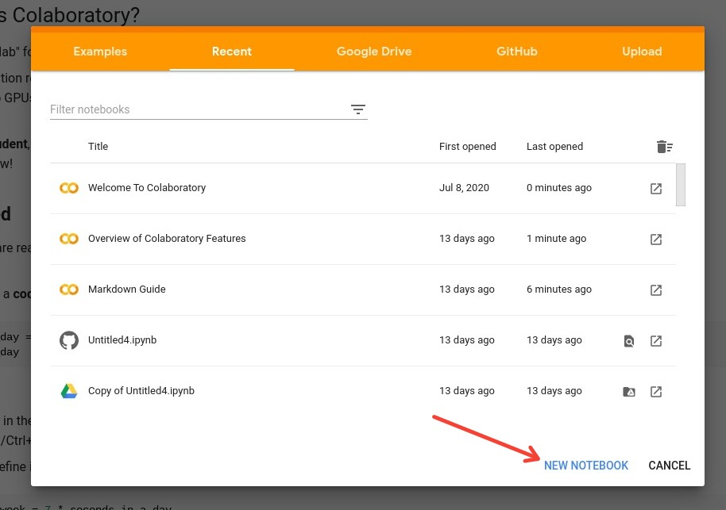
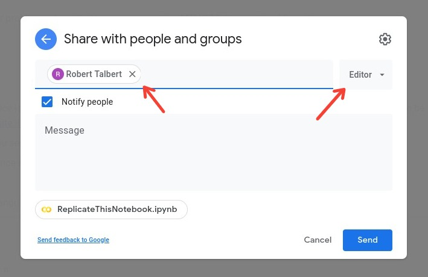

# MTH 225: Python and Jupyter crash course 

As a basic tool for exploring mathematical ideas and applying them to computer science, we'll be using the **Python** programming language frequently in the course starting in weeks 2 or 3. You'll be learning the essentials of Python --- "just enough to be dangerous" is our motto --- and also the **Jupyter notebook** platform for running Python. ("Jupyter" is pronounced like the planet "Jupiter".) Since our coverage of Python is minimal, we will not use class time or synchronous meetings to cover it. Instead, in this assignment you'll work through some self-paced modules to learn what you need to know. 

**Learning targets:** This assignment addresses *Learning Target CS.2: I can apply computer programming and computational thinking to frame and solve mathematical and computational problems.*

There are two parts to this assignment, one involving Python and the other involving the Jupyter notebook platform. 

**Time requirements:** This will vary widely depending on your prior experience with programming and with Python and other specifics of the assignment. **Most students in the past who have started with zero knowledge of the content have said this assignment takes a total of about 8-10 hours to complete**, mostly concentrated in Part 1. It's best to spend about 30-60 minutes a day at minimum on this, and spread it out over two weeks. 

**Value:** This assignment is worth **20 engagement credits**. 

**Deadline:** All work must be submitted no later than **11:59pm Eastern on Sunday, September 13**. 

## Part 1: Introduction to Python

In this part, you will learn the basics of programming in Python --- a simple, free, and widely-used programming language that we will use as the "mathematical microscope" in this class. 

**To complete this part:**

1. Go to http://www.codeacademy.com and create a free account, or sign in with a social media or GitHub account. 
2. Then go to https://www.codecademy.com/learn/learn-python. This is a free, self-paced entry level minicourse on Python. **Although you may be prompted to sign up for "Codeacademy Pro", you do not need to do this to take the short course, and you do not need to pay or give credit card information.** If you set up an account but cannot access the minicourse without giving payment information, please let me (Prof. Talbert) know. 
3. The minicourse is split up into 12 units, each consisting of 1-2 lessons. **Complete the first 9 units of the course**: "Python Syntax" through "Exam Statistics". (The remaining 3 units are optional; we won't use any of the material in them, in MTH 225.) When you complete a lesson, you will see a checkmark go up next to that lesson, like this: https://i.imgur.com/5ySdn7g.jpg. You do not need to complete the "Projects" or "Quizzes" at the end of the lessons; in fact you can't access these unless you have paid for the Pro version of Codeacademy (which you do NOT need to do). 

**To submit your work:** When you have completed the nine units assigned above, you will just need to show me your account page at Codeacademy with all the required lessons checked off. The checkmarks on all nine units will be counted as proof of completion. You can either show me your screen in person in a F2F class meeting, show it to me on Zoom or Google Meet, or send me a screenshot (that shows your name on the screen as well as all of the checks). 

## Part 2: Jupyter notebooks and Google Colab

In this part, you will learn the basics of  **Jupyter notebooks**, a graphical browser-based platform for running Python and other languages, and **Google Colab** which is a system for running and storing Jupyter notebooks that integrates with Google Docs. 

**To complete this part:**

1. Watch the following videos: 
    + Get started with Google Colaboratory (3:09) https://www.youtube.com/watch?v=inN8seMm7UI 
    + The Jupyter Notebook environment part 1 https://www.youtube.com/watch?v=T4WXs6niloU&t=2s (6:48)
    + The Jupyter Notebook environment part 2 https://www.youtube.com/watch?v=tz4UwhQs0Z8 (4:22) 
    + The Jupyter Notebook environment part 3 https://www.youtube.com/watch?v=woEVRMADIck (7:38) 
2. If you are unfamiliar with the **Markdown** text formatting system, go to this website and work through the tutorial: http://markdowntutorial.com/  Markdown is a simple plaintext-based system for writing formatted text. It's fairly common (used on GitHub, Reddit, and elsewhere) so you might be familiar with it already; if that's the case, skip the tutorial. 
3. Go to https://colab.research.google.com/ and click on the "Examples" tab. Read through the notebooks titled "Welcome to Colaboratory", "Overview of Colaboratory Features", and "Markdown Guide". You can skip any technical Python or CS language. 
4. Now it's time to make a notebook! Go to https://colab.research.google.com/ and click "New Notebook": 

5. Change the title of the notebook to `Lastname.ipynb` where `Lastname` is your last name. For example Alex McAndrews would name their notebok `McAndrews.ipynb`. 
6. In your notebook, make an exact duplicate of this notebook: https://i.imgur.com/LzbQzs6.jpg  Note that there is a mix of headers, italicized and bold text, LaTeX coding for math, and other style elements. All of these need to be present in your notebook. 

**To submit your work:** Make sure you're signed in to your GVSU Google account. Then in Colab, click **Share** in the upper-right corner.

Then you can do one of two things: Under "Share with people and groups", you can enter my email address (talbertr@gvsu.edu) in the blank and make sure "Editor" is selected. (The message is optional.)

Click "Send" and I'll get an email with a link to your notebook. 

Or, under "Get link", adjust the sharing settings so that anyone with the link can edit. Then click "Copy link" and email me the link. 

([Here's a video version of the GIF above](https://drive.google.com/file/d/1Y7dqSVs-Xkr5zxbEC2VR1lGaodIai_P6/view).)

## How this assignment is graded

You'll be awarded the 20 engagement credits that this assignment is worth, once you have:

1. Given me proof of completion of Part 1 (lessons 1-9 of the CodeAcademy course). Acceptable forms of proof are described above. 
2. Sent me a link to your Jupyter notebook in Part 2, and your notebook faithfully replicates the notebook shown in Part 2. 

If you can only complete one part, **Part 1 is worth 15 engagement credits, and Part 2 is worth 5**. 

## Getting help

You can ask me (Talbert) for help on this assignment at any time through whatever medium (email, Campuswire, etc.) works for you. 

You can also ask questions of your classmates, especially on Campuswire, but you may not use their work as your own. For academic honesty purposes, we'll treat this assignment the same as Weekly Practice. 

<!--stackedit_data:
eyJoaXN0b3J5IjpbLTI5OTI2ODc0MiwxMDg3MDQ0NzE3XX0=
-->